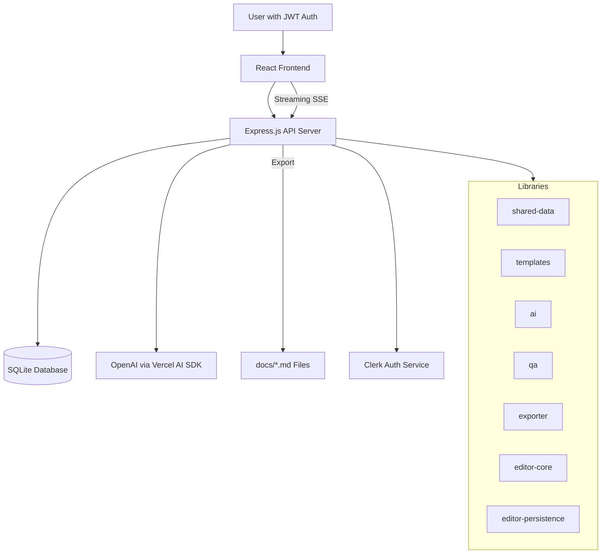
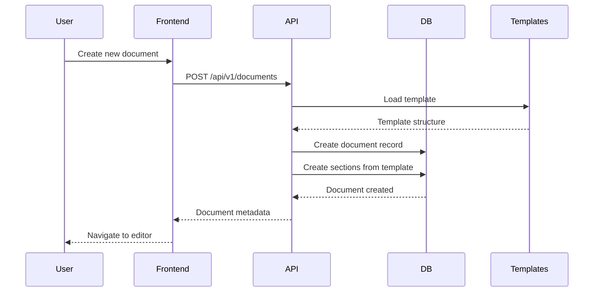
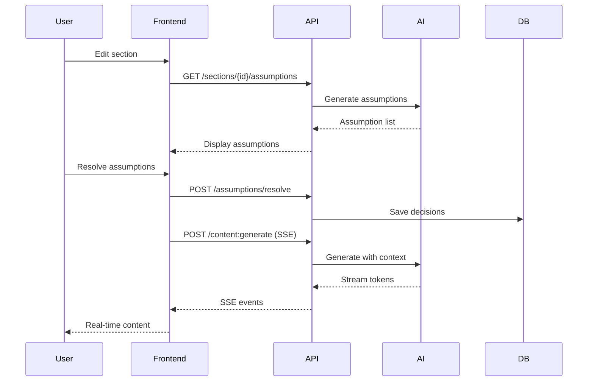

# CTRL FreaQ Backend Architecture Document {#backend-architecture-document}

## Introduction {#introduction}

This document outlines the backend architecture for CTRL FreaQ, focusing on server-side systems, data persistence, API design, shared services, and non-UI specific concerns. It serves as the definitive technical specification and single source of truth for AI-driven development, ensuring consistency and adherence to constitutional principles and chosen patterns.

**Relationship to Frontend Architecture:**
The frontend uses React with detailed UI architecture, routing, state management, and component guidelines specified in a separate Frontend Architecture Document (`docs/ui-architecture.md`). This backend architecture document defines the API contracts, data models, and service layer that the frontend consumes.

### Starter Template or Existing Project {#starter-template}

**Foundation:** Greenfield project (no starter template)
The project is built from scratch following the Constitutional principles defined in `CONSTITUTION.md`, implementing library-first architecture with strict test-driven development requirements.

### Change Log {#change-log}

| Date       | Version | Description                                          | Author      |
|------------|---------|------------------------------------------------------|-------------|
| 2025-09-13 | 1.0     | Initial backend architecture from Old Architecture  | Winston AI  |
| 2025-09-12 | 0.8     | Milkdown v7.15.5 WYSIWYG editor implementation     | Architect   |
| 2025-09-12 | 0.7     | Rename persistence package for clarity              | Architect   |
| 2025-09-12 | 0.6     | Section content generation API                      | Architect   |
| 2025-09-12 | 0.5     | Enhanced assumption resolution API                  | Architect   |
| 2025-09-11 | 0.4     | Epic 2 redesign: Document Editor paradigm          | Architect   |

## High Level Architecture {#high-level-architecture}

### Technical Summary {#technical-summary}

CTRL FreaQ MVP implements a modular monolith architecture running locally with Express.js API server, SQLite database, and library-first design patterns. The system provides comprehensive document editing with WYSIWYG Markdown, Git-style patching, conversational co-authoring via LLM integration (OpenAI/Vercel AI SDK), and streaming responses for real-time UX. Authentication uses Clerk with stateless JWT, while all core functionality is exposed through CLI interfaces per Constitutional requirements.

### High Level Overview {#high-level-overview}

1. **Architecture Style:** Modular monolith (local MVP) evolving to AWS serverless
2. **Repository Structure:** Monorepo using pnpm workspaces + Turborepo
3. **Service Architecture:** Web app with Express.js API and React frontend
4. **Core Data Flow:** User authenticates → Document editor with section navigation → AI-assisted content generation → Quality gates validation → Export to markdown files
5. **Key Decisions:**
   - Local-first MVP for rapid iteration
   - Library-first architecture for maintainability
   - Streaming UX for responsive AI interactions
   - Document-focused design aligned with PRD goals

### High Level Project Diagram {#project-diagram}



### Architectural and Design Patterns {#architectural-patterns}

- **Library-First Architecture:** Every feature as standalone library with CLI interface - _Rationale:_ Constitutional requirement ensuring testability, reusability, and clear boundaries
- **Repository Pattern:** Abstract data access layer for SQLite → DynamoDB migration - _Rationale:_ Enables seamless transition to cloud infrastructure without code changes
- **Dependency Injection via Service Locator:** Per-request context resolution - _Rationale:_ Avoids singletons, improves testability, enables request-scoped configuration
- **REST over HTTP:** JSON-based API with SSE for streaming - _Rationale:_ Simple, widely supported, enables real-time features
- **Test-First Development (TDD):** Mandatory Red-Green-Refactor cycle - _Rationale:_ Constitutional requirement ensuring quality and correctness

## Tech Stack {#tech-stack}

### Cloud Infrastructure {#cloud-infrastructure}

- **Provider:** Local development (MVP) → AWS (Phase 2)
- **Key Services:** SQLite (MVP) → DynamoDB, Lambda, API Gateway (Phase 2)
- **Deployment Regions:** N/A (local MVP)

### Technology Stack Table {#technology-stack-table}

| Category           | Technology        | Version  | Purpose                              | Rationale                                    |
|--------------------|-------------------|----------|--------------------------------------|----------------------------------------------|
| **Language**       | TypeScript        | 5.4.x    | Primary development language        | Strong typing, excellent tooling, team standard |
| **Runtime**        | Node.js           | 20.x     | JavaScript runtime                  | LTS version, stable performance              |
| **Backend Framework** | Express.js     | 5.1.0    | API server framework                | Mature, flexible middleware ecosystem        |
| **Database**       | SQLite            | 3.x      | Local data storage (MVP)            | Zero-config, embedded, easy migration path   |
| **DB Access**      | better-sqlite3    | 9.x      | SQLite driver                       | Fast synchronous API, type-safe              |
| **Authentication** | Clerk             | latest   | User authentication                 | Hosted solution, quick setup for MVP         |
| **LLM SDK**        | Vercel AI SDK     | 3.x      | AI model integration                | Provider abstraction, streaming support      |
| **Testing**        | Vitest            | 1.x      | Unit and integration testing        | Fast, TypeScript-native                      |
| **Monorepo**       | pnpm + Turborepo  | 9.x/1.x  | Workspace management                | Efficient dependency management, caching     |
| **Logging**        | Pino              | 9.5.0    | Structured logging                  | High-performance JSON logging                |
| **UI Framework**   | React             | 18.x     | Frontend framework                  | Component model, ecosystem, team expertise   |
| **CSS**            | Tailwind CSS      | 3.x      | Utility-first styling               | Rapid development, consistent design         |
| **Editor**         | Milkdown          | 7.15.5   | WYSIWYG Markdown editor             | Markdown-native, extensible, Git-style patches |

## Data Models {#data-models}

### Model: User {#model-user}

**Purpose:** Authenticated actor and document owner via Clerk

**Key Attributes:**
- id: string (Clerk user ID) - Unique identifier from Clerk
- email: string - User email address
- name: string (optional) - Display name
- provider: string - Authentication provider (e.g., 'clerk')
- createdAt: datetime - Account creation timestamp

**Relationships:**
- One-to-many with Document (owner)
- One-to-many with ActivityLog (actor)
- One-to-many with Proposal (creator)

### Model: Document {#model-document}

**Purpose:** Root entity for project document lifecycle

**Key Attributes:**
- id: string/uuid - Unique document identifier
- ownerUserId: string - Foreign key to User.id
- type: enum (architecture|prd|ui|other) - Document type
- title: string - Document title
- templateId: string - Template identifier
- templateVersion: string - Template version from YAML
- schemaVersion: string - Document schema version
- version: string (semver) - Document version
- status: enum (draft|ready|published) - Publication status
- assumptionAggressivenessDefault: enum (conservative|balanced|yolo) - Default decision policy
- projectId: string/uuid - Foreign key to Project.id
- rowVersion: integer - Optimistic concurrency control
- createdAt, updatedAt: datetime - Timestamps

**Relationships:**
- Many-to-one with User (owner)
- One-to-many with Section, Assumption, Citation, TraceLink, Proposal, ActivityLog

### Model: Section {#model-section}

**Purpose:** Hierarchical content units within documents

**Key Attributes:**
- id: string/uuid - Section identifier
- docId: string - Foreign key to Document.id
- parentSectionId: string (nullable) - Parent section for hierarchy
- key: string - Section key (e.g., 'introduction', 'tech-stack')
- title: string - Display title
- contentMarkdown: text - Section content in Markdown
- status: enum (idle|assumptions|drafting|review|ready) - Section lifecycle state
- orderIndex: integer - Sort order within parent
- depth: integer - Nesting depth (0=root)
- assumptionsResolved: boolean - Assumption status flag
- decisionAggressivenessOverride: enum (nullable) - Section-specific policy
- rowVersion: integer - Version for concurrent edits
- updatedAt: datetime - Last modification time

**Relationships:**
- Many-to-one with Document
- Optional many-to-one with parent Section
- One-to-many with child Sections
- One-to-many with Citation, Proposal

**Constraints:**
- Unique composite key: (docId, parentSectionId, orderIndex)
- Root sections: depth = 0 and parentSectionId = NULL
- Child sections: depth = parent.depth + 1

### Model: Assumption {#model-assumption}

**Purpose:** Capture and resolve assumptions before content generation

**Key Attributes:**
- id: string/uuid - Assumption identifier
- docId: string - Foreign key to Document.id
- scope: enum (document|section) - Assumption scope
- sectionId: string (nullable) - Section reference when scope=section
- title: string - Assumption title
- intent: string - What needs to be resolved
- status: enum (clear|unclear|unanswered|ambiguous|conflicting|tradeoffs) - Resolution status
- decision: string - Resolution decision
- orderIndex: integer - Display order
- createdAt: datetime - Creation timestamp

**Relationships:**
- Many-to-one with Document
- Optional many-to-one with Section

### Model: KnowledgeItem {#model-knowledge-item}

**Purpose:** Canonical knowledge for system context

**Key Attributes:**
- id: string/uuid - Knowledge identifier
- type: enum (standard|pattern|decision) - Knowledge type
- title: string - Knowledge title
- slug: string - URL-friendly identifier
- body: text - Knowledge content (markdown)
- tags: string[] - Categorization tags
- version: string - Knowledge version
- projectId: string/uuid - Project scope
- createdAt, updatedAt: datetime - Timestamps

**Relationships:**
- Referenced by Citation and TraceLink

### Model: Proposal {#model-proposal}

**Purpose:** AI-generated content proposals with diff tracking

**Key Attributes:**
- id: string/uuid - Proposal identifier
- docId: string - Document reference (denormalized for queries)
- sectionId: string - Target section
- createdByUserId: string - User who requested proposal
- diffPatch: text - Unified diff or patch operations
- state: enum (proposed|applied|rejected) - Proposal status
- reason: string (optional) - Application/rejection reason
- createdAt, approvedAt: datetime - Timestamps

**Relationships:**
- Many-to-one with Document, Section, User

### Model: Project {#model-project}

**Purpose:** Personal project container (MVP) for documents and knowledge

**Key Attributes:**
- id: string/uuid - Project identifier
- ownerUserId: string - User owner (unique constraint)
- name: string - Project name
- slug: string - URL-friendly identifier (unique)
- createdAt, updatedAt: datetime - Timestamps

**Relationships:**
- One-to-one with User (MVP enforces single project)
- One-to-many with Documents, KnowledgeItems

**Notes:**
- Auto-created on first login
- No deletion in MVP
- Rename allowed via PATCH API

## Components {#components}

### apps/api - Express.js API Server {#api-server}

**Responsibility:** Authentication, document editing API, assumption resolution, content generation, quality gates, export functionality, streaming responses

**Key Interfaces:**
- REST API endpoints under `/api/v1/*`
- SSE streaming for chat and proposals
- Clerk session validation
- Anti-CSRF protection

**Dependencies:** All library packages, Clerk SDK, Express middleware

**Technology Stack:** Express.js 5.1.0, TypeScript, Node.js 20.x

**Key Modules:**
- Auth Module: Clerk integration, session management
- Document Editor: WYSIWYG editing, Git-style patching, ToC navigation
- Assumptions Engine: Per-section assumption lifecycle management
- Context Builder: Token budgeting, redaction, context composition
- Chat Orchestrator: LLM routing, streaming responses
- Proposal Engine: Diff generation, preview, apply/reject workflow
- QA & Traceability: Quality gates, trace links, citations
- Exporter: Markdown file generation with sharding
- Streaming Client: SSE/Web Streams with <300ms TTFB

### packages/shared-data - Data Access Layer {#shared-data}

**Responsibility:** Repository pattern implementation for all data models, database migrations, transaction management

**Key Interfaces:**
- `DocumentRepository`: Document CRUD operations
- `SectionRepository`: Hierarchical section management
- `AssumptionRepository`: Assumption tracking
- `KnowledgeRepository`: Knowledge base access
- Query interfaces with pagination support

**Dependencies:** better-sqlite3, zod schemas

**Technology Stack:** TypeScript, better-sqlite3 9.x

**CLI Commands:**
```bash
shared-data query --type document --id DOC123
shared-data create-doc --type architecture --title "My Project"
shared-data list-sections --doc-id DOC123
```

### packages/templates - Template Engine {#templates}

**Responsibility:** YAML template parsing, validation, expansion, migration management

**Key Interfaces:**
- `loadTemplate(id)`: Load template by ID
- `validateTemplate(template)`: Schema validation
- `expandTemplate(template, data)`: Template expansion
- Migration check utilities

**Dependencies:** yaml parser, zod validation

**Technology Stack:** TypeScript, YAML

**CLI Commands:**
```bash
templates validate --file architecture.yaml
templates expand --template architecture --doc-id DOC123
templates check-migration --from-version 1.0 --to-version 1.1
```

### packages/ai - LLM Integration {#ai-package}

**Responsibility:** OpenAI integration via Vercel AI SDK, streaming helpers, context management

**Key Interfaces:**
- `explain(context)`: Generate explanations
- `suggestOutline(context)`: Content suggestions
- `proposeEdits(context, draft)`: Generate diffs
- Streaming response handlers

**Dependencies:** Vercel AI SDK, OpenAI client

**Technology Stack:** TypeScript, Vercel AI SDK 3.x

**CLI Commands:**
```bash
ai chat --prompt "Explain microservices" --model gpt-4o-mini
ai propose --section-id SEC123 --mode improve
ai stream-test --prompt "Hello" --verify-sse
```

### packages/qa - Quality Gates {#qa-package}

**Responsibility:** Quality gate definitions, execution engine, traceability validation

**Key Interfaces:**
- `runGates(docId)`: Execute all gates
- `checkGate(name, docId)`: Single gate check
- Gate result reporting

**Dependencies:** shared-data, zod schemas

**Technology Stack:** TypeScript

**CLI Commands:**
```bash
qa run-gates --doc-id DOC123 --gates all
qa check-gate --name "schema-completeness" --doc-id DOC123
qa validate-traceability --doc-id DOC123
```

### packages/exporter - Document Export {#exporter}

**Responsibility:** Markdown rendering, file sharding, idempotent export operations

**Key Interfaces:**
- `exportFull(docId)`: Full document export
- `exportShards(docId)`: Sharded export
- Diff checking utilities

**Dependencies:** markdown-it, shared-data

**Technology Stack:** TypeScript, markdown-it

**CLI Commands:**
```bash
exporter export --doc-id DOC123 --output-dir docs/
exporter export-shards --doc-id DOC123 --base-path docs/architecture/
exporter diff --doc-id DOC123 --target docs/architecture.md
```

### packages/editor-core - WYSIWYG Editor {#editor-core}

**Responsibility:** Milkdown integration, Markdown editing, Git-style patch generation

**Key Interfaces:**
- Patch creation and application
- Markdown/WYSIWYG conversion
- Diff visualization

**Dependencies:** Milkdown 7.15.5, diff-match-patch

**Technology Stack:** TypeScript, Milkdown

**CLI Commands:**
```bash
editor-core patch-create --old "text1" --new "text2"
editor-core patch-apply --patch "diff.patch" --content "original"
```

### packages/editor-persistence - Client Persistence {#editor-persistence}

**Responsibility:** Local pending changes, patch storage, change replay

**Key Interfaces:**
- Pending change storage
- Batch save operations
- Change history management

**Dependencies:** localforage, diff-match-patch

**Technology Stack:** TypeScript, IndexedDB via localforage

### packages/template-resolver - Template Resolution {#template-resolver}

**Responsibility:** Template hierarchy navigation, configuration extraction, caching

**Key Interfaces:**
- `loadDocumentTemplate(templateId)`: Load and cache templates
- `findSectionTemplate(template, sectionId)`: Navigate hierarchy
- `extractGenerationConfig(section)`: Extract LLM config

**Dependencies:** yaml, lodash

**Technology Stack:** TypeScript

## External APIs {#external-apis}

### OpenAI API {#openai-api}

- **Purpose:** LLM-powered content generation, explanations, and proposals
- **Documentation:** https://platform.openai.com/docs
- **Base URL(s):** https://api.openai.com/v1
- **Authentication:** Bearer token via API key
- **Rate Limits:** Model-dependent, handled via exponential backoff

**Key Endpoints Used:**
- `POST /chat/completions` - Generate content and proposals
- Streaming mode for real-time responses

**Integration Notes:** Accessed via Vercel AI SDK abstraction layer, 2 retries with jitter on 429/5xx errors

### Clerk Authentication API {#clerk-api}

- **Purpose:** User authentication, session management, profile data
- **Documentation:** https://clerk.com/docs
- **Base URL(s):** Configured per Clerk instance
- **Authentication:** Session cookies, JWT validation
- **Rate Limits:** Standard Clerk limits apply

**Key Endpoints Used:**
- Session validation endpoints
- User profile retrieval

**Integration Notes:** SDK-based integration, session validation on all authoring endpoints

## Core Workflows {#core-workflows}

### Document Creation Workflow {#document-creation-workflow}



### Content Generation with Assumptions {#content-generation-workflow}



## REST API Spec {#rest-api-spec}

```yaml
openapi: 3.0.0
info:
  title: CTRL FreaQ Authoring API
  version: 1.0.0
  description: Document authoring and AI assistance API
servers:
  - url: http://localhost:3000/api/v1
    description: Local development server

paths:
  /documents:
    post:
      summary: Create new document
      requestBody:
        required: true
        content:
          application/json:
            schema:
              type: object
              properties:
                type:
                  type: string
                  enum: [architecture, prd, ui, other]
                title:
                  type: string
      responses:
        201:
          description: Document created

  /documents/{docId}:
    get:
      summary: Get document metadata
      parameters:
        - name: docId
          in: path
          required: true
          schema:
            type: string

  /sections/{sectionId}:
    get:
      summary: Get section with content
    patch:
      summary: Update section

  /sections/{sectionId}/content:generate:
    post:
      summary: Generate section content (SSE)
      description: Streaming endpoint for AI content generation

  /sections/{sectionId}/proposals:generate:
    post:
      summary: Generate content proposal (SSE)
      description: Create diff-based proposal for section changes
```

## Database Schema {#database-schema}

### SQLite Schema (MVP) {#sqlite-schema}

```sql
-- Documents table
CREATE TABLE IF NOT EXISTS documents (
  id TEXT PRIMARY KEY,
  owner_user_id TEXT NOT NULL,
  type TEXT NOT NULL CHECK (type IN ('architecture','prd','ui','other')),
  title TEXT NOT NULL,
  template_id TEXT NOT NULL,
  template_version TEXT NOT NULL,
  schema_version TEXT NOT NULL,
  version TEXT NOT NULL,
  status TEXT NOT NULL CHECK (status IN ('draft','ready','published')),
  assumption_aggressiveness_default TEXT NOT NULL,
  project_id TEXT,
  row_version INTEGER NOT NULL DEFAULT 0,
  created_at TEXT NOT NULL,
  updated_at TEXT NOT NULL
);
CREATE INDEX idx_documents_owner ON documents(owner_user_id);

-- Sections table with hierarchical structure
CREATE TABLE IF NOT EXISTS sections (
  id TEXT PRIMARY KEY,
  doc_id TEXT NOT NULL REFERENCES documents(id) ON DELETE CASCADE,
  parent_section_id TEXT REFERENCES sections(id) ON DELETE CASCADE,
  key TEXT NOT NULL,
  title TEXT NOT NULL,
  content_markdown TEXT NOT NULL DEFAULT '',
  status TEXT NOT NULL,
  order_index INTEGER NOT NULL,
  depth INTEGER NOT NULL CHECK (depth >= 0),
  assumptions_resolved INTEGER NOT NULL DEFAULT 0,
  decision_aggressiveness_override TEXT,
  row_version INTEGER NOT NULL DEFAULT 0,
  updated_at TEXT NOT NULL,
  UNIQUE (doc_id, parent_section_id, order_index)
);
CREATE INDEX idx_sections_hierarchy ON sections(doc_id, parent_section_id, order_index);

-- Assumptions table
CREATE TABLE IF NOT EXISTS assumptions (
  id TEXT PRIMARY KEY,
  doc_id TEXT NOT NULL REFERENCES documents(id) ON DELETE CASCADE,
  scope TEXT NOT NULL CHECK (scope IN ('document','section')),
  section_id TEXT REFERENCES sections(id) ON DELETE CASCADE,
  title TEXT NOT NULL,
  intent TEXT NOT NULL,
  status TEXT NOT NULL,
  decision TEXT NOT NULL DEFAULT '',
  order_index INTEGER NOT NULL,
  created_at TEXT NOT NULL
);
CREATE INDEX idx_assumptions_scope ON assumptions(doc_id, scope, section_id);

-- Proposals with denormalized doc_id
CREATE TABLE IF NOT EXISTS proposals (
  id TEXT PRIMARY KEY,
  doc_id TEXT NOT NULL REFERENCES documents(id) ON DELETE CASCADE,
  section_id TEXT NOT NULL REFERENCES sections(id) ON DELETE CASCADE,
  created_by_user_id TEXT,
  diff_patch TEXT NOT NULL,
  state TEXT NOT NULL CHECK (state IN ('proposed','applied','rejected')),
  reason TEXT,
  created_at TEXT NOT NULL,
  approved_at TEXT
);
CREATE INDEX idx_proposals_lookup ON proposals(doc_id, section_id, created_at);
```

### DynamoDB Migration Path {#dynamodb-migration}

Key-based access patterns for future DynamoDB compatibility:
- Partition key: `docId` for document-scoped queries
- Sort keys: Composite keys like `sectionId#orderIndex`
- No JOINs - all queries use single-table design patterns
- Cursor-based pagination ready
- Optimistic locking via version fields

## Source Tree {#source-tree}

```
ctrl-freaq/
├── apps/
│   ├── web/                      # React frontend application
│   │   ├── src/
│   │   │   ├── components/       # React components
│   │   │   ├── lib/              # Utilities and services
│   │   │   └── routes/           # Page components
│   │   └── package.json
│   └── api/                      # Express.js backend (future)
├── packages/
│   ├── shared-data/              # Data access layer
│   │   ├── src/
│   │   │   ├── cli.ts           # CLI interface
│   │   │   ├── repositories/    # Repository pattern
│   │   │   ├── migrations/      # Database migrations
│   │   │   └── index.ts         # Public API
│   │   ├── test/
│   │   └── package.json
│   ├── templates/                # Template engine
│   │   ├── src/
│   │   │   ├── cli.ts
│   │   │   ├── loader.ts
│   │   │   └── validator.ts
│   │   └── package.json
│   ├── ai/                      # LLM integration
│   │   ├── src/
│   │   │   ├── cli.ts
│   │   │   ├── provider.ts
│   │   │   └── streams.ts
│   │   └── package.json
│   ├── qa/                       # Quality gates
│   ├── exporter/                 # Document export
│   ├── editor-core/              # WYSIWYG editor
│   ├── editor-persistence/       # Client persistence
│   └── template-resolver/        # Template resolution
├── docs/
│   ├── architecture.md           # This document
│   ├── architecture/             # Sharded sections
│   ├── prd.md                   # Product requirements
│   └── brief.md                 # Project brief
├── templates/                    # YAML templates
│   ├── architecture.yaml
│   ├── prd.yaml
│   └── brief.yaml
├── .bmad-core/                   # Agent configurations
├── package.json                  # Root package.json
├── pnpm-workspace.yaml          # Workspace configuration
├── turbo.json                   # Turborepo config
├── tsconfig.base.json           # Base TypeScript config
└── CONSTITUTION.md              # Development principles
```

## Infrastructure and Deployment {#infrastructure-deployment}

### Infrastructure as Code {#infrastructure-as-code}

- **Tool:** Terraform (Phase 2)
- **Location:** `infra/terraform/`
- **Approach:** Modular configuration for AWS resources

### Deployment Strategy {#deployment-strategy}

- **Strategy:** Local development (MVP) → AWS Serverless (Phase 2)
- **CI/CD Platform:** GitHub Actions
- **Pipeline Configuration:** `.github/workflows/`

### Environments {#environments}

- **Development:** Local SQLite, dev Clerk instance, OpenAI dev key
- **Staging (Phase 2):** AWS dev account, DynamoDB, Lambda
- **Production (Phase 2):** AWS prod account, full monitoring

### Environment Promotion Flow {#promotion-flow}

```
Local Dev → Git Push → CI Tests → Merge to Main
                                    ↓
                        (Phase 2) Deploy to Staging
                                    ↓
                             Manual Promotion
                                    ↓
                            Production Deploy
```

### Rollback Strategy {#rollback-strategy}

- **Primary Method:** Git revert and redeploy
- **Trigger Conditions:** Failed health checks, error rate > 1%
- **Recovery Time Objective:** < 5 minutes

## Error Handling Strategy {#error-handling-strategy}

### General Approach {#general-approach}

- **Error Model:** Typed exceptions with error codes
- **Exception Hierarchy:** HttpError base class with specific subtypes
- **Error Propagation:** Catch at boundaries, log with context, return sanitized response

### Logging Standards {#logging-standards}

- **Library:** Pino 9.5.0
- **Format:** Structured JSON with ISO-8601 timestamps
- **Levels:** trace, debug, info, warn, error, fatal
- **Required Context:**
  - Correlation ID: UUID per request
  - Service Context: Component name, version
  - User Context: userId (no PII in logs)

### Error Handling Patterns {#error-patterns}

#### External API Errors {#external-api-errors}

- **Retry Policy:** 2 retries with exponential backoff (100ms, 300ms)
- **Circuit Breaker:** Open after 5 consecutive failures
- **Timeout Configuration:** 30s for LLM, 5s for others
- **Error Translation:** Map to standard error codes

#### Business Logic Errors {#business-logic-errors}

- **Custom Exceptions:** ValidationError, NotFoundError, ConflictError
- **User-Facing Errors:** `{ code, message, requestId }`
- **Error Codes:** Stable string codes (bad_request, not_found, etc.)

#### Data Consistency {#data-consistency}

- **Transaction Strategy:** SQLite transactions for multi-table updates
- **Compensation Logic:** Rollback on failure within transaction
- **Idempotency:** Version fields for optimistic concurrency

## Coding Standards {#coding-standards}

### Core Standards {#core-standards}

- **Languages & Runtimes:** TypeScript 5.4.x, Node.js 20.x
- **Style & Linting:** ESLint with strict TypeScript rules
- **Test Organization:** `*.test.ts` files colocated with source

### Naming Conventions {#naming-conventions}

| Element      | Convention    | Example                |
|--------------|---------------|------------------------|
| Files        | kebab-case    | document-service.ts    |
| Classes      | PascalCase    | DocumentRepository     |
| Functions    | camelCase     | createDocument()       |
| Constants    | UPPER_SNAKE   | MAX_RETRIES           |
| Interfaces   | PascalCase    | IDocumentService      |

### Critical Rules {#critical-rules}

- **No console.log:** Use Pino logger for all output
- **Repository Pattern:** All database access through repositories
- **Error Handling:** Never throw strings, use typed errors
- **Async/Await:** No unhandled promise rejections
- **Input Validation:** Zod validation at API boundaries
- **No Singletons:** Use Service Locator pattern
- **Test First:** Write failing tests before implementation

## Test Strategy and Standards {#test-strategy}

### Testing Philosophy {#testing-philosophy}

- **Approach:** Test-First Development (TDD) - mandatory
- **Coverage Goals:** 100% for new code, 80% overall
- **Test Pyramid:** 60% unit, 30% integration, 10% E2E

### Test Types and Organization {#test-types}

#### Unit Tests {#unit-tests}

- **Framework:** Vitest 1.x
- **File Convention:** `*.test.ts` or `*.spec.ts`
- **Location:** Colocated with source files
- **Mocking Library:** Vitest built-in mocks
- **Coverage Requirement:** 100% for public methods

**AI Agent Requirements:**
- Generate tests for all public methods
- Cover edge cases and error conditions
- Follow AAA pattern (Arrange, Act, Assert)
- Mock all external dependencies

#### Integration Tests {#integration-tests}

- **Scope:** Repository patterns, API endpoints, library CLIs
- **Location:** `test/integration/` directories
- **Test Infrastructure:**
  - **Database:** In-memory SQLite for tests
  - **External APIs:** Mocked responses
  - **Authentication:** Test tokens

#### E2E Tests with Playwright {#e2e-tests-playwright}

- **Framework:** Playwright Test Framework
- **Location:** `tests/e2e/` directory
- **File Convention:** `*.e2e.ts` for functional tests, `*.visual.ts` for visual regression
- **Scope:** Critical user flows, visual regression, cross-browser compatibility
- **Test Infrastructure:**
  - **Browsers:** Chromium, Firefox, WebKit (Safari)
  - **Viewports:** Mobile (320px), Tablet (768px), Desktop (1440px), Wide (1920px)
  - **Visual Regression:** Screenshot comparison with configurable thresholds
  - **Performance:** FPS monitoring during animations

**AI Agent Requirements:**
- Generate page object models for complex UI interactions
- Create data-testid attributes for reliable element selection
- Implement visual regression baselines for new features
- Test all responsive breakpoints defined in specs
- Verify animations respect prefers-reduced-motion
- Include cross-browser compatibility checks

#### DynamoDB Compatibility Tests {#dynamodb-compatibility-tests}

All data access must verify:
- No cross-entity JOINs
- Key-based access only
- Cursor pagination patterns
- No table scans or LIKE queries
- Version-based concurrency

### Test Data Management {#test-data-management}

- **Strategy:** Fixtures and factories
- **Fixtures:** `test/fixtures/` directories
- **Factories:** Object mother pattern
- **Cleanup:** Automatic rollback after each test

### Continuous Testing {#continuous-testing}

- **CI Integration:** Run on every PR and merge
- **Performance Tests:** Benchmark critical paths
- **Security Tests:** Dependency scanning, SAST

## Security {#security}

### Input Validation {#input-validation}

- **Validation Library:** Zod
- **Validation Location:** API route handlers
- **Required Rules:**
  - All external inputs MUST be validated
  - Validation at API boundary before processing
  - Whitelist approach preferred over blacklist

### Authentication & Authorization {#auth-authorization}

- **Auth Method:** Clerk with JWT sessions
- **Session Management:** Stateless JWT, HttpOnly cookies
- **Required Patterns:**
  - Validate session on all `/api/v1/*` routes
  - Return 401 for invalid/expired sessions
  - Document owner has full access (MVP)

### Secrets Management {#secrets-management}

- **Development:** `.env.local` file (never committed)
- **Production:** AWS SSM Parameter Store (Phase 2)
- **Code Requirements:**
  - NEVER hardcode secrets
  - Access via environment variables only
  - No secrets in logs or error messages

### API Security {#api-security}

- **Rate Limiting:** Per-user quotas (Phase 2)
- **CORS Policy:** Same-origin only (MVP)
- **Security Headers:** X-Frame-Options, X-Content-Type-Options
- **HTTPS Enforcement:** Required in production

### Data Protection {#data-protection}

- **Encryption at Rest:** SQLite file permissions 600
- **Encryption in Transit:** HTTPS in production
- **PII Handling:** Minimal PII, no logs
- **Logging Restrictions:** No passwords, tokens, or keys

### Dependency Security {#dependency-security}

- **Scanning Tool:** npm audit (MVP)
- **Update Policy:** Monthly security updates
- **Approval Process:** Review all new dependencies

### LLM Security {#llm-security}

- **Prompt Injection:** Scope context, require user approval
- **Output Validation:** Treat as untrusted, sanitize
- **Token Limits:** Budget per request (2K tokens MVP)

## SOC 2 Implementation Guidelines {#soc2-guidelines}

### Authentication Requirements {#soc2-authentication}

- Check valid JWT/session before processing requests
- Return 401 for missing/invalid tokens
- Implement token expiration checks
- Support MFA hooks with shorter session expiry

### Logging Requirements {#soc2-logging}

All operations must log (JSON format):
- Authentication events: login/logout/refresh
- Data access: CREATE/READ/UPDATE/DELETE with old/new values
- Authorization failures with required vs actual permissions
- Administrative changes with admin_id and changes

### Data Protection {#soc2-data-protection}

- Field-level encryption for sensitive data
- Database-level encryption
- Bcrypt/scrypt/argon2 for passwords
- TLS 1.2+ for all connections
- Secure session tokens (128+ bits)

### Audit Trail {#soc2-audit}

Every table includes:
- created_at, created_by
- updated_at, updated_by
- deleted_at, deleted_by (soft deletes)
- Version tracking for changes

## Next Steps {#next-steps}

### Frontend Architecture {#frontend-next-steps}

For UI components, create Frontend Architecture Document with:
- Reference to this backend architecture
- React component structure
- State management approach
- UI/UX patterns aligned with backend APIs

### Implementation Phase {#implementation-next-steps}

1. Set up development environment per this architecture
2. Implement library packages with CLI interfaces
3. Build Express.js API with defined endpoints
4. Create React frontend consuming the APIs
5. Establish CI/CD pipeline with test gates