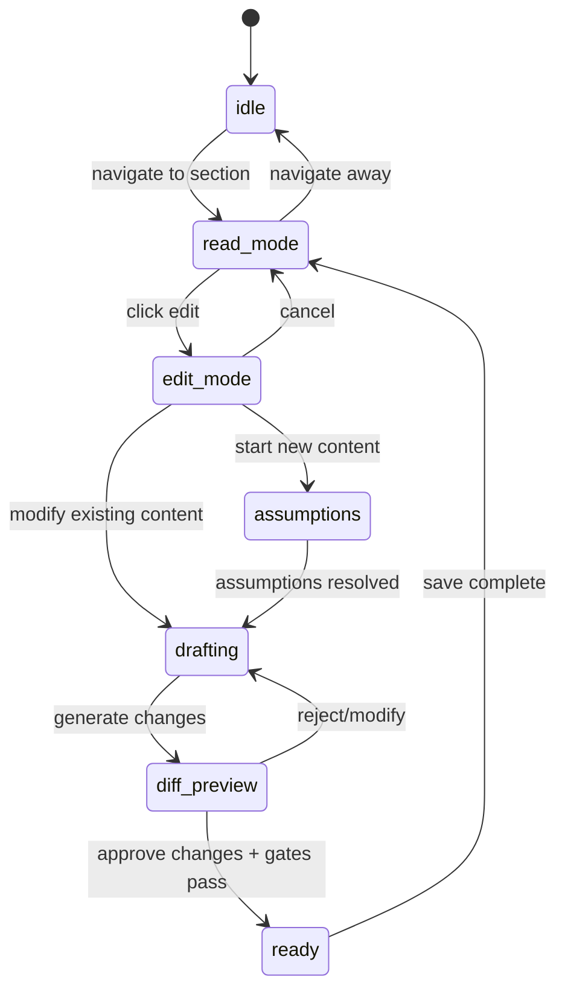
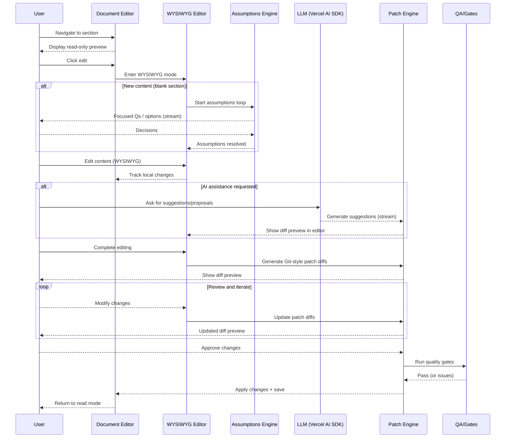
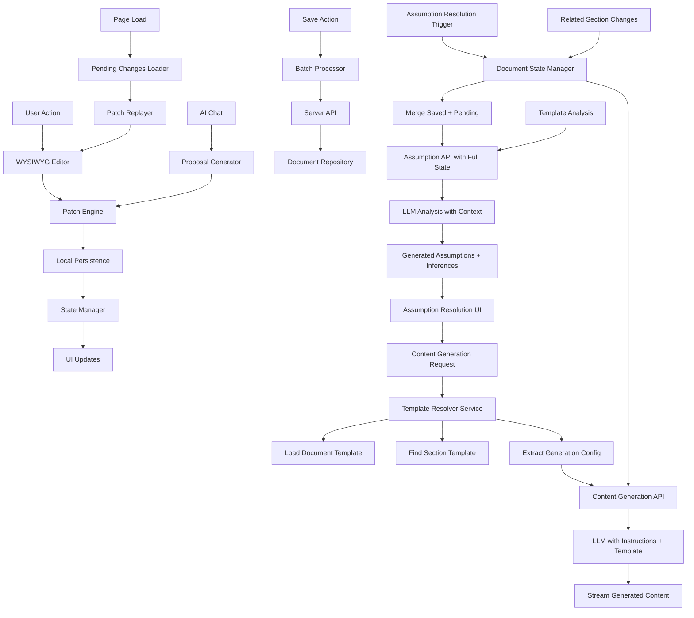

# CRTL FreaQ Architecture Document

## Introduction
This document outlines the overall project architecture for CRTL FreaQ, including backend systems, shared services, and non‑UI concerns. It serves as the guiding architectural blueprint for AI‑driven development, ensuring consistency and adherence to chosen patterns and technologies.

### Document Organization
This architecture document focuses on **MVP implementation details** using local development architecture with SQLite, Express.js, and library-first design patterns.

### Constitutional Compliance
This architecture implements the CTRL FreaQ Constitution requirements:
- ✅ **Library-First Architecture**: Each feature as standalone library with CLI
- ✅ **CLI Interface Standard**: All libraries expose command-line interfaces  
- ✅ **Test-First Development**: Mandatory TDD with Red-Green-Refactor cycle
- ✅ **Integration Testing**: DynamoDB-compatible patterns verified in tests
- ✅ **Observability Standards**: Structured logging, metrics, health checks
- ✅ **Versioning & Breaking Changes**: Semantic versioning with migration docs
- ✅ **Simplicity & Minimalism**: MVP-focused with YAGNI compliance

Relationship to Frontend Architecture
- Frontend specifics are documented separately in a Frontend Architecture document and must be used alongside this document for full‑stack implementation.

Starter Template or Existing Project
- Foundation: Greenfield (no starter; scaffold per PRD).

Compliance/SLO Stance
- MVP: Follow PRD NFRs; no regulated PII; SOC 2 is aspirational.
- Future: SOC 2 aspirational for production deployment.

Terminology & Conventions
- When referring to a specific document, suffix with the word "document" (e.g., "Architecture document", "PRD document").

Change Log
| Date       | Version | Description                       | Author |
|------------|---------|-----------------------------------|--------|
| 2025-09-12 | 0.8     | Specify Milkdown v7.15.5 as WYSIWYG editor implementation with integration architecture details | Architect |
| 2025-09-12 | 0.7     | Rename packages/persistence to packages/editor-persistence for clarity and consistency with editor-core package naming | Architect |
| 2025-09-12 | 0.6     | Section content generation API with backend template resolution; Template Resolver Service; comprehensive caching and template hierarchy navigation | Architect |
| 2025-09-12 | 0.5     | Enhanced assumption resolution API with pending changes support; Document State Synchronization architecture; updated data models | Architect |
| 2025-09-11 | 0.4     | Epic 2 redesign: shift from wizard to Document Editor paradigm; add WYSIWYG, Git-style patching, section-based navigation | Architect |
| 2025-09-11 | 0.3     | Remove MCP from MVP; add Spec Kit export flow; terminology updates | Architect |
| 2025-09-10 | 0.2     | Add Projects-lite MVP architecture (personal project) | Architect |
| 2025-09-09 | 0.1     | Initial architecture draft (MVP)  | Architect |

## Library-First Architecture Implementation (Constitution §I)

### Constitutional Requirements
Every feature begins as a standalone library with clear boundaries and responsibilities per Constitution requirements:

#### Library Principles
- **Self-contained**: Minimal external dependencies, can function independently
- **Independently testable**: Complete test suite with TDD compliance
- **Purpose-driven**: Explicit functionality scope, solves concrete problems
- **Reusable**: Usable across different contexts and projects
- **CLI-enabled**: Command-line interface for all core functions

#### Library Responsibilities Matrix

| Library | Concrete Problem Solved | CLI Commands | Key Dependencies |
|---------|------------------------|--------------|------------------|
| `packages/shared-data` | Repository pattern with DynamoDB constraints | `query`, `create-doc`, `list-sections` | better-sqlite3, zod |
| `packages/templates` | Template validation and expansion | `validate`, `expand`, `check-migration` | yaml, zod |
| `packages/ai` | LLM integration with streaming | `chat`, `propose`, `stream-test` | @vercel/ai, openai |
| `packages/qa` | Quality gates validation | `run-gates`, `check-gate`, `validate-traceability` | zod |
| `packages/exporter` | Document export with versioning | `export`, `export-shards`, `diff` | markdown-it |
| `packages/editor-core` | WYSIWYG Markdown editing with Git-style patching | `patch-create`, `patch-apply`, `patch-preview` | milkdown@7.15.5, diff-match-patch |
| `packages/editor-persistence` | Client-side pending changes with patch diff storage | `store-pending`, `replay-changes`, `batch-save` | localforage, diff-match-patch |
| `packages/template-resolver` | Template hierarchy navigation and config extraction | `resolve-template`, `extract-config`, `cache-invalidate` | yaml, lodash |

#### Forbidden Organizational Libraries
These would violate Constitution requirements:
- ❌ `packages/shared-types` (organizational only)  
- ❌ `packages/shared-utils` (grab bag of utilities)
- ❌ `packages/common` (unclear purpose)

#### Library Boundaries and Composition

```typescript
// Good: Libraries compose at application layer
// apps/web/src/lib/services/document-service.ts
import { DocumentRepository } from '@packages/shared-data';
import { TemplateEngine } from '@packages/templates';
import { QualityGates } from '@packages/qa';
import { Exporter } from '@packages/exporter';

export class DocumentService {
  constructor(
    private documentRepo: DocumentRepository,
    private templateEngine: TemplateEngine,
    private qualityGates: QualityGates,
    private exporter: Exporter
  ) {}

  async createDocument(templateId: string, data: any) {
    // Compose library functions without libraries depending on each other
    const template = await this.templateEngine.load(templateId);
    const document = await this.documentRepo.create(template.expand(data));
    const gateResults = await this.qualityGates.run(document.id);
    
    if (gateResults.hasBlockers) {
      throw new Error('Quality gates failed');
    }
    
    return document;
  }
}
```

#### Library Independence Verification

Each library must pass these independence tests:

```bash
# Test 1: Library can be used standalone
cd packages/templates
npm test  # Should pass without other packages

# Test 2: CLI works independently  
npx templates validate --file test/fixtures/valid.yaml
npx templates --help  # Should show all commands

# Test 3: No circular dependencies
npx madge --circular src/  # Should report no circular dependencies

# Test 4: Minimal dependency footprint
npm ls --depth=0  # Should show only essential dependencies
```

#### Package Structure Standard

```
packages/[library-name]/
├── src/
│   ├── cli.ts              # CLI interface (required)
│   ├── index.ts            # Main library exports
│   ├── lib/                # Core library code
│   └── types.ts            # Library-specific types
├── test/
│   ├── cli.test.ts         # CLI interface tests
│   ├── integration/        # Integration tests
│   └── unit/               # Unit tests
├── package.json            # Independent versioning
├── README.md              # Usage examples and CLI docs
├── CHANGELOG.md           # Version history
└── tsconfig.json          # Library-specific TS config
```

#### Shared Types Strategy (Revised)
Instead of organizational `shared-types` package, use:

1. **Library-owned types**: Each library exports its own types
2. **Protocol types**: Minimal interface contracts in consuming applications
3. **Schema sharing**: Use zod schemas as the source of truth, exported from owning library

```typescript
// packages/shared-data/src/index.ts - exports its own types
export type { Document, Section, Assumption } from './types';
export { DocumentSchema, SectionSchema } from './schemas';

// apps/web uses protocol interfaces, not shared types
import type { Document } from '@packages/shared-data';
```

## High Level Architecture

### Technical Summary
CRTL FreaQ MVP runs locally with a modular monorepo: an Express.js API server with a React frontend authenticated via stateless JWT. The UI provides a comprehensive Document Editor with section-based navigation, WYSIWYG Markdown editing, Git-style patching, and conversational co‑authoring with diff‑based approvals. LLM integration uses the Vercel AI SDK (OpenAI). Responses stream to the UI via Node streams/SSE for near real‑time UX.

### High Level Overview
1) Architecture style: Modular monolith (local MVP) with a web app.
2) Repository: Monorepo using pnpm workspaces + Turborepo (`apps/web`, `packages/*`, `docs/*`).
3) Services: Web (authoring, chat, export). Local DB is SQLite.
4) Core flows: User authenticates (Clerk) → document editor with section-based editing + conversational co‑authoring → proposals/diffs with Git-style patching → validates via quality gates → exports `docs/architecture.md` and shards under `docs/architecture/` → downstream tools (e.g., Spec Kit) consume exported documents.
5) Key decisions: Local‑first MVP; streaming UX; document-focused architecture.

### High Level Project Diagram
```mermaid
graph TD
  user[User (JWT Auth)] --> web[React Frontend]
  web --> api[Express.js API]
  web -->|Section-aware chat (Vercel AI SDK)| openai[(OpenAI Provider)]
  web -->|Proposals/Diffs, Export| files[(docs/architecture.md + shards)]

```

### Architectural and Design Patterns
- Serverless Evolution: Start local modular services; evolve to AWS API Gateway + Lambda. Rationale: cost efficiency, scale, aligns with PRD.
- Repository Pattern: Abstract data access (SQLite → DynamoDB). Rationale: portability and testability.
- Dependency Injection/Modules: Encapsulate services and boundaries. Rationale: clearer seams, easier testing.
- REST over HTTP: Simple endpoints (deterministic JSON). Rationale: clarity and compatibility.
- Streaming Responses: Node streams/SSE for real‑time UX.

## Tech Stack (Approved)


Technology Stack Table
| Category      | Technology                | Version  | Purpose                              | Rationale |
|---------------|---------------------------|----------|--------------------------------------|-----------|
| Language      | TypeScript                | 5.4.x    | Primary language                     | Strong typing, tooling |
| Runtime       | Node.js                   | 20.x     | JS runtime (web)                     | LTS, performance |
| Backend Framework | Express.js             | 5.1.0    | API server                           | Mature, flexible, middleware |
| UI            | Tailwind CSS + Skeleton   | 3.4.x/2.x| Styling + components                  | Speed, consistency |
| Auth          | Clerk                     | latest   | Authentication (MVP)                 | Simple hosted auth |
| LLM SDK       | Vercel AI SDK             | 3.x      | Model access/streaming               | Provider abstraction |
| Database      | SQLite                    | 3.x      | Local storage (MVP)                  | Simple, embedded |
| Data Layer    | better‑sqlite3            | 9.x      | DB access/abstraction                | Fast, lightweight local DB access |
| HTTP Server   | Express.js                | 5.1.0    | API endpoints                        | Simplicity |
| Testing       | Vitest                    | 1.x      | Unit testing                         | Fast TS testing |
| Monorepo      | pnpm + Turborepo          | 9.x/1.x  | Workspaces + pipelines               | Speed, caching |
| CI            | GitHub Actions            | n/a      | Lint, type‑check, build              | Ubiquitous |
| Logging       | Pino                     | 9.5.0    | Structured logging with transports  | High-performance JSON logging with multi-tier streaming |
| Observability | Pino + Local logging | 9.5.0/n/a | Logs/metrics/traces                  | High-performance structured logging |

## Data Models

Model: User
- Purpose: Authenticated actor and document owner via Clerk.
- Key Attributes:
  - id (string, Clerk user ID)
  - email (string)
  - name (string, optional)
  - provider (string, e.g., clerk)
  - createdAt (datetime)
- Relationships: 1‑to‑many with Document, ActivityLog, Proposal.

Model: Document
- Purpose: Root entity for a project document lifecycle (Architecture is the first type).
- Key Attributes:
  - id (string/uuid)
  - ownerUserId (string, FK→User.id)
  - type (enum: architecture|prd|ui|other)
  - title (string)
  - schemaVersion (string)
  - version (string, semver)
  - status (enum: draft|ready|published)
  - templateId (string)       // e.g., 'architecture'
  - templateVersion (string)  // from YAML TemplateDocument.version
  - assumptionAggressivenessDefault (enum: conservative|balanced|yolo)
  - projectId (string/uuid, FK→Project.id)  // MVP: personal project scoping
  - createdAt, updatedAt (datetime)
- Relationships: 1‑to‑many with Section, Assumption, Citation, TraceLink, Proposal, ActivityLog.

Model: Section
- Purpose: Per‑section content unit for the Architecture document; supports hierarchical subsections.
- Key Attributes:
  - id (string/uuid)
  - docId (FK→Document.id)
  - parentSectionId (FK→Section.id, nullable)
  - key (string, e.g., introduction/high‑level/tech‑stack)
  - title (string)
  - contentMarkdown (text)
  - status (enum: draft|ready)
  - order (int)
  - depth (int, 0=root)
  - assumptionsResolved (boolean)
  - updatedAt (datetime)
  - decisionAggressivenessOverride (enum: conservative|balanced|yolo, nullable)
- Relationships: Many‑to‑one Document; optional many‑to‑one Parent Section; one‑to‑many Child Sections (0..*); 1‑to‑many Citation, Proposal; many TraceLink.
  
Constraints/Invariants
- Root sections: depth = 0 and parentSectionId = NULL
- Child sections: depth = parent.depth + 1
- Unique ordering per (docId, parentSectionId, order)

Indexes (SQLite)
- (docId, parentSectionId, order)
- (docId, depth)

Model: Assumption
- Purpose: Capture and resolve assumptions for the document or per section prior to drafting.
- Key Attributes:
  - id (string/uuid)
  - docId (FK→Document.id)
  - scope (enum: document|section)
  - sectionId (FK→Section.id, nullable when scope=document)
  - title (string)
  - intent (string)
  - status (enum: clear✅|unclear❔|unanswered❌|ambiguous❔|conflicting❔|tradeoffs❔)
  - decision (string)
  - order (int)
  - createdAt (datetime)
- Relationships: Many‑to‑one Document; optional many‑to‑one Section.

Model: KnowledgeItem
- Purpose: Canonical knowledge for system context.
- Key Attributes:
  - id (string/uuid)
  - type (enum: standard|pattern|decision)
  - title (string)
  - slug (string)
  - body (markdown/text)
  - tags (string[])
  - version (string)
  - projectId (string/uuid, FK→Project.id)  // MVP: personal project scoping
  - createdAt, updatedAt (datetime)
- Relationships: Referenced by Citation and TraceLink.

Model: Citation
- Purpose: Link section content to knowledge sources for provenance.
- Key Attributes:
  - id (string/uuid)
  - docId (FK→Document.id)
  - sectionId (FK→Section.id)
  - knowledgeId (FK→KnowledgeItem.id)
  - anchor (string, optional — section anchor/range)
  - createdAt (datetime)
- Relationships: Many‑to‑one Section, KnowledgeItem.

Model: TraceLink (Minimal)
- Purpose: Map requirement ↔ section ↔ knowledge/decision for traceability.
- Key Attributes:
  - id (string/uuid)
  - docId (FK→Document.id)
  - requirementRef (string, e.g., PRD FRx/NFRx or text)
  - sectionId (FK→Section.id)
  - knowledgeId (FK→KnowledgeItem.id, optional)
  - createdAt (datetime)
- Relationships: Many‑to‑one Section; optional KnowledgeItem.

Model: Proposal
- Purpose: Represent AI‑generated write proposals and review outcomes.
- Key Attributes:
  - id (string/uuid)
  - sectionId (FK→Section.id)
  - createdByUserId (FK→User.id)
  - diffPatch (text, unified diff/ops)
  - state (enum: proposed|applied|rejected)
  - reason (string, optional)
  - createdAt, approvedAt (datetime, optional)
- Relationships: Many‑to‑one Section, User; linked in ActivityLog.

Model: ActivityLog
- Purpose: Audit changes and important events (read/write, publish, QA).
- Key Attributes:
  - id (string/uuid)
  - actorUserId (FK→User.id, optional for system)
  - action (string enum)
  - targetType (string enum: doc|section|proposal|knowledge|qa)
  - targetId (string)
  - metadata (json)
  - createdAt (datetime)
- Relationships: Many‑to‑one User (optional), references various targets by ID.

Model: Project (MVP — Personal Project)
- Purpose: Provide a single personal project per user to scope documents and knowledge.
- Key Attributes:
  - id (string/uuid)
  - ownerUserId (FK→User.id, unique)  // enforces one project per user
  - name (string)
  - slug (string, unique)
  - createdAt, updatedAt (datetime)
- Relationships:
  - 1‑to‑many Documents (Document.projectId FK)
  - 1‑to‑many KnowledgeItems (project-scoped)
- Notes:
  - Auto-created on first login if missing; no delete in MVP; rename-only via API.
  - Backfill: For any pre-existing local documents, create the personal project on first login and backfill `projectId`; enforce NOT NULL only after backfill completes.
  - Security: Owner-only access; all Projects API routes verify `ownerUserId == session.userId`.
  
Indexes (SQLite)
- (ownerUserId) UNIQUE — enforces exactly one project per user
- (slug) UNIQUE — stable link target for dashboards

Model: Project
- Purpose: Group related documents, knowledge, and collaborators under organizations with multi-project support.
- Key Attributes:
    - id (string/uuid)
    - organizationId (FK→Organization.id)
    - createdByUserId (FK→User.id)
    - name (string)
    - slug (string)
    - createdAt, updatedAt (datetime)
- Relationships:
    - Many‑to‑one Organization (owner)
    - 1‑to‑many Documents (Document.projectId FK)
    - 1‑to‑many KnowledgeItems
    - Many‑to‑many Users (collaborators) via ProjectMembership (optional)
- Notes:
    - Extends the MVP personal project model to support multiple projects per user and shared access.

## CLI Interface Standard Implementation (Constitution §II)

### Overview
Every library package exposes core functionality through command-line interfaces following Constitution requirements:
- **Input**: Command-line arguments and/or stdin
- **Output**: Results to stdout, errors to stderr  
- **Formats**: Support both JSON and human-readable output
- **Behavior**: Consistent flag patterns and error codes

### CLI Commands by Package

#### packages/shared-data CLI
```bash
# Document operations
shared-data query --type document --id DOC123 --output json
shared-data create-doc --type architecture --title "My Project" --user-id USER123
shared-data list-docs --user-id USER123 --status draft --limit 10

# Section operations  
shared-data list-sections --doc-id DOC123 --parent-id SEC456 --output human
shared-data get-section --id SEC123 --include-content --output json

# Knowledge operations
shared-data query-knowledge --type pattern --slug "microservices" --output json
shared-data list-assumptions --doc-id DOC123 --scope section --section-id SEC456
```

#### packages/templates CLI
```bash
# Template validation and processing
templates validate --file templates/architecture.yaml --schema-version 1.0
templates list --type architecture --output json  
templates expand --template architecture --doc-id DOC123 --output markdown
templates check-migration --from-version 1.0 --to-version 1.1 --doc-id DOC123
```

#### packages/ai CLI
```bash
# AI operations for testing and debugging
ai chat --prompt "Explain microservices" --model gpt-4o-mini --output json
ai propose --section-id SEC123 --mode improve --temperature 0.2 --dry-run
ai stream-test --prompt "Hello" --verify-sse --timeout 30s
ai validate-context --doc-id DOC123 --section-id SEC456 --token-budget 4000
```

#### packages/qa CLI  
```bash
# Quality gates operations
qa run-gates --doc-id DOC123 --gates all --output json
qa check-gate --name "schema-completeness" --doc-id DOC123 --verbose
qa list-gates --type blocker --output human
qa validate-traceability --doc-id DOC123 --check-citations --output json
```

#### packages/exporter CLI
```bash
# Export operations
exporter export --doc-id DOC123 --format markdown --output-dir docs/
exporter export-shards --doc-id DOC123 --base-path docs/architecture/ --dry-run
exporter validate-export --file docs/architecture.md --check-frontmatter
exporter diff --doc-id DOC123 --target docs/architecture.md --show-changes
```

### Common CLI Patterns

#### Output Formats
All CLI commands support:
```bash
--output json    # Machine-readable JSON output
--output human   # Human-readable formatted output (default)
--verbose        # Include debug information
--quiet          # Suppress non-error output
```

#### Error Handling
Consistent exit codes across all CLI tools:
- `0` - Success
- `1` - General error  
- `2` - Invalid arguments
- `3` - Resource not found
- `4` - Permission denied
- `5` - Network/external service error

#### Input/Output Patterns
```bash
# stdin/stdout for piping
shared-data query --type document --user-id USER123 | qa run-gates --input stdin
templates validate --file - < architecture.yaml
exporter export --doc-id DOC123 --format json | jq '.sections[].title'

# File input/output
ai chat --prompt-file prompts/explain.txt --output-file response.json
qa run-gates --doc-id DOC123 --report-file quality-report.json
```

### Development Standards for CLI
- Each package includes `src/cli.ts` as entry point
- CLI functionality accessible programmatically via library APIs
- Unit tests for all CLI commands with different output formats
- Integration tests verify stdin/stdout/stderr behavior
- Help text and examples for all commands
- Shell completion support where applicable

## Components

### apps/api — API Server (Express.js)
- Responsibilities: Authentication, comprehensive document editing (WYSIWYG, Git-style patching, section-based navigation), assumptions resolution, conversational co‑authoring (read/write proposals), QA/traceability, export, collaboration indicators, streaming UX.
  - Projects‑lite (MVP): personal project bootstrap on first login; track `activeProjectId` in session; expose minimal Projects API (GET list/detail; PATCH rename) with owner‑only guards.
- Key Modules:
  - Auth (Clerk): login/logout, session, user profile fetch; gate authoring routes.
  - Document Editor: comprehensive editing UI with ToC navigation; section read/edit mode toggles; WYSIWYG Markdown editor; Git-style diff patching; local pending changes; save/resume.
  - Assumptions Engine: per‑section assumption lifecycle (status, Q&A/options, approvals); stores on Section/Assumption models.
  - Assumptions Policy Controls: document‑level aggressiveness selector (Conservative/Balanced/YOLO) and per‑section override.
  - Context Builder: composes section + knowledge context; token budgeting; redaction; section/doc IDs.
  - Chat Orchestrator: routes requests to LLM SDK; read mode (explain/outline/suggest) and write proposals mode (diffs).
  - Document Chat (QA Panel): global chat about the entire document; supports narrowing context to selected TOC sections and toggling inclusion of knowledge registry; shows citations that deep‑link to sections; maintains per‑document chat history.
  - Proposal Engine: generates unified diff/ops; preview; apply/decline with reason; updates Section + Changelog and emits ActivityLog.
  - QA & Traceability: runs quality gates; maintains TraceLink; renders citations/back‑links; publish gating.
  - Exporter: writes `docs/architecture.md` and shards under `docs/architecture/*.md`; idempotent diff.
  - Collaboration Indicators: lightweight section “editing by <user>” and conflict warnings.
  - Streaming Client: stream rendering with Node/Web Streams or SSE; TTF first chunk <300ms target.
  - Local Store: better‑sqlite3 access via shared data layer; migrations; transactions.
- External Deps: Clerk, Vercel AI SDK, better‑sqlite3.
 
TOC Interactions
- Checkbox‑select sections to include in Document Chat context; “Chat about selected” action opens/updates the QA panel with those sections.
- Status badges per section (idle, assumptions, drafting, review, ready); filter/search TOC to locate sections quickly.
- Clicking a citation in Document Chat scrolls the document to the referenced section and highlights the cited range (when available).

Routing Table (MVP)
| Route | Guard | Purpose |
|------|-------|---------|
| `/login` | Public | Clerk login page |
| `/author` | Auth (Clerk) | TOC + full document view; create/open document |
| `/author/doc/[docId]` | Auth (Clerk) | Load specific document; deep-link to sections |
| `/api/v1/**` | Auth + anti‑CSRF | Authoring API (local) |
| `/api/v1/projects` and `/api/v1/projects/:id` | Auth (owner‑only) | Projects API: list (single), detail, PATCH rename |

Projects (MVP) — Session & Bootstrap
- Session stores `activeProjectId`; set on login to the user’s personal project.
- First‑login bootstrap:
  1) Lookup by `ownerUserId`; if none, create project; retry on unique‑constraint race.
  2) Set `activeProjectId` in session; return to UI with project preselected.
- UI surfaces current project in sidebar and Dashboard list; rename allowed via PATCH.
- Observability: include `projectId` in logs/audit for authoring and knowledge operations.
 
Validation & NFRs (MVP)
- Slug uniqueness per project; validate on rename; return updated entity after PATCH.
- Idempotent rename operations; repeated requests yield the same stored state.
- Performance: Single-row lookups by `ownerUserId`; ensure indexes on (`ownerUserId`) and (`slug`).

Document Editor — Section Lifecycle



### packages/shared-data — Data Layer (better‑sqlite3)
- Responsibilities: Provide repository interfaces for Document, Section, Assumption, KnowledgeItem, Citation, TraceLink, Proposal, ActivityLog; hide DB specifics.
- Features: migrations bootstrap; connection pooling (as needed for better‑sqlite3); transactions; indexes per Data Models section; invariants (e.g., Section depth/order).
- Database Design Constraints:
  - No cross‑entity JOINs in repositories; compose in app layer.
  - Avoid table scans/LIKE queries; all reads go through key‑based access patterns with pagination.
  - Repository methods accept explicit pagination (limit + cursor) and projection fields.
  - Prefer write‑amplification over read‑amplification when needed (maintain derived keys).
  - Enforce unique ordering per parent in code (mirrors composite sort keys later).
- Interfaces (examples):
  - `Documents.getById(id): Document`
  - `Sections.listByDoc(docId, parentSectionId?): Section[]`
  - `Knowledge.searchByType(type, q?, limit?): KnowledgeItem[]`
  - `Trace.add(link: TraceLink): void`

### packages/shared-types — Types & Schemas
- Responsibilities: Centralize TS types, zod schemas, and API contracts used by both apps/web and services/mcp.
- Contents: model types; API request/response types; error envelopes; quality gates definitions.

### packages/templates — Template Loader & Validator
- Responsibilities: Parse YAML templates (architecture/prd/brief), validate structure, expose typed TemplateDocument/TemplateSection trees with defaults.
- Features: load from `templates/*.yaml`; expose `getTemplate('architecture')`; validate `version` and provide migration hints.

### packages/ai — LLM Integration (Vercel AI SDK)
- Responsibilities: Wrap ai‑sdk with configured provider; expose read (analysis/suggest) and write‑proposal helpers; streaming helpers.
- APIs (examples):
  - `ai.explain(context): Stream<TextChunk>`
  - `ai.suggestOutline(context): Stream<TextChunk>`
  - `ai.proposeEdits(context, draft): Stream<Diff>`
- Notes: Do not store secrets in repo; use env for keys.

### packages/qa — Quality Gates & Evaluation
- Responsibilities: Define/runtimes for gates (blocker/non‑blocker); export QA snapshot; evaluation harness for document quality.
- Outputs: pass/fail report; JSON snapshot attached to publish; metrics counters.

### packages/exporter — Markdown Export
- Responsibilities: Deterministic rendering for full doc and shards; include version header, schema version, changelog; idempotent output.
- Paths: `docs/architecture.md`, `docs/architecture/*.md`.

### packages/template-resolver — Template Resolution Service
- Responsibilities: Extract section templates from document templates; resolve generation configuration; cache resolved templates per document version.
- Key Functions:
  - `loadDocumentTemplate(templateId): Promise<DocumentTemplate>` — Load and cache document templates
  - `findSectionTemplate(documentTemplate, sectionId): TemplateSection | null` — Navigate template hierarchy to find section
  - `extractGenerationConfig(sectionTemplate, documentTemplate): GenerationConfig` — Extract all generation-relevant configuration
  - `invalidateCache(templateId): void` — Clear cached templates when updated
- Caching Strategy: LRU cache with template version-based invalidation; cache resolved configs per section for performance
- Error Handling: Graceful degradation when templates not found; validation of template syntax before LLM processing

### Cross‑Cutting Concerns
- Error Handling: Standard error envelope `{ code, message, details?, requestId }`; user‑friendly messages in UI; log stack traces server‑side.
- Logging: Pino (or console structured) in MVP; requestId propagation; redact secrets.
- Security: Clerk session on web; secure API key handling.
- Streaming: Use Web Streams/SSE for real-time UX.
- Performance: Client P95 <3s; server P95 ≤300ms; TTFMP ≤2s; streaming for long generations.

## Observability Standards Implementation (Constitution §V)

### Constitutional Requirements
All systems must provide comprehensive observability through structured logging, multi-tier streaming, performance metrics, error tracking, and health checks per Constitution mandate.

### Logging Architecture
- **Technology**: Pino v9.5.0 for high-performance structured JSON logging
- **Multi-Tier Strategy**: Console (development) + File rotation + Error isolation  
- **Library Independence**: Each library maintains its own logger with consistent configuration
- **Request Tracing**: RequestId propagation across all operations
- **Security**: Automatic redaction of secrets and sensitive data

#### SOC 2 Structured Logging Requirements

All logging implementations must enforce the Constitutional JSON structure (Rule 8):
- **Mandatory fields**: timestamp (ISO-8601), level, event_type, user_id, session_id, ip_address, action, resource, result, metadata
- **Event categorization**: Automatically classify logs as auth|data_access|admin_action|system
- **User context**: Attach userId and sessionId to all log entries from authenticated requests
- **Result tracking**: Set result field to "success" or "failure" based on operation outcome
- **Metadata standards**: Include request_id, resource_id, and operation-specific details
- **Security**: Never log passwords, tokens, or sensitive PII in metadata

### Performance Monitoring
- **Query Performance**: Monitor SQLite operations for DynamoDB compatibility patterns
- **API Latency**: Track operation timing with P95 thresholds
- **Error Rates**: Structured error tracking with severity classification
- **Health Checks**: Standard endpoints with aggregated status reporting

### Observability Targets (MVP)
- Chat time-to-first-token: P95 < 500ms
- Proposal generation: P95 < 3s 
- Server error rate: ≤ 1%
- API reads latency: P95 ≤ 100ms

### CLI Observability
- All CLI commands support `--verbose` and `--quiet` modes
- JSON and human-readable output formats
- Consistent exit codes and error handling
- Health check commands for all libraries

## Service Locator & Factories

Goals
- Avoid singletons and tight coupling. Provide a per‑request context (locator) that resolves services (db, repos, ai client, logger) via factory methods. Improves testability and enables per‑request configuration (requestId, timeouts, user identity).

Design
- Locator interface (example):
```ts
interface Locator {
  requestId: string;
  logger: Logger;
  db(): DbHandle;                         // returns a connection scoped handle (better‑sqlite3)
  repos(): {
    documents: DocumentsRepo;
    sections: SectionsRepo;
    assumptions: AssumptionsRepo;
    knowledge: KnowledgeRepo;
    trace: TraceRepo;
    proposals: ProposalsRepo;
    activity: ActivityRepo;
  };
  ai(opts?: { model?: string; temperature?: number }): AiClient; // Vercel AI SDK wrapper
  session(): Promise<{ userId: string; email?: string }>;        // Clerk session
}
```

- Construction:
  - Build a base app locator with static factories (config‑driven) at startup.
  - Per request, derive a child locator with `requestId`, `userId`, and any overrides (timeouts, model selection).

- Usage:
  - Controllers accept `locator` as the first param or retrieve from request context.
  - Services and repositories receive explicit dependencies from the locator (e.g., `service(locator.repos(), locator.ai())`).

- Testing:
  - Provide a test locator that returns fakes/mocks (in‑memory repos, fake AI client) without altering production code.

Source Tree
- packages/locator
  - `src/index.ts` — Locator interface and factory types
  - `src/node.ts` — Node/Express.js implementation to derive per‑request locators
  - `src/test.ts` — test locator helpers and fakes

## Core Document Editor Workflow (MVP Focus)

Purpose
- The MVP's primary objective is to provide a comprehensive Document Editor enabling users to create and manage Architecture documents with flexible section-based editing and AI assistance. The MCP server is secondary and non‑blocking.

Overview
1) Load Template: App loads the Architecture template from repository YAML (e.g., `templates/architecture.yaml`). If absent, seed from `.bmad-core/templates/architecture-tmpl.yaml` and persist as `templates/architecture.yaml` for ongoing source‑of‑truth editing.
2) Document‑Level Assumptions: Run a top‑level assumptions loop for the entire document (scope = document) to establish global decisions (e.g., starter vs. greenfield, compliance stance, streaming, db strategy). These decisions seed section flows.
3) Render Document Editor: Build a comprehensive editor with navigable Table of Contents and full document rendering. Sections display as read-only previews with edit mode toggles, or placeholders for missing content.
4) Section-Based Editing: Users can navigate to any section and toggle between read mode (preview) and edit mode (WYSIWYG Markdown editor). Local pending changes stored as Git-style patch diffs.
5) New Section Content Flow: For blank sections, trigger assumption resolution loop before drafting. For existing content, allow direct WYSIWYG editing with diff tracking.
6) Conversational Co-Authoring: Integrated chat within editor context for AI assistance in read (explain/suggest) and write‑proposal modes with streaming output and diff previews.
7) Git-Style Patching: All changes managed as patch diffs, enabling review, approval/rejection, and replay of pending changes on reload.
8) Save & Export: Batch save all modified sections to document repository. Export to `docs/architecture.md` and shards `docs/architecture/*.md` is available on-demand via explicit user action (export button/command).

State Machine (per Section)
- States: `idle → read_mode → edit_mode → [assumptions] → drafting → diff_preview → ready`
- Transitions:
  - idle→read_mode: navigate to section; display read-only preview
  - read_mode→edit_mode: click edit button; enter WYSIWYG editor
  - edit_mode→assumptions: start new content for blank section
  - edit_mode→drafting: modify existing content or post-assumptions drafting
  - drafting→diff_preview: generate Git-style patch diffs for changes
  - diff_preview→ready: approve changes and quality gates pass
  - diff_preview→drafting: reject/modify changes and continue editing
  - ready→read_mode: save complete, return to preview
  - edit_mode→read_mode: cancel editing, discard pending changes

Sequence (document editor section editing)


Additional Sequences

Open/Update Existing Document
```mermaid
sequenceDiagram
  participant U as User
  participant W as Web (Wizard)
  participant D as DB (SQLite)
  U->>W: Open document
  W->>D: Load Document + Sections (ordered)
  D-->>W: Document meta + Section tree
  W-->>U: Render TOC + full document
  U->>W: Select section to edit
  W-->>U: Show current content + status
  U->>W: Request improvements (chat/proposal)
  W-->>U: Show diff preview
  U->>W: Approve changes
  W->>D: Update Section content + metadata
  D-->>W: OK (row_version++)
  W-->>U: Re-render section; status updated
```

Publish/Export
```mermaid
sequenceDiagram
  participant U as User
  participant W as Web (Wizard)
  participant Q as QA/Gates
  participant X as Exporter
  U->>W: Publish Architecture
  W->>Q: Run quality gates (blockers/non-blockers)
  Q-->>W: Results (pass or blockers)
  alt Pass
    W->>X: Export full + shards
    X-->>W: Wrote files + unchanged list
    W-->>U: Publish complete; links to diffs
  else Blockers
    W-->>U: Show issues; navigate to sections
  end
```

Template & Section Schema (UI contracts)
```ts
// Template document (root) — subset capturing defaults
interface TemplateDocument {
  id: string;                 // template id
  title: string;              // template name
  version: string;            // template version (from YAML)
  assumptions?: {             // document‑level assumptions
    assertions?: string[];
    checklist?: string[];
    guidance?: string;
  };
  decisionAggressivenessDefault?: 'conservative'|'balanced'|'yolo';
  sections: TemplateSection[];
}

// Template section (subset of architecture-tmpl.yaml semantics)
interface TemplateSection {
  id: string;                 // e.g., "introduction", "high-level-architecture"
  title?: string;             // may contain expressions
  version?: string;           // optional per‑section template version marker
  assumptions?: {
    assertions?: string[];
    checklist?: string[];
    guidance?: string;        // used to frame the assumptions loop
  };
  instruction?: string;       // guidance for drafting content
  content?: string;           // fixed content when provided
  sections?: TemplateSection[]; // nested sub-sections
  condition?: string;         // optional display condition
  type?: 'paragraphs'|'bullet-list'|'numbered-list'|'table'|'mermaid'|'custom';
  decisionAggressivenessDefault?: 'conservative'|'balanced'|'yolo'; // optional override per section
}

// Runtime section instance persisted in DB
interface SectionInstance {
  id: string;                 // UUID
  docId: string;
  parentSectionId?: string;
  key: string;                // template.id
  title: string;              // resolved
  contentMarkdown: string;    // user/AI authored
  status: 'idle'|'assumptions'|'drafting'|'review'|'ready';
  order: number;
  depth: number;              // 0=root
  assumptionsResolved: boolean;
  decisionAggressiveness?: 'conservative'|'balanced'|'yolo'; // resolved effective policy
}
```

Assumptions Resolution (UX rules)
- Per assumption show: status, intent, decision; loop with focused Qs or up to 3 options; explicit approvals.
- Use concise, streaming responses; capture final ordered list to metadata; do not proceed without critical assumptions resolved.
- Mirrors the rules in `.bmad-core/tasks/create-doc.md`.

MCP Positioning (MVP)
- MCP read endpoints are useful for agents but are secondary. Authoring flow must work entirely locally without MCP.

### Assumption Resolution Policy (Aggressiveness)

Modes
- Conservative: AI never finalizes non‑trivial assumptions; always asks; presents up to 3 options with pros/cons and waits for explicit user choice.
- Balanced: AI auto‑resolves low‑risk assumptions with clear dominance; asks for ambiguous/trade‑off cases; summarizes auto decisions for review.
- YOLO: AI decides by default using project context; surfaces key decisions and allows one‑click adjustments; logs rationale and enables quick revert.

Defaults & Overrides
- The template defines `decisionAggressivenessDefault` at the document level; each section may optionally define its own default.
- The user can adjust the document‑wide default at any time; sections inherit unless they specify an override or the user adjusts per‑section.
- Example: Introduction inherits the document default; High Level Architecture defaults to Conservative regardless of document default.

UI Controls
- Document toolbar: Aggressiveness selector (Conservative | Balanced | YOLO) with helper text and link to preferences.
- Section header: Optional override dropdown showing effective policy; reset to inherit.
- Audit: Record policy used for each assumption decision in ActivityLog.

## Document Editor Architecture

### Core Components

#### WYSIWYG Markdown Editor
- **Purpose**: Provide rich text editing experience while maintaining Markdown compatibility
- **Implementation**: Milkdown v7.15.5 (https://github.com/Milkdown/milkdown) - Plugin-based WYSIWYG markdown editor built on ProseMirror
- **Features**: 
  - Real-time WYSIWYG editing with Markdown source compatibility
  - Extensible plugin system for custom functionality
  - Built-in support for tables, code blocks, math equations
  - Theme system with customizable styling
  - Collaborative editing capabilities via Yjs integration
  - Command system for keyboard shortcuts and toolbar actions
  - TypeScript support with comprehensive type definitions

**Milkdown Integration Architecture**:
- **Core Editor**: Milkdown editor instance per section with isolated state
- **Plugin Configuration**: Custom plugins for section-specific behavior (status indicators, assumptions integration)
- **Theme Integration**: Custom theme aligned with application design system
- **Change Tracking**: Integration with Git-style patch engine via Milkdown's onChange API
- **Collaborative Features**: Yjs integration for real-time collaboration (Phase 2)
- **Performance**: Editor instance pooling for memory management across sections

#### Git-Style Patch Engine (`packages/editor-core`)
- **Purpose**: Track document changes as atomic patch operations
- **Key Functions**:
  - `createPatch(original: string, modified: string): Patch[]`
  - `applyPatch(content: string, patches: Patch[]): string`
  - `previewPatch(content: string, patches: Patch[]): DiffView`
- **Benefits**: Granular change tracking, conflict resolution, undo/redo capabilities

#### Local Persistence Layer (`packages/editor-persistence`)
- **Purpose**: Manage pending changes before server persistence
- **Storage Strategy**: 
  - Client-side storage (localStorage/IndexedDB via localforage)
  - Per-section patch diffs with timestamps
  - Automatic replay on page reload
- **Conflict Resolution**: Last-write-wins with user notification

#### Section Navigation & State Management
- **Table of Contents**: Interactive navigation with section status indicators
- **Section States**: 
  - `idle` (not selected)
  - `read_mode` (viewing content)
  - `edit_mode` (WYSIWYG editing)
  - `has_pending` (unsaved changes)
  - `saving` (persistence in progress)
- **State Transitions**: Managed through centralized state machine

#### Document State Manager (`packages/editor-persistence`)
- **Purpose**: Manages document state including both saved content and pending changes
- **Core Functions**:
  - `getCurrentState(): DocumentState` - Merge saved content with pending patches
  - `prepareForAssumptionResolution(sectionId: string): AssumptionContext` - Prepare state for assumption APIs
  - `applyPendingPatches(savedContent: string, patches: PatchDiff[]): string` - Apply patches to content
  - `trackSectionChanges(sectionId: string, patches: PatchDiff[])` - Track pending changes per section
  - `hasUnsavedChanges(sectionId?: string): boolean` - Check for unsaved changes
- **State Tracking**:
  - Per-section pending patches with timestamps
  - Automatic replay on page load
  - Delta compression for large documents
  - Conflict detection for collaborative editing

#### Integration Points
- **AI Assistance**: Conversational co-authoring within editor context with full document state
- **Quality Gates**: Real-time validation during editing with pending changes context
- **Export System**: Batch conversion of pending changes to final document format
- **Collaboration**: Section-level editing indicators and conflict warnings
- **Assumption Resolution**: Full document state including unsaved changes for context-aware assumptions

### Data Flow Architecture



### Performance Considerations
- **Incremental Loading**: Load document sections on-demand as user navigates
- **Debounced Persistence**: Batch local changes to reduce storage operations
- **Diff Optimization**: Use efficient diff algorithms to minimize patch size
- **Memory Management**: Clear unused editor instances when navigating between sections

### Document State Synchronization

#### State Management Strategy
The Document Editor maintains multiple layers of state to support real-time editing while ensuring data consistency:

1. **Server State**: Last saved version of each section stored in database
2. **Client Cache**: Local copy of saved state for offline capability
3. **Pending Changes**: Git-style patch diffs for each modified section
4. **Merged State**: Real-time combination of saved state + pending patches

#### State Synchronization Patterns

**For AI Operations** (Assumptions, Chat, Proposals):
- Always send complete merged state including pending changes
- Use delta compression for large documents (>100KB)
- Include section dependency graph for context understanding
- Cache merged state to avoid recomputation per API call

**For Collaborative Editing**:
- Broadcast pending changes to other users in real-time
- Implement operational transformation for conflict resolution
- Use section-level locking to prevent simultaneous edits
- Maintain activity log for audit and rollback capability

**For Persistence Operations**:
- Batch multiple section changes into single save operation
- Use optimistic updates with rollback on server errors
- Implement automatic save with user-configurable intervals
- Preserve patch history for undo/redo functionality

#### API Integration Patterns

```typescript
// Example: Preparing document state for assumption resolution
interface DocumentState {
  sections: Array<{
    id: string;
    savedContent: string;        // Last saved version
    pendingPatches: PatchDiff[]; // Unsaved changes
    mergedContent: string;       // Computed: savedContent + patches
    lastModified: timestamp;
    hasConflicts: boolean;
  }>;
  metadata: {
    documentVersion: string;
    lastSyncTime: timestamp;
    conflictResolution: 'last-write-wins' | 'manual';
  };
}

// Usage in assumption resolution
POST /api/v1/documents/{docId}/assumptions/query
{
  "sectionId": "SEC123",
  "currentState": {
    "sections": [
      {
        "id": "SEC123",
        "content": "merged content with pending changes",
        "hasUnsavedChanges": true
      },
      // Include related sections for context
      ...relatedSections
    ]
  }
}
```

#### Performance Optimizations

- **State Compression**: Use diff-based compression for large documents
- **Selective Synchronization**: Only send changed sections to APIs
- **Smart Caching**: Cache assumption results per document state hash
- **Background Processing**: Pre-compute assumptions for likely next sections
- **Network Optimization**: Batch API calls and use HTTP/2 multiplexing

#### Error Handling & Recovery

- **Connection Loss**: Queue pending changes locally, sync on reconnect
- **Merge Conflicts**: Present diff view with manual resolution options
- **Server Errors**: Rollback optimistic updates, preserve user changes
- **Data Corruption**: Automatic backup creation before major operations

### Template Resolution & Content Generation

#### Template Hierarchy Traversal
The Template Resolver Service navigates complex document template hierarchies to find section-specific configuration:

```typescript
interface TemplateSection {
  id: string;                 // e.g., "introduction", "high-level-architecture"
  title?: string;
  instruction?: string;       // LLM instructions for content generation
  template?: string;          // Template text for LLM to render/fill
  type?: 'paragraphs'|'bullet-list'|'numbered-list'|'table'|'mermaid'|'custom';
  sections?: TemplateSection[]; // nested sub-sections
  decisionAggressivenessDefault?: 'conservative'|'balanced'|'yolo';
}

// Traversal algorithm
function findSectionTemplate(documentTemplate: DocumentTemplate, sectionId: string): TemplateSection | null {
  // Breadth-first search through nested sections
  const queue = [...documentTemplate.sections];
  
  while (queue.length > 0) {
    const section = queue.shift();
    if (section.id === sectionId) {
      return section;
    }
    if (section.sections) {
      queue.push(...section.sections);
    }
  }
  
  return null;
}
```

#### Generation Configuration Extraction
Extract all generation-relevant configuration with proper inheritance:

```typescript
interface GenerationConfig {
  instruction?: string;
  template?: string;
  type?: string;
  aggressivenessPolicy: 'Conservative' | 'Balanced' | 'YOLO';
  maxTokens?: number;
  temperature?: number;
}

function extractGenerationConfig(
  sectionTemplate: TemplateSection, 
  documentTemplate: DocumentTemplate
): GenerationConfig {
  return {
    instruction: sectionTemplate.instruction,
    template: sectionTemplate.template,
    type: sectionTemplate.type,
    // Inheritance: section -> document -> system default
    aggressivenessPolicy: 
      sectionTemplate.decisionAggressivenessDefault || 
      documentTemplate.decisionAggressivenessDefault || 
      'Balanced',
    maxTokens: sectionTemplate.maxTokens || documentTemplate.maxTokens || 4000,
    temperature: sectionTemplate.temperature || documentTemplate.temperature || 0.7
  };
}
```

#### Template Caching Strategy

**Cache Structure**:
```typescript
interface TemplateCache {
  templates: Map<string, CachedTemplate>;     // templateId -> template
  sections: Map<string, CachedSection>;       // sectionKey -> resolved config
  lruOrder: string[];                         // LRU tracking
  maxSize: number;                           // Cache size limit
}

interface CachedTemplate {
  template: DocumentTemplate;
  version: string;
  loadedAt: timestamp;
  accessCount: number;
}

interface CachedSection {
  templateId: string;
  sectionId: string;
  config: GenerationConfig;
  templateVersion: string;
  resolvedAt: timestamp;
}
```

**Cache Operations**:
- **Cache Key**: `${templateId}:${sectionId}:${templateVersion}` for section configs
- **Invalidation**: Version-based - clear all entries when template version changes
- **LRU Eviction**: Remove least recently used templates when cache size exceeded
- **Background Refresh**: Pre-load commonly used templates during low traffic
- **Cache Warming**: Load document template when first section is accessed

#### Content Generation Pipeline

```typescript
async function generateSectionContent(sectionId: string, request: ContentGenerationRequest) {
  // 1. Resolve template with caching
  const cacheKey = `${request.documentId}:${sectionId}`;
  let config = templateCache.get(cacheKey);
  
  if (!config || config.templateVersion !== currentTemplateVersion) {
    const documentTemplate = await templateResolver.loadDocumentTemplate(request.templateId);
    const sectionTemplate = templateResolver.findSectionTemplate(documentTemplate, sectionId);
    
    if (!sectionTemplate) {
      throw new Error(`Section template not found: ${sectionId}`);
    }
    
    config = templateResolver.extractGenerationConfig(sectionTemplate, documentTemplate);
    templateCache.set(cacheKey, config);
  }
  
  // 2. Build context-aware prompt
  const prompt = buildContentGenerationPrompt({
    instruction: config.instruction,
    template: config.template,
    documentState: request.currentDocumentState,
    resolvedAssumptions: request.resolvedAssumptions,
    sectionType: config.type
  });
  
  // 3. Stream LLM generation with progress events
  return streamLLMGeneration(prompt, {
    maxTokens: config.maxTokens,
    temperature: config.temperature
  });
}
```

#### Error Handling & Fallbacks

- **Template Not Found**: Use default generation strategy with basic instructions
- **Invalid Template Syntax**: Validate before sending to LLM, fall back to instruction-only mode  
- **Cache Corruption**: Rebuild cache from source templates on validation failure
- **Network Failures**: Use cached templates during template service outages
- **LLM Errors**: Retry with simplified prompt if generation fails

## Source Tree

Monorepo (root)
- `package.json` — scripts, workspace tooling (pnpm, turbo)
- `pnpm-workspace.yaml` — workspaces: apps/*, services/*, packages/*
- `turbo.json` — pipeline (lint, typecheck, build, test)
- `tsconfig.base.json` — base TS config with project references
- `.github/workflows/ci.yml` — lint/typecheck/build on PR and main
- `.env.example` — `CLERK_*`, `OPENAI_API_KEY`, `DB_PATH=./.data/dev.sqlite`
- `.editorconfig`, `.nvmrc`, `.prettier*`, `eslint.config.*`
- `docs/` — architecture.md + shards, prd.md, brief.md
- `templates/` — source‑of‑truth YAML templates: `architecture.yaml`, `prd.yaml`, `brief.yaml`

apps/web (SvelteKit)
- `src/app.d.ts` — ambient types
- `src/routes/+layout.svelte` — app chrome, auth gate
- `src/routes/(app)/author/+page.svelte` — TOC + document render
- `src/routes/api/v1/documents/+server.ts` — POST create; GET list (optional)
- `src/routes/api/v1/documents/[docId]/+server.ts` — GET/PATCH document meta
- `src/routes/api/v1/documents/[docId]/sections/+server.ts` — GET list sections
- `src/routes/api/v1/sections/[sectionId]/+server.ts` — GET/PATCH section
- `src/routes/api/v1/documents/[docId]/assumptions/resolve/+server.ts` — POST resolve
- `src/routes/api/v1/sections/[sectionId]/chat.read/+server.ts` — POST (SSE)
- `src/routes/api/v1/sections/[sectionId]/proposals.generate/+server.ts` — POST (SSE)
- `src/routes/api/v1/proposals/[proposalId]/apply/+server.ts` — POST
- `src/routes/api/v1/proposals/[proposalId]/reject/+server.ts` — POST
- `src/routes/api/v1/documents/[docId]/gates.run/+server.ts` — POST
- `src/routes/api/v1/documents/[docId]/export/+server.ts` — POST
- `src/routes/(app)/login/+page.svelte` — Clerk login
- `src/lib/components/` — UI components (TOC, AssumptionsPanel, DiffViewer, GateResults)
- `src/lib/features/assumptions/` — assumptions engine UI logic
- `src/lib/features/editor/` — document editor with section management
- `src/lib/features/chat/` — section‑aware chat orchestrator (read/write proposals)
- `src/lib/features/chat/document-chat.svelte` — global document QA panel (context selection from TOC, citations)
- `src/lib/features/exporter/` — trigger exports, progress UI
- `src/lib/features/qa/` — quality gates UI
- `src/lib/streaming/` — Web Streams/SSE client helpers
- `src/lib/api/` — typed client for MCP and local services
- `src/lib/store/` — local stores (Svelte) and query cache
- `src/lib/styles/` — Tailwind/Skeleton setup

services/mcp (Node/TS)
- `src/index.ts` — HTTP server bootstrap
- `src/routes/knowledge.ts` — defines routes `/v1/knowledge` and `/{id}`
- `src/controllers/knowledge-controller.ts`
- `src/schemas/knowledge.ts` — zod/json‑schema for request/response
- `src/repos/knowledge-repo.ts` — uses shared‑data
- `src/middleware/{error,request-id,logger}.ts`
- `src/config.ts` — env parsing
- `test/` — unit test stubs (Vitest)

packages/shared-data (better‑sqlite3)
- `src/db.ts` — connection, migrations bootstrap
- `src/migrations/*` — SQL migrations (idempotent)
- `src/repositories/{documents,sections,assumptions,knowledge,citations,trace,proposals,activity}.ts`
- `src/index.ts` — exports repository interfaces
- `README.md` — access patterns and pagination rules

packages/shared-types
- `src/models.ts` — Document, Section, Assumption, KnowledgeItem, …
- `src/api.ts` — REST types (KnowledgeItem, Page<T>, ErrorEnvelope)
- `src/schemas.ts` — zod schemas for validation

packages/ai
- `src/provider.ts` — Vercel AI SDK wrapper
- `src/streams.ts` — streaming helpers (Node/Web Streams)
- `src/index.ts` — high‑level helpers (explain/suggest/proposeEdits)

packages/qa
- `src/gates.ts` — blocker/non‑blocker definitions
- `src/run-gates.ts` — engine; returns structured results + snapshot

packages/exporter
- `src/full.ts` — render full `docs/architecture.md`
- `src/shards.ts` — render `docs/architecture/*.md`
- `src/index.ts` — idempotent export orchestrator

Naming & Conventions
- Folders/files: kebab‑case; React/Svelte components in PascalCase.svelte
- TS strict mode; ESM modules
- Env: `.env.local` for dev; never commit secrets
- Tests: Vitest per package under `test/`

Root Scripts (package.json)
- `dev:web` — run SvelteKit dev server
- `dev:mcp` — run MCP HTTP server
- `dev` — concurrently run web + mcp
- `typecheck` — tsc ‑‑build ‑‑pretty false
- `lint` — eslint .
- `build` — turbo run build
- `test` — turbo run test

## Error Handling Strategy

Principles
- Do not leak internal details or stack traces to clients; include a `requestId` for correlation.
- Use a standard error envelope for APIs: `{ code, message, details?, requestId? }`.
- Normalize validation/auth/NOT FOUND/TOO MANY REQUESTS/INTERNAL errors to stable `code` values.
- Log at source with structured fields; propagate `requestId` across layers.
- Prefer fast‑fail with actionable user messages in UI; offer retry where appropriate.

Canonical Error Codes
- `bad_request` — invalid parameters, schema violations
- `unauthorized` — user not authenticated
- `forbidden` — authenticated but not allowed
- `not_found` — resource missing
- `conflict` — optimistic concurrency/version mismatch
- `rate_limited` — too many requests (Phase 2)
- `internal_error` — unexpected server error

Server Error Mapping (services/mcp)
```ts
// middleware/error.ts
import type { ErrorRequestHandler } from 'express';

class HttpError extends Error { constructor(public status: number, public code: string, msg: string, public details?: any){ super(msg);} }

export const errorHandler: ErrorRequestHandler = (err, req, res, _next) => {
  const requestId = req.headers['x-request-id'] as string | undefined;
  let status = 500, code = 'internal_error', message = 'Unexpected error';
  if (err instanceof HttpError) { status = err.status; code = err.code; message = err.message; }
  else if (err.name === 'ZodError') { status = 400; code = 'bad_request'; message = 'Invalid request'; }
  // Log server-side with stack
  req.log?.error({ requestId, code, status, err }, 'request failed');
  res.status(status).json({ code, message, details: process.env.NODE_ENV==='development'?err.details:undefined, requestId });
};
```

Controller Example
```ts
// controllers/knowledge-controller.ts
import { z } from 'zod';
const Q = z.object({ type: z.enum(['standard','pattern','decision']), q: z.string().optional(), limit: z.number().int().min(1).max(100).optional(), cursor: z.string().optional() });

export async function listKnowledge(req, res, next){
  try {
    const { type, q, limit, cursor } = Q.parse(req.query);
    const page = await repos.knowledge.list({ type, q, limit, cursor });
    res.json(page);
  } catch (err) { next(err); }
}
```

Client/UI Handling (SvelteKit)
```ts
// src/lib/api/client.ts
export type ApiError = { code: string; message: string; requestId?: string };

export async function api<T>(path: string, init?: RequestInit): Promise<T> {
  const r = await fetch(path, { ...init, headers: { 'accept': 'application/json', ...(init?.headers||{}) }});
  if (!r.ok) {
    const e = await r.json().catch(() => ({}));
    throw <ApiError>{ code: e.code || 'internal_error', message: e.message || 'Request failed', requestId: e.requestId };
  }
  return r.json() as Promise<T>;
}
```

Streaming Error Handling
- Display partial output as it arrives; if the stream aborts, show a toast with a friendly message and log the `requestId` if available.
- For proposal generation, keep the last good diff; allow retry without losing user input.

Example (client)
```ts
// src/lib/streaming/read.ts
export async function streamText(url: string, onChunk: (t: string)=>void) {
  const r = await fetch(url);
  if (!r.body) throw { code: 'internal_error', message: 'No response body' };
  const reader = r.body.getReader();
  const dec = new TextDecoder();
  try {
    while (true) { const { value, done } = await reader.read(); if (done) break; onChunk(dec.decode(value, { stream: true })); }
  } catch (e) { throw { code: 'internal_error', message: 'Stream interrupted' }; }
}
```

Validation Errors (UI)
- Highlight invalid fields inline; show a summary at top of the section.
- Block publish on blockers; allow save as draft with warnings for non‑blockers.

Optimistic Concurrency (Phase 2)
- Include `version` on Document/Section writes; if mismatch, return `409 conflict` with latest version pointer; UI offers merge.

Auth Errors
- MVP: Minimal; Phase 2: on 401/403, redirect to login and show message "You don’t have access to this resource." Keep `requestId` for support.

## REST API Specification — MCP Read (MVP)

Conventions
- Base Path: `/v1`
- Auth: None (local dev); Phase 2: Clerk/JWT or API Gateway authorizer
- Content-Type: `application/json; charset=utf-8`
- Pagination: Cursor-based (`limit`, `cursor`); no totals (Dynamo-friendly)
- Errors: Standard envelope `{ code: string, message: string, details?: any, requestId?: string }`
- Determinism: Field order and shapes are stable and documented; no extraneous properties

Types (TypeScript)
```ts
type KnowledgeType = 'standard' | 'pattern' | 'decision';

interface KnowledgeItem {
  id: string;
  type: KnowledgeType;
  title: string;
  slug: string;
  body: string;       // markdown/text
  tags: string[];
  version: string;    // semver or doc version
  createdAt: string;  // ISO-8601
  updatedAt: string;  // ISO-8601
}

interface Page<T> {
  items: T[];
  nextCursor?: string;
}

interface ErrorEnvelope {
  code: string;
  message: string;
  details?: any;
  requestId?: string;
}
```

Endpoints

GET /v1/knowledge
- Purpose: List knowledge items by type with optional prefix search
- Query Params:
  - `type` (required): `standard|pattern|decision`
  - `q` (optional): string; prefix match on `title` or `slug` (case-insensitive); repository ensures key-based pattern
  - `limit` (optional): integer 1..100; default 25
  - `cursor` (optional): opaque string from previous response
- Responses:
  - 200: `Page<KnowledgeItem>`
  - 400: `ErrorEnvelope` (invalid params)
  - 500: `ErrorEnvelope`

Example 200
```json
{
  "items": [
    {
      "id": "kn-std-001",
      "type": "standard",
      "title": "Coding Standards",
      "slug": "coding-standards",
      "body": "# Standards...",
      "tags": ["typescript", "style"],
      "version": "1.0.0",
      "createdAt": "2025-09-09T15:00:00Z",
      "updatedAt": "2025-09-09T15:00:00Z"
    }
  ],
  "nextCursor": "eyJvZmZzZXQiOiAiS04tU1RELTAwMSJ9"
}
```

GET /v1/knowledge/{id}
- Purpose: Retrieve a single knowledge item by ID
- Path Params: `id` (string)
- Responses:
  - 200: `KnowledgeItem`
  - 404: `ErrorEnvelope` (not found)
  - 500: `ErrorEnvelope`

Validation & Limits
- Enforce `type` enum and `limit` bounds; reject invalid `cursor` values.
- `q` must be sanitized; repository maps to key-prefix queries (avoid scans).

Error Semantics
- `code` examples: `bad_request`, `not_found`, `internal_error`
- Include `requestId` for correlation in logs.

Phase 2 (Planned additions)
- GET `/v1/documents/{docId}` — fetch document metadata
- GET `/v1/documents/{docId}/sections` — list top-level sections ordered
- GET `/v1/documents/{docId}/sections/{sectionId}` — fetch a section with citations/trace links
- GET `/v1/documents/{docId}/trace` — list trace links for the document

## Authoring API (Local App, MVP)

Scope
- These endpoints power the UI authoring workflow: create/open/save documents, run assumptions, generate proposals, apply changes, run gates, and export. In MVP they live inside the SvelteKit app under `/api/v1/*`. Auth via Clerk; CSRF protection via SvelteKit forms or headers.

Conventions
- Base Path: `/api/v1`
- Auth: Clerk session (MVP)
- Content-Type: `application/json; charset=utf-8`
- Errors: Standard envelope `{ code, message, details?, requestId? }`
- Streaming: SSE `text/event-stream` for chat/proposal generation

Types (selected)
```ts
type Aggressiveness = 'conservative'|'balanced'|'yolo';

interface DocumentMeta {
  id: string;
  type: 'architecture';
  title: string;
  templateId: string;
  templateVersion: string;
  schemaVersion: string;
  version: string;
  status: 'draft'|'ready'|'published';
  assumptionAggressivenessDefault: Aggressiveness;
}

interface SectionSummary { id: string; parentSectionId?: string; key: string; title: string; status: 'idle'|'assumptions'|'drafting'|'review'|'ready'; order: number; depth: number; assumptionsResolved: boolean; }

interface AssumptionItem { 
  id: string; 
  scope: 'document'|'section'; 
  sectionId?: string; 
  title: string; 
  intent: string; 
  status: 'clear'|'unclear'|'unanswered'|'ambiguous'|'conflicting'|'tradeoffs'; 
  decision: string; 
  order: number; 
  responseType: 'free_text'|'selection';
  suggestedOptions?: Array<{ id: string; label: string; description?: string; rationale?: string; }>;
  inferredFrom?: { sectionId: string; confidence: 'high'|'medium'|'low'; excerpt?: string; };
}

interface Proposal { id: string; sectionId: string; state: 'proposed'|'applied'|'rejected'; diffPatch: string; reason?: string; createdAt: string; }
```

Documents
- POST `/api/v1/documents`
  - Body: `{ type: 'architecture', title: string }`
  - 201: `DocumentMeta`
- GET `/api/v1/documents/{docId}` → `DocumentMeta`
- PATCH `/api/v1/documents/{docId}`
  - Body: partial `DocumentMeta` (e.g., `assumptionAggressivenessDefault`)
  - 200: `DocumentMeta`

Sections
- GET `/api/v1/documents/{docId}/sections` → `SectionSummary[]` (ordered by parent/order)
- GET `/api/v1/sections/{sectionId}` → `{ meta: SectionSummary, contentMarkdown: string }`
- PATCH `/api/v1/sections/{sectionId}`
  - Body: `{ title?, contentMarkdown?, status?, decisionAggressivenessOverride? }`
  - 200: `SectionSummary`

Assumptions
- GET `/api/v1/documents/{docId}/assumptions?scope=document|section&sectionId?` → `AssumptionItem[]`
  - Note: Only returns cached assumptions based on last saved state
- POST `/api/v1/documents/{docId}/assumptions/query` → `AssumptionItem[]`
  - Body: `{ scope: 'document'|'section', sectionId?, currentState: { sections: Array<{ id: string, content: string, patches?: PatchDiff[] }> }, aggressivenessPolicy?: 'Conservative'|'Balanced'|'YOLO' }`
  - Purpose: Generate assumptions considering current document state including pending changes
- POST `/api/v1/documents/{docId}/assumptions/generate` → `{ assumptions: AssumptionItem[], inferredDecisions: Array<{ assumptionId: string, inferredFrom: string, confidence: 'high'|'medium'|'low' }> }`
  - Body: `{ sectionId: string, sectionTemplate: object, currentDocumentState: { sections: Array<{ id: string, content: string, status: string }> }, previousAssumptions?: AssumptionItem[], aggressivenessPolicy?: 'Conservative'|'Balanced'|'YOLO' }`
  - Purpose: Generate assumptions for a specific section based on template and current document state, with inference of decisions from existing content
- POST `/api/v1/documents/{docId}/assumptions/resolve`
  - Body: `{ scope: 'document'|'section', sectionId?, decisions: Array<{ id: string, decision: string, selectedOptionId?: string }> }`
  - 200: `{ updated: AssumptionItem[] }`

Content Generation
- POST `/api/v1/sections/{sectionId}/content:generate` (SSE) → Streaming section content generation
  - Body: `{ currentDocumentState: { sections: Array<{ id: string, content: string, status: string, hasUnsavedChanges: boolean }> }, resolvedAssumptions: Array<{ id: string, title: string, decision: string, selectedOptionId?: string, confidence?: 'high'|'medium'|'low' }>, history?: ChatMessage[], threadId?: string }`
  - Stream events: `progress` (template_loaded|analyzing|generating|formatting), `template_loaded` (config info), `rationale` (explanation), `token` (content), `diff` (patch), `done` (final result), `error`
  - Purpose: Generate section content using backend-resolved template, instructions, and full document context including assumptions
  - Note: Backend extracts section template, instructions, and generation config from document template

Chat (Read‑only analysis)
- POST `/api/v1/sections/{sectionId}/chat:read` (SSE)
  - Body: `{ prompt: string, history?: ChatMessage[], threadId?: string }`
    - `ChatMessage = { id?: string, role: 'user'|'assistant'|'system', content: string }`
  - Stream events: `token` (partial text), `done { messageId }`
  - Behavior: UI maintains local history; to “reply”, send another request including updated history + new prompt.

Proposals (Write intents)
- POST `/api/v1/sections/{sectionId}/proposals:generate` (SSE)
  - Body: `{ mode: 'improve'|'expand'|'clarify'|'applyTemplate'|'fromTemplate', currentDocumentState?: { sections: Array<{ id: string, content: string }> }, resolvedAssumptions?: AssumptionItem[], notes?: string, history?: ChatMessage[], threadId?: string }`
  - Stream events: `token` (proposal text), `diff` (periodic unified diff), `done { proposalId }`, `error`
  - Note: When mode='fromTemplate', backend extracts section template and uses currentDocumentState + resolvedAssumptions for context

Document Chat (QA)
- POST `/api/v1/documents/{docId}/chat:read` (SSE)
  - Purpose: Ask questions about the document as a whole (explain, find gaps, challenge decisions, summarize), with citations to sections/knowledge.
  - Body: `{ prompt: string, history?: ChatMessage[], threadId?: string, includeSections?: string[], includeKnowledge?: boolean, maxTokens?: number }`
  - Stream events: `token` (partial text), `done { messageId, citations?: Array<{ type: 'section'|'knowledge', id: string, range?: string }> }`
  - Behavior: Read‑only in MVP (no write proposals at document scope). “Reply” by sending another request including updated history + prompt.
- POST `/api/v1/proposals/{proposalId}:apply`
  - Body: `{ reason?: string }`
  - 200: `{ section: SectionSummary }`
- POST `/api/v1/proposals/{proposalId}:reject`
  - Body: `{ reason?: string }`
  - 200: `{ proposal: Proposal }`

Quality Gates
- POST `/api/v1/documents/{docId}/gates:run`
  - 200: `{ pass: boolean, blockers: GateIssue[], warnings: GateIssue[], snapshotId: string }`

Export
- POST `/api/v1/documents/{docId}/export`
  - Body: `{ full: 'docs/architecture.md', shards: 'docs/architecture' }`
  - 200: `{ wrote: string[], unchanged: string[] }`

Templates
- GET `/api/v1/templates/{templateId}` → current YAML (for UI preview)
- POST `/api/v1/templates/seed` → seeds `templates/architecture.yaml` from `.bmad-core` if missing (dev‑only)

Notes
- All authoring endpoints are local to the app in MVP; they may move behind API Gateway in Phase 2.
- SSE endpoints must set `Cache-Control: no-store` and heartbeat pings; clients handle retry with backoff.

### Controller Template (zod → locator → response)
```ts
// Example SvelteKit controller using zod and the Service Locator
import type { RequestHandler } from '@sveltejs/kit';
import { SomeBodySchema, SomeResponseSchema } from '@shared/schemas';
import { requireAntiCsrf } from '$lib/security/csrf';
import { createAppLocator } from '@locator/node';

export const POST: RequestHandler = async ({ request, locals }) => {
  requireAntiCsrf(request);
  if (!locals?.user) return new Response(JSON.stringify({ code: 'unauthorized', message: 'Login required' }), { status: 401 });

  const body = SomeBodySchema.parse(await request.json());

  const app = createAppLocator(/* factories */);
  const requestId = crypto.randomUUID();
  const locator = app.derive(requestId);
  const t0 = performance.now();

  const result = await someService(locator).doWork(body);
  const ms = performance.now() - t0;
  locator.logger.info({ requestId, ms }, 'someService.doWork');

  const payload = SomeResponseSchema.parse(result); // ensure output contract
  return new Response(JSON.stringify(payload), { headers: { 'content-type': 'application/json' } });
};
```

## Coding Standards

### TypeScript & General
- TS config: `"strict": true`, `"exactOptionalPropertyTypes": true`, `"noUncheckedIndexedAccess": true`, `"noImplicitOverride": true`, `"useUnknownInCatchVariables": true`, `"noFallthroughCasesInSwitch": true`.
- Types first: prefer explicit return types on exported functions; use `unknown` over `any`; narrow with zod or guards at boundaries.
- Naming: kebab-case for files/dirs; PascalCase for Svelte components and classes; camelCase for vars/functions; UPPER_SNAKE for env keys.
- Modules: ESM only; no CommonJS. Avoid default exports for shared libraries; prefer named exports.
- Imports: order as std/lib → third‑party → internal; no `../../..` ladders beyond two levels—use path aliases.
- Path aliases (tsconfig): `@types/*`, `@data/*`, `@ai/*`, `@qa/*`, `@exporter/*`, `@shared/*` → map to corresponding packages.
- Async: `async/await` preferred; never ignore promise rejections; wrap with try/catch at boundaries.

### SvelteKit (apps/web)
- Files: use route groups `(app)` to separate authed areas; page components in PascalCase when split.
- Stores: colocate writable/derived stores under `src/lib/store`; name as `somethingStore`.
- Components: keep components pure; move side‑effects to `load`, actions, or dedicated modules.
- Accessibility: semantic HTML, labels for inputs, keyboard focus order preserved, focus styles visible. Use Skeleton components accessibly.
- Styling: Tailwind utility‑first; extract reusable classes with `@apply` sparingly; avoid deep custom CSS unless necessary.
- SSR/CSR: prefer SSR pages; mark CSR only when streaming or browser‑only APIs are required.

### Node Services (services/mcp)
- HTTP: thin controllers → services → repositories; validate all inputs via zod.
- Errors: never throw strings; throw typed `HttpError(status, code, message)`; map to the standard envelope.
- Logging: use structured logger; include `requestId`, `path`, `method`, `status`, `latencyMs`. Do not log secrets or large payloads.
- Config: parse env once in `config.ts` with zod; fail fast on invalid/missing.
- Dependency rule: no singletons. Inject dependencies via a per‑request Service Locator (see “Service Locator & Factories”); services constructed through factories.

### API Contracts & Validation
- Authoring API and MCP Read API must validate all requests with shared zod schemas from `packages/shared-types`.
- Responses must conform to schemas; no extra properties; stable field order when serialized.
- Error envelope is mandatory: `{ code, message, details?, requestId? }`.

### Data & Repositories
- Only key‑based reads; no scans or cross‑entity joins (future Dynamo alignment). Compose results at service layer.
- Enforce invariants in code: unique `(docId, parentSectionId, order)`, section depth rules.
- Migrations: idempotent; never destructive without an explicit migration step and backup.

### Security & Privacy
- Auth: Clerk session enforced on authoring endpoints. MCP remains local/open in MVP only.
- Input handling: sanitize any user‑supplied markdown before rendering; escape output where appropriate.
- Secrets: read from env; never log or commit; Phase 2: move to SSM.
- LLM data policy: do not send secrets to the model; redact known secret patterns; document prompts for review.

### Testing
- Unit: Vitest; file suffix `*.test.ts`; co‑locate near code or under `test/`.
- Contract tests: validate request/response schemas round‑trip (zod); golden samples for endpoints and exporters.
- Streaming tests: ensure SSE endpoints emit `token` and terminal `done` events; handle abort gracefully.
- CI gates: lint, typecheck, tests must pass; no skipped tests on main.

### Formatting, Linting, Commits
- Prettier for formatting; 120‑col soft wrap; single quotes; trailing commas where valid.
- ESLint: no `any`, no unused vars (except `_` prefix), no implicit `any` in `.d.ts`.
- Commits: Conventional Commits (`feat:`, `fix:`, `docs:`, `refactor:`, `chore:`); small, focused PRs.

### Docs & Markdown
- Use fenced code blocks with language tags; mermaid for diagrams.
- Keep lines ≤ 120 chars; wrap long lists thoughtfully.
- Every exported function that isn't obvious gets a brief JSDoc (purpose, params, returns, errors).

## Library Versioning Policy (Constitution §VI)

### Semantic Versioning Requirements
Each library package maintains independent semantic versioning following MAJOR.MINOR.PATCH format per Constitution mandate:

#### Version Components
- **MAJOR**: Breaking API changes require migration documentation
- **MINOR**: New features with backward compatibility  
- **PATCH**: Bug fixes and internal improvements only

#### MVP Versioning Strategy
```json
// All libraries start at 0.1.0 for MVP
{
  "packages/shared-data": "0.1.0",
  "packages/templates": "0.1.0", 
  "packages/ai": "0.1.0",
  "packages/qa": "0.1.0",
  "packages/exporter": "0.1.0"
}
```

#### Breaking Change Management

##### Pre-1.0 Breaking Changes (MVP Phase)
Even in 0.x versions, breaking changes require:

```typescript
// packages/shared-data/CHANGELOG.md
## [0.2.0] - 2025-09-15
### BREAKING CHANGES
- `DocumentRepository.listByOwner()` now requires `PaginationOptions` parameter
- Removed deprecated `DocumentRepository.getAll()` method (table scan violation)

### Migration Guide
```typescript
// Before (0.1.x)
const docs = await repo.listByOwner('user123');

// After (0.2.x) 
const docs = await repo.listByOwner('user123', { limit: 10 });
```

### Added
- Cursor-based pagination support
- DynamoDB compatibility verification

### Fixed
- Query performance issues with large datasets
```

##### Post-1.0 Breaking Change Process
1. **Deprecation Period**: 
   - Minimum 2 minor versions before removal
   - Add @deprecated JSDoc annotations with removal version
   - Include migration path in deprecation notice
2. **Migration Documentation**: 
   - Provide step-by-step migration guide
   - Include code examples for before/after
   - Document breaking changes in CHANGELOG.md
3. **CLI Warnings**: 
   - Show deprecation warnings on every use
   - Include link to migration documentation
   - Suggest alternative commands
4. **Version Dependencies**: 
   - Maintain compatibility matrix between libraries
   - Validate inter-library version compatibility in CI
5. **Communication**:
   - Document deprecation in release notes
   - Update all examples and documentation
   - Consider providing automated migration scripts

```typescript
// Example deprecation in 1.2.0
export class DocumentRepository {
  /**
   * @deprecated Use listByOwner() with pagination options instead. 
   * Will be removed in 2.0.0
   */
  async getAll(): Promise<Document[]> {
    console.warn('DocumentRepository.getAll() is deprecated. Use listByOwner() with pagination.');
    throw new Error('Method removed for DynamoDB compatibility');
  }
}
```

#### Version Lock Files and Dependencies

##### Package Version Tracking
```json
// package-lock.json equivalent for internal dependencies
{
  "dependencies": {
    "@packages/shared-data": "0.1.0",
    "@packages/templates": "0.1.0",
    "@packages/qa": "0.1.0"
  },
  "devDependencies": {
    "@packages/shared-data": "file:../packages/shared-data"
  }
}
```

##### CLI Version Compatibility
```bash
# CLI tools check version compatibility
shared-data --version
# Output: shared-data v0.1.0 (compatible with templates ^0.1.0, qa ^0.1.0)

# Version mismatch warnings
templates validate --file architecture.yaml
# Warning: shared-data v0.2.0 detected, templates v0.1.0 requires ^0.1.0
# Recommendation: Update templates to v0.2.0
```

#### Changelog Requirements

##### Mandatory CHANGELOG.md Format
```markdown
# Changelog

All notable changes to this project will be documented in this file.

The format is based on [Keep a Changelog](https://keepachangelog.com/en/1.0.0/),
and this project adheres to [Semantic Versioning](https://semver.org/spec/v2.0.0.html).

## [Unreleased]

## [0.2.0] - 2025-09-15
### Breaking Changes
- Repository methods now enforce DynamoDB constraints

### Added
- CLI interface with JSON/human output
- Health check endpoints
- Performance monitoring

### Changed
- Query interface for pagination compatibility

### Deprecated
- `getAll()` methods (table scan violations)

### Removed
- Complex query methods incompatible with DynamoDB

### Fixed
- Memory leaks in long-running operations

### Security
- Input validation for all CLI commands
```

#### Version Release Process

##### Automated Version Management
```bash
# Version bump script for each library
cd packages/shared-data

# Patch release (bug fixes)
npm version patch
# Updates package.json: 0.1.0 -> 0.1.1
# Updates CHANGELOG.md with date
# Creates git tag: shared-data-v0.1.1

# Minor release (new features)
npm version minor  
# Updates package.json: 0.1.1 -> 0.2.0

# Major release (breaking changes)
npm version major
# Updates package.json: 0.2.0 -> 1.0.0
# Requires migration guide in CHANGELOG.md
```

##### Version Verification in CI
```yaml
# .github/workflows/version-check.yml
name: Version Consistency Check

on: [pull_request]

jobs:
  version-check:
    runs-on: ubuntu-latest
    steps:
      - uses: actions/checkout@v3
      
      - name: Check version consistency
        run: |
          # Verify CHANGELOG.md updated for version changes
          ./scripts/check-changelog-updated.sh
          
          # Verify breaking changes have migration docs
          ./scripts/check-migration-docs.sh
          
          # Verify CLI version compatibility
          ./scripts/check-cli-compatibility.sh
```

#### Version Dependencies Tracking

##### Inter-Library Compatibility Matrix
```typescript
// packages/shared-data/src/version-check.ts
export const COMPATIBLE_VERSIONS = {
  templates: '^0.1.0',
  qa: '^0.1.0', 
  exporter: '^0.1.0'
};

export function checkVersionCompatibility() {
  // Runtime check for version mismatches
  const installedVersions = getInstalledVersions();
  const incompatible = findIncompatibleVersions(installedVersions, COMPATIBLE_VERSIONS);
  
  if (incompatible.length > 0) {
    console.warn('Version compatibility issues detected:', incompatible);
  }
}
```

##### Migration Documentation Template
```markdown
# Migration Guide: shared-data v0.1.x to v0.2.x

## Breaking Changes Summary
1. Repository pagination API changes
2. Removed table scan methods
3. New DynamoDB constraint enforcement

## Step-by-Step Migration

### 1. Update Repository Calls
**Before:**
```typescript
const docs = await repo.listByOwner('user123');
```

**After:**
```typescript
const docs = await repo.listByOwner('user123', { limit: 10 });
```

### 2. Replace Deprecated Methods
**Before:**
```typescript
const allDocs = await repo.getAll(); // Table scan
```

**After:**
```typescript
const users = await userRepo.list(); 
const allDocs = await Promise.all(
  users.map(user => repo.listByOwner(user.id, { limit: 100 }))
);
```

### 3. Update CLI Commands
**Before:**
```bash
shared-data query --all-documents
```

**After:**
```bash
shared-data query --type document --user-id USER123 --limit 100
```

## Automated Migration Tools
```bash
# Run migration script
npx shared-data migrate --from 0.1.x --to 0.2.x --dry-run
npx shared-data migrate --from 0.1.x --to 0.2.x --apply
```
```

#### Version Compliance Verification
- All pull requests must include version impact assessment
- Breaking changes blocked without migration documentation
- CLI tools enforce version compatibility warnings
- Integration tests verify cross-library version compatibility

## Test-First Development Requirements (Constitution §III)

### Mandatory TDD Process
Test-driven development is **NON-NEGOTIABLE** and strictly enforced per Constitution requirements:

#### 1. Tests Written First
- **No implementation without failing tests** - This rule has no exceptions
- Tests define requirements and acceptance criteria
- All stakeholders must approve tests before any implementation begins
- Tests serve as executable specifications

#### 2. Red-Green-Refactor Cycle
Must be followed without exception for all new code:

1. **RED Phase**: Write failing test
   - Test must fail for the right reason (not due to syntax errors)
   - Verify test failure before proceeding
   - Document what the test verifies

2. **GREEN Phase**: Minimal implementation to pass
   - Write only enough code to make the test pass
   - No optimization or "nice-to-have" features
   - Focus on satisfying the test requirements exactly

3. **REFACTOR Phase**: Improve code quality
   - Improve design without changing behavior
   - All tests must continue to pass
   - Consider patterns, performance, readability

#### 3. Workflow Implementation
```bash
# Example TDD workflow for new feature
git checkout -b feature/assumption-resolver

# 1. Write failing test first
echo "Writing test for assumption resolver..."
# Create test file with failing test
npm test -- assumption-resolver  # Should fail

# 2. Get stakeholder approval on test
git add tests/
git commit -m "test: add failing test for assumption resolver

- Defines expected behavior for assumption resolution
- Covers edge cases: empty input, invalid format
- Ready for implementation review"

# Submit PR for test review BEFORE implementation
gh pr create --title "TEST ONLY: Assumption resolver requirements"

# 3. After approval, implement minimal solution
# 4. Refactor for quality

#### TDD Enforcement Mechanisms

##### CI Pipeline Enforcement
- Enforce minimum 80% test coverage for new code (coverage delta)
- Fail builds where implementation exists without tests

##### Developer Workflow Requirements
- Tests must fail initially (Red phase verification)
- Implementation must be minimal to pass tests (Green phase)
- Refactoring must not break existing tests (Refactor phase)
- Document test-first approach in PR description template
# 5. Submit implementation PR
```

#### 4. Coverage and Quality Requirements
- **New code**: 100% test coverage required - no exceptions
- **Edge cases**: Mandatory test coverage for error conditions
- **Integration points**: All library interactions must have tests
- **DynamoDB patterns**: Tests verify key-based access patterns only

#### 5. Enforcement Mechanisms
```json
// package.json scripts for enforcement
{
  "scripts": {
    "test:coverage": "vitest --coverage --coverage-threshold=100",
    "pre-commit": "npm run test:coverage && npm run lint",
    "ci:test": "npm run test:coverage -- --reporter=verbose"
  }
}
```

#### 6. Git Hooks for TDD Enforcement
```bash
#!/bin/sh
# .git/hooks/pre-commit
echo "Enforcing TDD requirements..."

# Check if new .ts/.js files have corresponding test files
new_source_files=$(git diff --cached --name-only --diff-filter=A | grep -E '\.(ts|js)$' | grep -v '\.test\.' | grep -v '\.spec\.')

for file in $new_source_files; do
    test_file1="${file%.*}.test.${file##*.}"
    test_file2="${file%.*}.spec.${file##*.}"
    
    if [ ! -f "$test_file1" ] && [ ! -f "$test_file2" ]; then
        echo "ERROR: No test file found for $file"
        echo "TDD requires tests before implementation"
        echo "Create $test_file1 or $test_file2"
        exit 1
    fi
done

# Run tests to ensure they pass
npm run test:coverage
if [ $? -ne 0 ]; then
    echo "ERROR: Tests must pass before commit"
    exit 1
fi
```

#### 7. DynamoDB-Compatible Test Patterns
When testing data access, ensure tests verify DynamoDB constraints:

```typescript
// Good: Tests key-based access
describe('DocumentRepository', () => {
  it('should query documents by user ID (key-based)', async () => {
    const docs = await repo.listByUser('user123', { limit: 10 });
    expect(docs).toHaveLength(2);
    // Verify no table scans occurred
    expect(mockDb.scan).not.toHaveBeenCalled();
  });

  it('should fail on attempted JOIN operation', async () => {
    // Test that repository prevents complex queries
    await expect(
      repo.listDocumentsWithAuthorNames() // This would require JOIN
    ).rejects.toThrow('Cross-entity queries not supported');
  });
});
```

#### 8. Exception Handling for Legacy Code
- **Existing code**: Must have tests added before any modifications
- **Bug fixes**: Write failing test that reproduces bug, then fix
- **Refactoring**: Full test coverage required before refactoring begins

### Integration with Development Workflow
- PR templates include TDD checklist
- Code review requires test review first
- CI/CD blocks deployment without 100% test coverage
- All library APIs require contract tests

## Test Strategy

Goals
- Prove correctness of core logic (authoring flow, repositories, exporters) and API contracts.
- Verify streaming behaviors are robust (SSE token flow, termination, retries).
- Provide “live” integration tests against external services to catch integration drift (opt‑in to control cost/rate limits).

Test Layers
- Unit (Vitest):
  - Packages: shared‑types (schema invariants), shared‑data (repos with SQLite in‑memory), exporter, qa gates logic, templates loader/validator.
  - Services: controllers/services pure logic with fakes for I/O.
  - Web: isolated utilities and store logic.
- Integration (Local) - **DynamoDB Compatibility Required**:
  - Authoring API: spin up SvelteKit route handlers in test mode; hit `/api/v1` routes end‑to‑end with an in‑memory SQLite file.
  - MCP Read API: start Node server (or supertest) and call `/v1/knowledge*` routes with seeded data.
  - Streaming: assert SSE endpoints emit `token` chunks and terminal `done` event; verify abort/resume semantics.
  - **Repository Integration Tests (MANDATORY)**: All data access patterns must be tested with DynamoDB constraints:
    - **No cross-entity JOINs**: Test composition in application layer only
    - **Key-based access only**: All queries use primary key (pk) or sort key (sk) patterns
    - **Pagination with cursors**: Test limit/cursor patterns, never offset-based pagination
    - **No LIKE queries or table scans**: Repository must reject or throw on table scan operations
    - **Optimistic concurrency**: Test version field updates and conflict resolution
    - **Composite key ordering**: Verify proper sort key construction for hierarchical data (sections, assumptions)
### DynamoDB Integration Test Examples

```typescript
// packages/shared-data/test/integration/repository.test.ts
describe('Repository DynamoDB Compatibility', () => {
  let db: BetterSQLite3Database;
  let documentRepo: DocumentRepository;

  beforeEach(() => {
    db = new Database(':memory:');
    documentRepo = new DocumentRepository(db);
  });

  describe('Key-based access patterns', () => {
    it('should query documents by owner (partition key)', async () => {
      const docs = await documentRepo.listByOwner('user123', { limit: 10 });
      
      // Verify query uses indexed access
      expect(mockQueryStats.indexUsed).toBe(true);
      expect(mockQueryStats.fullTableScan).toBe(false);
    });

    it('should get document by ID (single key lookup)', async () => {
      const doc = await documentRepo.getById('doc123');
      
      // Should be O(1) lookup
      expect(mockQueryStats.rowsExamined).toBe(1);
    });

    it('should list sections by document and parent (composite key)', async () => {
      const sections = await sectionRepo.listByDocAndParent('doc123', 'parent456', { limit: 5 });
      
      // Should use compound index
      expect(mockQueryStats.indexKeys).toEqual(['doc_id', 'parent_section_id', 'order_index']);
    });
  });

  describe('Pagination patterns', () => {
    it('should use cursor-based pagination', async () => {
      const page1 = await documentRepo.listByOwner('user123', { limit: 2 });
      expect(page1.nextCursor).toBeDefined();
      
      const page2 = await documentRepo.listByOwner('user123', { 
        limit: 2, 
        cursor: page1.nextCursor 
      });
      
      // Verify no overlap and continuation
      expect(page2.items[0].id).not.toBe(page1.items[1].id);
    });

    it('should reject offset-based pagination', async () => {
      await expect(
        documentRepo.listByOwner('user123', { offset: 10, limit: 5 })
      ).rejects.toThrow('Offset pagination not supported for DynamoDB compatibility');
    });
  });

  describe('Forbidden operations', () => {
    it('should prevent cross-entity joins', async () => {
      await expect(
        documentRepo.getDocumentsWithUserNames() // Would require JOIN
      ).rejects.toThrow('Cross-entity queries not supported');
    });

    it('should prevent full-text search operations', async () => {
      await expect(
        documentRepo.searchByContent('microservices') // Would require LIKE/FTS
      ).rejects.toThrow('Full-text search not supported');
    });

    it('should prevent table scans', async () => {
      await expect(
        documentRepo.getAllDocuments() // No WHERE clause
      ).rejects.toThrow('Table scans not supported');
    });
  });

  describe('Optimistic concurrency', () => {
    it('should handle version conflicts', async () => {
      const doc = await documentRepo.getById('doc123');
      const updatedDoc = { ...doc, title: 'New Title', version: doc.version };
      
      // Simulate concurrent update
      await documentRepo.update('doc123', { title: 'Other Title', version: doc.version });
      
      // Should detect version conflict
      await expect(
        documentRepo.update('doc123', updatedDoc)
      ).rejects.toThrow('Version conflict');
    });
  });
});
```

### CLI Integration Tests

```typescript
// Each package must test CLI interfaces
describe('CLI Integration Tests', () => {
  it('should output valid JSON format', async () => {
    const result = await runCLI(['shared-data', 'query', '--type', 'document', '--id', 'doc123', '--output', 'json']);
    
    expect(result.exitCode).toBe(0);
    expect(() => JSON.parse(result.stdout)).not.toThrow();
    
    const output = JSON.parse(result.stdout);
    expect(output).toHaveProperty('id', 'doc123');
  });

  it('should support stdin/stdout piping', async () => {
    const input = JSON.stringify({ type: 'document', userId: 'user123' });
    const result = await runCLI(['shared-data', 'query', '--input', 'stdin'], { stdin: input });
    
    expect(result.exitCode).toBe(0);
    expect(result.stdout).toContain('doc123');
  });

  it('should enforce DynamoDB patterns in CLI', async () => {
    const result = await runCLI(['shared-data', 'query', '--type', 'document', '--search-content', 'test']);
    
    expect(result.exitCode).toBe(1);
    expect(result.stderr).toContain('Full-text search not supported');
  });
});
```

- Contract Tests:
  - Request/response must round‑trip zod schemas from `packages/shared-types`.
  - Golden JSON for KnowledgeItem and Authoring API responses; CI diff if shapes change.
  - **CLI Contract Tests**: All CLI commands must support required output formats and error codes.
  - **DynamoDB Constraint Tests**: Repository integration tests must verify DynamoDB compatibility.
- Live Integration (External) — opt‑in:
  - OpenAI via Vercel AI SDK: minimal prompt that exercises streaming; assert first chunk < 1.5s locally; guard tokens via `LIVE_OPENAI=1` and `OPENAI_API_KEY`.
  - Clerk: verify session retrieval and token introspection using test keys (`LIVE_CLERK=1` + clerk test env); do not run full browser login in MVP.
  - Rules: tiny prompts, strict rate‑limit/backoff, skip by default in CI; provide `pnpm test:live` to run locally.
- E2E UI (Optional MVP‑lite):
  - Playwright smoke: open authoring page, render TOC, create doc, basic navigation; no model calls (mock streaming).

Data & Fixtures
- SQLite: bootstrap schema and seed minimal fixtures (one document, a few sections, knowledge items) per test file using tmp DB path.
- Templates: load `templates/architecture.yaml`; provide a tiny inline template for micro tests.
- Golden data: store small JSON snapshots for KnowledgeItem, SectionSummary, Gates run results.

Execution & Tooling
- Runner: Vitest with two projects: `unit` and `integration`; separate `live` via env flag.
- Scripts:
  - `pnpm test` → unit + integration (local only)
  - `pnpm test:unit` → unit
  - `pnpm test:int` → integration (starts minimal servers as needed)
  - `pnpm test:live` → runs tests tagged `@live` when `OPENAI_API_KEY`/`CLERK_*` present
- Tagging: use `describe.skipIf(!process.env.LIVE_OPENAI)` style guards or Vitest `it.runIf` to gate live tests.

Coverage & Gates (MVP targets)
- Unit: ≥ 60% statements in packages; Integration: key routes covered; no absolute threshold gate in CI for MVP.
- CI must run: lint, type‑check, test (unit+integration), and report.

Streaming Test Example (conceptual)
```ts
it('streams chat read tokens and ends with done', async () => {
  const res = await fetch('/api/v1/sections/SEC1/chat.read', { method: 'POST', body: JSON.stringify({ prompt: 'Outline intro' }) });
  expect(res.headers.get('content-type')).toMatch('text/event-stream');
  const chunks = await collectSSE(res.body);
  expect(chunks.some(c => c.event==='token')).toBe(true);
  expect(chunks.find(c => c.event==='done')).toBeTruthy();
});
```

Live Test Policy
- Opt‑in only with `LIVE_OPENAI=1` / `LIVE_CLERK=1` and required keys set.
- Strict budgets: tiny prompts; at most a few requests; exponential backoff; abort on rate‑limit.
- Record environment and model versions in test output for audit.

## Security

Threat Model (MVP)
- Local development runtime; single‑user/limited users with Clerk auth; primary risks are key leakage, path traversal on exports, prompt‑injection causing unintended changes, and logging sensitive data.
- MCP server remains local and unauthenticated in MVP; treat as dev‑only. Phase 2 adds network exposure with auth controls.

Authentication & Authorization
- Authoring API: require a valid Clerk session cookie on all `/api/v1/**` routes; reject anonymous requests with 401.
- Authorization (MVP): document owner has full access; no sharing/roles. Phase 2: Organization/Project membership controls.
- SSE endpoints: validate session before starting the stream; close stream if session expires.

Session & CSRF
- Use same‑origin requests; SvelteKit’s load/actions guard against CSRF by default for form POSTs. For fetch APIs, include an anti‑CSRF header tied to the session and validate it server‑side.
- Set cookies `Secure`, `HttpOnly`, `SameSite=Lax` (Clerk defaults).

Input Validation & Output Encoding
- Validate all request inputs with zod (shared‑types). Reject on first error with `400 bad_request`.
- Sanitize user‑authored markdown on render; escape HTML by default; allow a small safe subset if rendering raw HTML is ever enabled.
- Encode all dynamic values in UI; avoid `{@html ...}` in Svelte without sanitizer.

Secrets & Keys
- Store dev secrets only in `.env.local`; never commit. Do not read keys from user input in MVP.
- Phase 2: store user‑provided API keys per account encrypted at rest (KMS/SSM/Secrets Manager); never echo in logs; rotate on demand.

Filesystem & Export Safety
- Only write under `docs/` when exporting; normalize/resolve paths to prevent traversal (`..`).
- SQLite DB path under `.data/`; set directory/file perms to `700`/`600`. Back up locally if needed; exclude from VCS.

Logging & Audit
- Structured logs with `requestId`, `userId` (when available), and minimal context. No secrets/large payloads.
- Audit events: proposal apply/reject (who, section, diff hash), document export, MCP read access, gates run.
- Retention: local logs only for MVP; Phase 2 retain in CloudWatch with lifecycle policies.

Transport & Headers
- Dev: prefer HTTPS locally (e.g., mkcert) if feasible.
- Phase 2: enforce HTTPS, HSTS, and secure cookies; set headers: `X-Frame-Options: DENY`, `X-Content-Type-Options: nosniff`, `Referrer-Policy: no-referrer`, and strict `Permissions-Policy`.

CORS & Rate Limiting
- CORS: same‑origin only in MVP; no cross‑site calls.
- Rate limiting/throttling: Phase 2 add API Gateway/WAF limits and per‑user quotas.

Content Security Policy (UI)
- Recommended CSP (Phase 2):
  - `default-src 'self'`
  - `script-src 'self'` (plus 'wasm-unsafe-eval' if required by tooling)
  - `connect-src 'self' https://api.openai.com` (and model provider endpoints)
  - `img-src 'self' data:`
  - `style-src 'self' 'unsafe-inline'` (or hashed styles with Tailwind)

LLM Safety
- Treat model output as untrusted data. Never execute code from responses. Apply text diffs only after explicit user approval.
- Prompt‑injection guardrails: scope context to the active section (or selected sections in Document Chat); show citations; avoid auto‑actions; summarize external instructions to the user.
- Redact secrets and sensitive tokens from prompts; allowlist knowledge sources; prefer citations over arbitrary web content.

Dependency & Supply Chain
- Pin versions; run `pnpm audit` in CI (informational in MVP). Phase 2: consider Snyk/Dependabot.
- Verify critical transitive deps for known issues (e.g., markdown renderers, SQLite bindings).

Cloud (Phase 2)
- IAM: least privilege roles per Lambda; deny wildcard actions.
- Data at rest: DynamoDB/SSM encrypted; KMS CMKs as needed.
- Network: API Gateway auth (JWT/Cognito or Clerk OIDC), WAF, throttling; private VPC endpoints if applicable.

### Anti‑CSRF Examples (Client + Server)
Client (Svelte)
```ts
// Include an anti-CSRF header with fetch POSTs
const csrf = localStorage.getItem('csrf') || crypto.randomUUID();
localStorage.setItem('csrf', csrf);
await fetch('/api/v1/documents', {
  method: 'POST',
  headers: { 'content-type': 'application/json', 'x-csrf': csrf },
  body: JSON.stringify({ type: 'architecture', title: 'CRTL FreaQ' })
});
```

Server (SvelteKit)
```ts
// apps/web/src/lib/security/csrf.ts
export function requireAntiCsrf(request: Request) {
  const token = request.headers.get('x-csrf');
  if (!token) { const e: any = new Error('Missing CSRF token'); e.status = 403; e.code = 'forbidden'; throw e; }
  // TODO: compare against a session-bound nonce
}
```

## External APIs

Principles
- No singletons. Access external APIs through factory functions resolved via a per‑request Service Locator (see next section). This ensures testability, avoids shared mutable state, and allows per‑request config (timeouts, tracing, requestId).
- Deterministic behavior. Pin model names/versions, capture request options alongside each call, and record them in logs for reproducibility.
- Timeouts/retries. Apply short client timeouts and bounded retries with exponential backoff. Never infinitely stream without heartbeats.

OpenAI via Vercel AI SDK
- Purpose: Section‑aware chat (read) and proposal generation (write diffs).
- Config: `OPENAI_API_KEY`, model (default `gpt-4o-mini` or chosen alternative), temperature (default 0.2), maxTokens per endpoint.
- Streaming: Use Web Streams/SSE; target time‑to‑first‑chunk < 300ms locally; send heartbeat pings.
- Retry: 429/5xx — up to 2 retries with jitter (100ms, 300ms). Abort on rate limit escalation.
- Logging: Log requestId, model, token usage (if provided), duration, truncated prompts (first/last N chars); do not log secrets.
- Factory (example): `makeAiClient({ requestId, model, temperature }): AiClient`.

Clerk (Auth)
- Purpose: Session validation, user identity, basic profile.
- Config: Clerk dev keys; session cookie validation on authoring endpoints.
- Usage: `getSession(locator)` returns `{ userId, email, roles? }` or throws 401.
- Live tests: optional with test keys; avoid browser login in CI.

GitHub/CI (Optional)
- Purpose: Status checks and preview artifacts.
- Strategy: Defer until CI pipeline is present; expose minimal status updates.

Backoff & Budgets (Global)
- OpenAI calls: small prompts, conservative tokens in MVP, budget guard per request (e.g., 2K tokens max).
- Clerk: network retries 1–2 on transient errors only.

## Database Schema (SQLite)

Conventions
- Timestamps stored as ISO‑8601 strings (`TEXT`) in UTC.
- Booleans stored as `INTEGER` 0/1.
- JSON stored as `TEXT` (stringified); keep shapes small and documented.
- Foreign keys enabled (`PRAGMA foreign_keys = ON`).

DDL (0001_init.sql)
```sql
-- documents
CREATE TABLE IF NOT EXISTS documents (
  id TEXT PRIMARY KEY,
  owner_user_id TEXT NOT NULL,
  type TEXT NOT NULL CHECK (type IN ('architecture','prd','ui','other')),
  title TEXT NOT NULL,
  template_id TEXT NOT NULL,
  template_version TEXT NOT NULL,
  schema_version TEXT NOT NULL,
  version TEXT NOT NULL,
  status TEXT NOT NULL CHECK (status IN ('draft','ready','published')),
  assumption_aggressiveness_default TEXT NOT NULL CHECK (assumption_aggressiveness_default IN ('conservative','balanced','yolo')),
  row_version INTEGER NOT NULL DEFAULT 0,
  created_at TEXT NOT NULL,
  updated_at TEXT NOT NULL
);
CREATE INDEX IF NOT EXISTS idx_documents_owner ON documents(owner_user_id);

-- sections
CREATE TABLE IF NOT EXISTS sections (
  id TEXT PRIMARY KEY,
  doc_id TEXT NOT NULL REFERENCES documents(id) ON DELETE CASCADE,
  parent_section_id TEXT REFERENCES sections(id) ON DELETE CASCADE,
  key TEXT NOT NULL,
  title TEXT NOT NULL,
  content_markdown TEXT NOT NULL DEFAULT '',
  status TEXT NOT NULL CHECK (status IN ('idle','assumptions','drafting','review','ready')),
  order_index INTEGER NOT NULL,
  depth INTEGER NOT NULL CHECK (depth >= 0),
  assumptions_resolved INTEGER NOT NULL DEFAULT 0,
  decision_aggressiveness_override TEXT CHECK (decision_aggressiveness_override IN ('conservative','balanced','yolo')),
  row_version INTEGER NOT NULL DEFAULT 0,
  updated_at TEXT NOT NULL,
  UNIQUE (doc_id, parent_section_id, order_index)
);
CREATE INDEX IF NOT EXISTS idx_sections_doc_parent_order ON sections(doc_id, parent_section_id, order_index);
CREATE INDEX IF NOT EXISTS idx_sections_doc_depth ON sections(doc_id, depth);

-- assumptions
CREATE TABLE IF NOT EXISTS assumptions (
  id TEXT PRIMARY KEY,
  doc_id TEXT NOT NULL REFERENCES documents(id) ON DELETE CASCADE,
  scope TEXT NOT NULL CHECK (scope IN ('document','section')),
  section_id TEXT REFERENCES sections(id) ON DELETE CASCADE,
  title TEXT NOT NULL,
  intent TEXT NOT NULL,
  status TEXT NOT NULL CHECK (status IN ('clear','unclear','unanswered','ambiguous','conflicting','tradeoffs')),
  decision TEXT NOT NULL DEFAULT '',
  order_index INTEGER NOT NULL,
  created_at TEXT NOT NULL,
  CHECK ((scope='document' AND section_id IS NULL) OR (scope='section' AND section_id IS NOT NULL))
);
CREATE INDEX IF NOT EXISTS idx_assumptions_doc_scope ON assumptions(doc_id, scope, section_id, order_index);

-- knowledge
CREATE TABLE IF NOT EXISTS knowledge (
  id TEXT PRIMARY KEY,
  type TEXT NOT NULL CHECK (type IN ('standard','pattern','decision')),
  title TEXT NOT NULL,
  slug TEXT NOT NULL,
  body TEXT NOT NULL,
  tags TEXT NOT NULL DEFAULT '[]', -- JSON array
  version TEXT NOT NULL,
  created_at TEXT NOT NULL,
  updated_at TEXT NOT NULL,
  UNIQUE (type, slug)
);
CREATE INDEX IF NOT EXISTS idx_knowledge_type_slug ON knowledge(type, slug);

-- citations
CREATE TABLE IF NOT EXISTS citations (
  id TEXT PRIMARY KEY,
  doc_id TEXT NOT NULL REFERENCES documents(id) ON DELETE CASCADE,
  section_id TEXT NOT NULL REFERENCES sections(id) ON DELETE CASCADE,
  knowledge_id TEXT NOT NULL REFERENCES knowledge(id) ON DELETE CASCADE,
  anchor TEXT,
  created_at TEXT NOT NULL
);
CREATE INDEX IF NOT EXISTS idx_citations_doc_section ON citations(doc_id, section_id, knowledge_id);

-- trace_links
CREATE TABLE IF NOT EXISTS trace_links (
  id TEXT PRIMARY KEY,
  doc_id TEXT NOT NULL REFERENCES documents(id) ON DELETE CASCADE,
  requirement_ref TEXT NOT NULL,
  section_id TEXT NOT NULL REFERENCES sections(id) ON DELETE CASCADE,
  knowledge_id TEXT REFERENCES knowledge(id) ON DELETE SET NULL,
  created_at TEXT NOT NULL
);
CREATE INDEX IF NOT EXISTS idx_trace_doc_section ON trace_links(doc_id, section_id, knowledge_id);

-- proposals (denormalize doc_id for key-first queries)
CREATE TABLE IF NOT EXISTS proposals (
  id TEXT PRIMARY KEY,
  doc_id TEXT NOT NULL REFERENCES documents(id) ON DELETE CASCADE,
  section_id TEXT NOT NULL REFERENCES sections(id) ON DELETE CASCADE,
  created_by_user_id TEXT,
  diff_patch TEXT NOT NULL,
  state TEXT NOT NULL CHECK (state IN ('proposed','applied','rejected')),
  reason TEXT,
  created_at TEXT NOT NULL,
  approved_at TEXT
);
CREATE INDEX IF NOT EXISTS idx_proposals_section_created ON proposals(section_id, created_at);
CREATE INDEX IF NOT EXISTS idx_proposals_doc_created ON proposals(doc_id, created_at);

-- activity
CREATE TABLE IF NOT EXISTS activity (
  id TEXT PRIMARY KEY,
  doc_id TEXT NOT NULL REFERENCES documents(id) ON DELETE CASCADE,
  actor_user_id TEXT,
  action TEXT NOT NULL,
  target_type TEXT NOT NULL,
  target_id TEXT NOT NULL,
  metadata TEXT NOT NULL DEFAULT '{}', -- JSON object
  created_at TEXT NOT NULL
);
CREATE INDEX IF NOT EXISTS idx_activity_doc_created ON activity(doc_id, created_at);
CREATE INDEX IF NOT EXISTS idx_activity_user_created ON activity(actor_user_id, created_at);
```

Invariants & Enforcement
- Sections: order is unique per `(doc_id, parent_section_id)`; depth ≥ 0; parent foreign key ensures tree consistency. Additional depth checks enforced in application code.
- Assumptions: document‑scoped entries must have `section_id IS NULL`; section‑scoped must have a valid `section_id`.
- Proposals: include `doc_id` to enable key‑first queries without joins.

Migrations
- Place migration files under `packages/shared-data/src/migrations/` with numeric prefixes (e.g., `0001_init.sql`).
- Bootstrap migrations at app start in dev; run idempotently. Keep each migration reversible where feasible.

Notes on DynamoDB Alignment
- Composite uniqueness `(doc_id, parent_section_id, order_index)` mirrors composite sort keys.
- Denormalized `doc_id` on proposals/activity aligns with partition key access patterns.


## Phase 2 Infrastructure & Deployment

MVP (Local‑only)
- Runtime: SvelteKit app and MCP service run locally via `pnpm dev` with `.env.local` providing Clerk and OpenAI keys.
- Data: SQLite at `.data/dev.sqlite`; create directory on first run; exclude from VCS.
- Exports: write to `docs/architecture.md` and `docs/architecture/*.md` only.
- HTTPS (optional): use mkcert/dev‑certs for local HTTPS when testing streaming and auth cookies.
- Developer Onboarding:
  - `pnpm i`, `pnpm dev` to run web + mcp; visit http://localhost:5173 (or SvelteKit default).
  - Copy `.env.example` → `.env.local`; fill `CLERK_*`, `OPENAI_API_KEY`, `DB_PATH=./.data/dev.sqlite`.

CI (MVP)
- GitHub Actions workflow: on PR and main → `pnpm lint`, `pnpm typecheck`, `pnpm build`, `pnpm test` (unit+integration). Live tests skipped unless secrets present.
- Artifacts: upload coverage reports (optional) and test summary.

Phase 2 (AWS Serverless)
- Goals: expose read APIs (and later write) securely, preserve streaming UX, keep baseline cost near zero, observe and audit.

Infrastructure (Terraform under `infra/terraform`)
- Providers/State: AWS provider pinned; remote backend for state (e.g., S3 + DynamoDB lock) with separate workspaces `dev` and `prod`.
- Modules:
  - `api_gateway` — HTTP API, routes, integration with Lambda; CORS; JWT authorizer (Clerk OIDC) or Cognito.
  - `lambda_mcp` — MCP read handlers (Node 20), bundling via esbuild; memory/timeout; env vars; IAM least‑privilege.
  - `dynamodb` — tables/GSIs per data mapping; point‑in‑time recovery; autoscaling.
  - `ssm` — secure parameters for API keys; KMS encryption.
  - `observability` — CloudWatch log groups, metric filters, dashboards; optional X‑Ray/OTel collector.
  - `iam` — roles/policies for Lambda, API Gateway, DynamoDB access.
- Networking/Security:
  - HTTPS via API Gateway; HSTS; WAF for rate limiting and basic protections.
  - CORS locked to app domain(s); headers set for security best practices.

Streaming (AWS Lambda Response Streaming)
- Configure Response Streaming for proposal/chat endpoints; target < 500ms TTF chunk in cloud.
- Keep payloads small; send heartbeats; handle client aborts; fall back to non‑streamed on unsupported edges.

Deployments
- CI/CD pipeline:
  - Build: typecheck, lint, test; bundle Lambda with esbuild; synth Terraform plan.
  - Review: upload plan artifact; manual approval for prod apply.
  - Apply: `terraform apply` on dev after merge; prod on tag/release.
- Secrets: use GitHub Environments/Actions secrets; Terraform pulls runtime secrets from SSM.

Environments & Config
- `dev`: lower concurrency/limits; relaxed logging; lower provisioned capacity.
- `prod`: stricter throttles and alerts; dashboards; alarms on error rates/latency.

Migration Plan (SQLite → DynamoDB)
- Step 1: keep repository interfaces stable; add a DynamoDB adapter behind a feature flag.
- Step 2: export SQLite data to NDJSON; import to DynamoDB with key generation matching schema.
- Step 3: run dual‑read (optional) to verify parity; cutover when confident.

Cost Controls
- Use on‑demand Lambdas and pay‑per‑request DynamoDB.
- CloudWatch log retention (e.g., 7–14 days) and filters to control volume.
- Guardrails in code: token budgets, retry caps.

## AI Agent Implementation Suitability

### Implementation Guidance
- Keep functions small and single-purpose; prefer composition over inheritance.
- Validate inputs and outputs with shared zod schemas; fail fast with clear error codes.
- Use the Service Locator for all external interactions (db, repos, ai, logger, session); avoid singletons.
- Write diffs via proposals; never mutate files directly without user approval.

### Error Prevention & Handling
- Map all errors to the standard envelope; include `requestId` and a helpful message.
- For streaming, always emit `done` and heartbeats; handle client aborts; timebox long generations.
- Log timers (ms) for key operations: chat, proposals, gates, export; track error rate.

### Common Pitfalls for Agents
- Do not bypass zod parsing for request or response bodies; always validate against shared schemas.
- Never write files outside the `docs/` directory during export; paths must be normalized and constrained.
- Do not introduce singletons; use the Service Locator to get db/repos/ai/logger per request.
- Do not log secrets or large payloads; include `requestId` and minimal context only.
- Do not skip anti‑CSRF checks on POST endpoints; include and validate the header.
- For streaming, always emit a terminal `done` event and heartbeat pings; handle client aborts.
