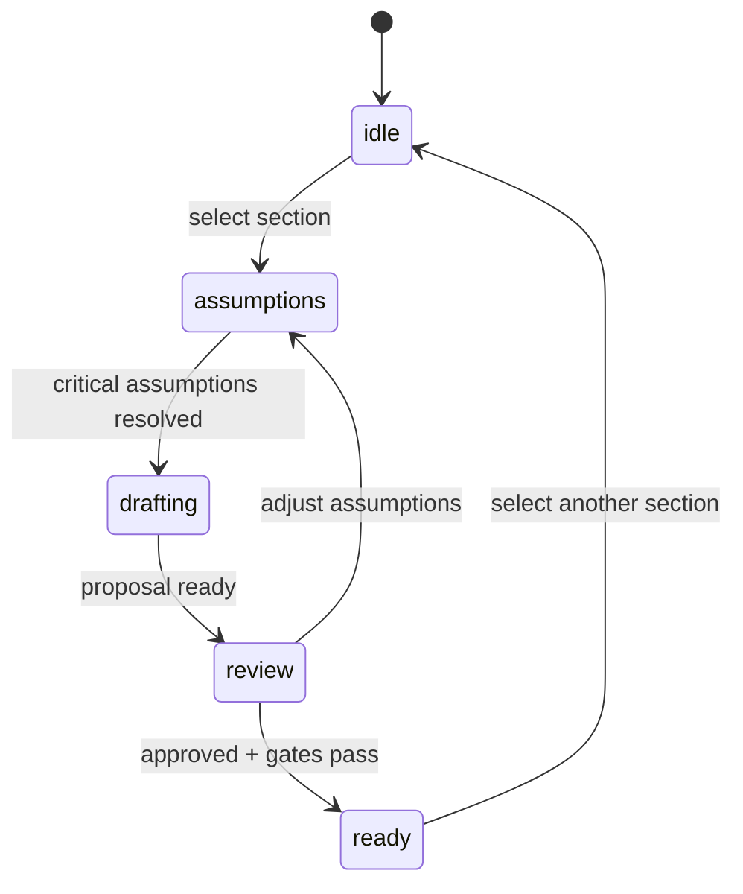
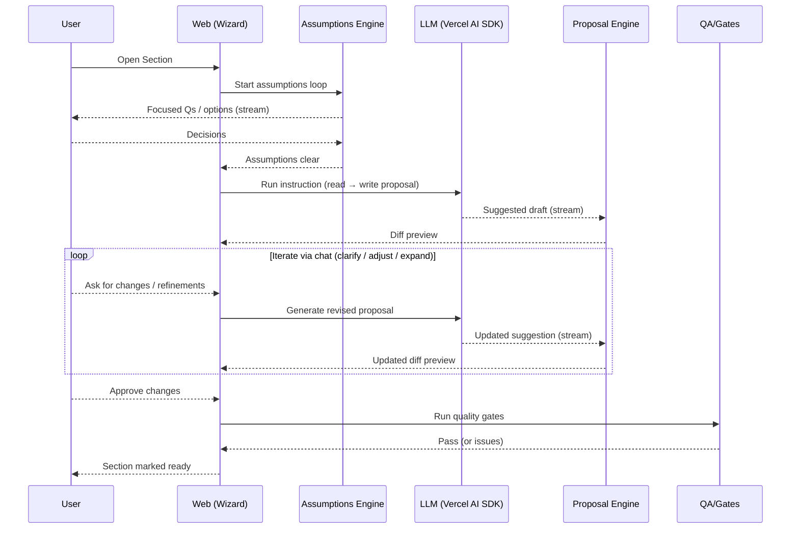

# CRTL FreaQ Architecture Document

## Introduction
This document outlines the overall project architecture for CRTL FreaQ, including backend systems, shared services, and non‑UI concerns. It serves as the guiding architectural blueprint for AI‑driven development, ensuring consistency and adherence to chosen patterns and technologies.

Relationship to Frontend Architecture
- Frontend specifics are documented separately in a Frontend Architecture document and must be used alongside this document for full‑stack implementation.

Starter Template or Existing Project
- Foundation: Greenfield (no starter; scaffold per PRD).

Compliance/SLO Stance
- MVP: Follow PRD NFRs; no regulated PII; SOC 2 is aspirational.
- Phase 2: Plan for SOC 2 alignment and stronger SLOs; introduce AWS serverless and managed services per PRD.

Terminology & Conventions
- When referring to a specific document, suffix with the word “document” (e.g., “Architecture document”, “PRD document”).

Change Log
| Date       | Version | Description                       | Author |
|------------|---------|-----------------------------------|--------|
| 2025-09-11 | 0.3     | Remove MCP from MVP; add Spec Kit export flow; terminology updates | Architect |
| 2025-09-09 | 0.1     | Initial architecture draft (MVP)  | Architect |
| 2025-09-10 | 0.2     | Add Projects-lite MVP architecture (personal project) | Architect |

## High Level Architecture

### Technical Summary
CRTL FreaQ MVP runs locally with a modular monorepo: a SvelteKit web app authenticated via Clerk. The UI provides a guided Architecture document authoring flow with section‑aware conversational co‑authoring and diff‑based approvals. LLM integration uses the Vercel AI SDK (OpenAI). Responses stream to the UI via Node streams/SSE for near real‑time UX. Phase 2 targets adding an MCP read service alongside AWS serverless (API Gateway + Lambda), DynamoDB, and AWS Lambda Response Streaming over HTTPS while retaining the same logical component boundaries.

### High Level Overview
1) Architecture style: Modular monolith (local MVP) with a web app; evolution path to serverless micro‑services and MCP read service in Phase 2.
2) Repository: Monorepo using pnpm workspaces + Turborepo (`apps/web`, `packages/*`, `docs/*`). A `services/mcp` workspace is planned for Phase 2.
3) Services: Web (authoring, chat, export). Phase 2 adds MCP (read endpoints for knowledge registry). Local DB is SQLite via an abstraction for future DynamoDB migration.
4) Core flows: User authenticates (Clerk) → authoring wizard + section‑aware chat → proposals/diffs → validates via quality gates → exports `docs/architecture.md` and shards under `docs/architecture/` → downstream tools (e.g., Spec Kit) consume exported documents. MCP reads are Phase 2.
5) Key decisions: Local‑first MVP; streaming UX; repository/data abstraction (Repository pattern) to enable DB swap; Phase 2: AWS serverless + DynamoDB + Lambda streaming + MCP read.

### High Level Project Diagram
```mermaid
graph TD
  user[User (Clerk Auth)] --> web[Web App (SvelteKit)]
  web -->|Section-aware chat (Vercel AI SDK)| openai[(OpenAI Provider)]
  web -->|Proposals/Diffs, Export| files[(docs/architecture.md + shards)]

  %% Phase 2 (dashed)
  subgraph phase2[Phase 2]
    mcp[MCP Read Service (Node/TS)] -.-> sqlite[(SQLite DB — Knowledge Registry)]
    apigw[[API Gateway]] -.-> lambda[[Lambda (MCP)]]
    lambda -.-> dynamo[(DynamoDB)]
    lambda -.->|Response Streaming| web
  end
```

### Architectural and Design Patterns
- Serverless Evolution: Start local modular services; evolve to AWS API Gateway + Lambda. Rationale: cost efficiency, scale, aligns with PRD.
- Repository Pattern: Abstract data access (SQLite → DynamoDB). Rationale: portability and testability.
- Dependency Injection/Modules: Encapsulate services and boundaries. Rationale: clearer seams, easier testing.
- REST over HTTP: Simple MCP read endpoints (deterministic JSON). Rationale: clarity and AI/agent compatibility.
- Streaming Responses: Node streams/SSE (MVP); AWS Lambda Response Streaming (Phase 2). Rationale: near real‑time UX.

## Tech Stack (Approved)

Cloud Infrastructure (Phase 2 plan)
- Provider: AWS
- Key Services: API Gateway, Lambda (Node 20), DynamoDB, SSM Parameter Store, CloudWatch
- Regions: us‑east‑1 (default)

Technology Stack Table
| Category      | Technology                | Version  | Purpose                              | Rationale |
|---------------|---------------------------|----------|--------------------------------------|-----------|
| Language      | TypeScript                | 5.4.x    | Primary language                     | Strong typing, tooling |
| Runtime       | Node.js                   | 20.x     | JS runtime (web/MCP)                 | LTS, performance |
| Web Framework | SvelteKit                 | 2.x      | Web app                              | Fast, SSR, DX |
| UI            | Tailwind CSS + Skeleton   | 3.4.x/2.x| Styling + components                  | Speed, consistency |
| Auth          | Clerk                     | latest   | Authentication (MVP)                 | Simple hosted auth |
| LLM SDK       | Vercel AI SDK             | 3.x      | Model access/streaming               | Provider abstraction |
| Database      | SQLite                    | 3.x      | Local storage (MVP)                  | Simple, embedded |
| Data Layer    | better‑sqlite3            | 9.x      | DB access/abstraction                | Fast, lightweight local DB access |
| HTTP Server   | SvelteKit/Node            | 2.x/20.x | API endpoints                        | Simplicity |
| Testing       | Vitest                    | 1.x      | Unit testing                         | Fast TS testing |
| Monorepo      | pnpm + Turborepo          | 9.x/1.x  | Workspaces + pipelines               | Speed, caching |
| CI            | GitHub Actions            | n/a      | Lint, type‑check, build              | Ubiquitous |
| Observability | Local logging (MVP); AWS CloudWatch (Phase 2) | n/a | Logs/metrics/traces                  | Simple locally; CloudWatch in Phase 2 |

## Data Models

Model: User
- Purpose: Authenticated actor and document owner via Clerk.
- Key Attributes:
  - id (string, Clerk user ID)
  - email (string)
  - name (string, optional)
  - provider (string, e.g., clerk)
  - createdAt (datetime)
- Relationships: 1‑to‑many with Document, ActivityLog, Proposal; many‑to‑many Organizations via OrganizationMembership (Phase 2).

Model: Document
- Purpose: Root entity for a project document lifecycle (Architecture is the first type).
- Key Attributes:
  - id (string/uuid)
  - ownerUserId (string, FK→User.id)
  - type (enum: architecture|prd|ui|other)
  - title (string)
  - schemaVersion (string)
  - version (string, semver)
  - status (enum: draft|ready|published)
  - templateId (string)       // e.g., 'architecture'
  - templateVersion (string)  // from YAML TemplateDocument.version
  - assumptionAggressivenessDefault (enum: conservative|balanced|yolo)
  - projectId (string/uuid, FK→Project.id)  // MVP: personal project scoping
  - createdAt, updatedAt (datetime)
- Relationships: 1‑to‑many with Section, Assumption, Citation, TraceLink, Proposal, ActivityLog.

Model: Section
- Purpose: Per‑section content unit for the Architecture document; supports hierarchical subsections.
- Key Attributes:
  - id (string/uuid)
  - docId (FK→Document.id)
  - parentSectionId (FK→Section.id, nullable)
  - key (string, e.g., introduction/high‑level/tech‑stack)
  - title (string)
  - contentMarkdown (text)
  - status (enum: draft|ready)
  - order (int)
  - depth (int, 0=root)
  - assumptionsResolved (boolean)
  - updatedAt (datetime)
  - decisionAggressivenessOverride (enum: conservative|balanced|yolo, nullable)
- Relationships: Many‑to‑one Document; optional many‑to‑one Parent Section; one‑to‑many Child Sections (0..*); 1‑to‑many Citation, Proposal; many TraceLink.
  
Constraints/Invariants
- Root sections: depth = 0 and parentSectionId = NULL
- Child sections: depth = parent.depth + 1
- Unique ordering per (docId, parentSectionId, order)

Indexes (SQLite)
- (docId, parentSectionId, order)
- (docId, depth)

Model: Assumption
- Purpose: Capture and resolve assumptions for the document or per section prior to drafting.
- Key Attributes:
  - id (string/uuid)
  - docId (FK→Document.id)
  - scope (enum: document|section)
  - sectionId (FK→Section.id, nullable when scope=document)
  - title (string)
  - intent (string)
  - status (enum: clear✅|unclear❔|unanswered❌|ambiguous❔|conflicting❔|tradeoffs❔)
  - decision (string)
  - order (int)
  - createdAt (datetime)
- Relationships: Many‑to‑one Document; optional many‑to‑one Section.

Model: KnowledgeItem
- Purpose: MCP‑queryable canonical knowledge.
- Key Attributes:
  - id (string/uuid)
  - type (enum: standard|pattern|decision)
  - title (string)
  - slug (string)
  - body (markdown/text)
  - tags (string[])
  - version (string)
  - projectId (string/uuid, FK→Project.id)  // MVP: personal project scoping
  - createdAt, updatedAt (datetime)
- Relationships: Referenced by Citation and TraceLink.

Model: Citation
- Purpose: Link section content to knowledge sources for provenance.
- Key Attributes:
  - id (string/uuid)
  - docId (FK→Document.id)
  - sectionId (FK→Section.id)
  - knowledgeId (FK→KnowledgeItem.id)
  - anchor (string, optional — section anchor/range)
  - createdAt (datetime)
- Relationships: Many‑to‑one Section, KnowledgeItem.

Model: TraceLink (Minimal)
- Purpose: Map requirement ↔ section ↔ knowledge/decision for traceability.
- Key Attributes:
  - id (string/uuid)
  - docId (FK→Document.id)
  - requirementRef (string, e.g., PRD FRx/NFRx or text)
  - sectionId (FK→Section.id)
  - knowledgeId (FK→KnowledgeItem.id, optional)
  - createdAt (datetime)
- Relationships: Many‑to‑one Section; optional KnowledgeItem.

Model: Proposal
- Purpose: Represent AI‑generated write proposals and review outcomes.
- Key Attributes:
  - id (string/uuid)
  - sectionId (FK→Section.id)
  - createdByUserId (FK→User.id)
  - diffPatch (text, unified diff/ops)
  - state (enum: proposed|applied|rejected)
  - reason (string, optional)
  - createdAt, approvedAt (datetime, optional)
- Relationships: Many‑to‑one Section, User; linked in ActivityLog.

Model: ActivityLog
- Purpose: Audit changes and important events (read/write, publish, QA).
- Key Attributes:
  - id (string/uuid)
  - actorUserId (FK→User.id, optional for system)
  - action (string enum)
  - targetType (string enum: doc|section|proposal|knowledge|qa)
  - targetId (string)
  - metadata (json)
  - createdAt (datetime)
- Relationships: Many‑to‑one User (optional), references various targets by ID.

Model: Project (MVP — Personal Project)
- Purpose: Provide a single personal project per user to scope documents and knowledge.
- Key Attributes:
  - id (string/uuid)
  - ownerUserId (FK→User.id, unique)  // enforces one project per user
  - name (string)
  - slug (string, unique)
  - createdAt, updatedAt (datetime)
- Relationships:
  - 1‑to‑many Documents (Document.projectId FK)
  - 1‑to‑many KnowledgeItems (project-scoped)
- Notes:
  - Auto-created on first login if missing; no delete in MVP; rename-only via API.
  - Backfill: For any pre-existing local documents, create the personal project on first login and backfill `projectId`; enforce NOT NULL only after backfill completes.
  - Security: Owner-only access; all Projects API routes verify `ownerUserId == session.userId`.
  
Indexes (SQLite)
- (ownerUserId) UNIQUE — enforces exactly one project per user
- (slug) UNIQUE — stable link target for dashboards

Model: Project (Phase 2)
- Purpose: Group related documents, knowledge, and collaborators under organizations with multi-project support.
- Key Attributes:
  - id (string/uuid)
  - organizationId (FK→Organization.id)
  - createdByUserId (FK→User.id)
  - name (string)
  - slug (string)
  - createdAt, updatedAt (datetime)
- Relationships:
  - Many‑to‑one Organization (owner)
  - 1‑to‑many Documents (Document.projectId FK)
  - 1‑to‑many KnowledgeItems
  - Many‑to‑many Users (collaborators) via ProjectMembership (optional)
- Notes:
  - Extends the MVP personal project model to support multiple projects per user and shared access.

Model: Organization (Phase 2)
- Purpose: Owns projects and controls membership and access.
- Key Attributes:
  - id (string/uuid)
  - name (string)
  - slug (string)
  - createdAt, updatedAt (datetime)
- Relationships:
  - 1‑to‑many Projects
  - Many‑to‑many Users via OrganizationMembership

Model: OrganizationMembership (Phase 2)
- Purpose: Join table for Users in Organizations with roles.
- Key Attributes:
  - id (string/uuid)
  - organizationId (FK→Organization.id)
  - userId (FK→User.id)
  - role (enum: owner|admin|member)
  - createdAt (datetime)
- Relationships: Many‑to‑one Organization; many‑to‑one User.

Notes on Access Control (Phase 2)
- Organization membership governs access to Projects and their Documents.
- Optional ProjectMembership can grant finer‑grained per‑project roles if needed; otherwise inherit from OrganizationMembership.

## Components

### apps/web — Web Application (SvelteKit)
- Responsibilities: Authentication, document authoring, assumptions resolution, section‑aware chat (read/write proposals), QA/traceability, export, collaboration indicators, streaming UX.
  - Projects‑lite (MVP): personal project bootstrap on first login; track `activeProjectId` in session; expose minimal Projects API (GET list/detail; PATCH rename) with owner‑only guards.
- Key Modules:
  - Auth (Clerk): login/logout, session, user profile fetch; gate authoring routes.
  - Document Authoring: document UI; section status; form validation; save/resume.
  - Assumptions Engine: per‑section assumption lifecycle (status, Q&A/options, approvals); stores on Section/Assumption models.
  - Assumptions Policy Controls: document‑level aggressiveness selector (Conservative/Balanced/YOLO) and per‑section override.
  - Context Builder: composes section + knowledge context; token budgeting; redaction; section/doc IDs.
  - Chat Orchestrator: routes requests to LLM SDK; read mode (explain/outline/suggest) and write proposals mode (diffs).
  - Document Chat (QA Panel): global chat about the entire document; supports narrowing context to selected TOC sections and toggling inclusion of knowledge registry; shows citations that deep‑link to sections; maintains per‑document chat history.
  - Proposal Engine: generates unified diff/ops; preview; apply/decline with reason; updates Section + Changelog and emits ActivityLog.
  - QA & Traceability: runs quality gates; maintains TraceLink; renders citations/back‑links; publish gating.
  - Exporter: writes `docs/architecture.md` and shards under `docs/architecture/*.md`; idempotent diff.
  - Collaboration Indicators: lightweight section “editing by <user>” and conflict warnings.
  - Streaming Client: stream rendering with Node/Web Streams or SSE; TTF first chunk <300ms target.
  - Local Store: better‑sqlite3 access via shared data layer; migrations; transactions.
- External Deps: Clerk, Vercel AI SDK, better‑sqlite3.
 
TOC Interactions
- Checkbox‑select sections to include in Document Chat context; “Chat about selected” action opens/updates the QA panel with those sections.
- Status badges per section (idle, assumptions, drafting, review, ready); filter/search TOC to locate sections quickly.
- Clicking a citation in Document Chat scrolls the document to the referenced section and highlights the cited range (when available).

Routing Table (MVP)
| Route | Guard | Purpose |
|------|-------|---------|
| `/login` | Public | Clerk login page |
| `/author` | Auth (Clerk) | TOC + full document view; create/open document |
| `/author/doc/[docId]` | Auth (Clerk) | Load specific document; deep-link to sections |
| `/api/v1/**` | Auth + anti‑CSRF | Authoring API (local) |
| `/api/v1/projects` and `/api/v1/projects/:id` | Auth (owner‑only) | Projects API: list (single), detail, PATCH rename |

Projects (MVP) — Session & Bootstrap
- Session stores `activeProjectId`; set on login to the user’s personal project.
- First‑login bootstrap:
  1) Lookup by `ownerUserId`; if none, create project; retry on unique‑constraint race.
  2) Set `activeProjectId` in session; return to UI with project preselected.
- UI surfaces current project in sidebar and Dashboard list; rename allowed via PATCH.
- Observability: include `projectId` in logs/audit for authoring and knowledge operations.
 
Validation & NFRs (MVP)
- Slug uniqueness per project; validate on rename; return updated entity after PATCH.
- Idempotent rename operations; repeated requests yield the same stored state.
- Performance: Single-row lookups by `ownerUserId`; ensure indexes on (`ownerUserId`) and (`slug`).

Authoring Wizard — State Diagram


### services/mcp — MCP Read Service (Node/TS) [Phase 2]
- Responsibilities: Expose deterministic read APIs over HTTP for knowledge registry; structured JSON responses for agents/LLMs; apply project scoping (Phase 2).
- Key Modules:
  - HTTP Controllers: `GET /knowledge`, `GET /knowledge/{id}`; validation and error mapping.
  - Knowledge Repository: CRUD for KnowledgeItem using better‑sqlite3 via shared data layer.
  - Project Scoping (Phase 2): filter knowledge queries by `projectId` derived from caller identity/session (activeProjectId).
  - Schemas/DTOs: zod/json‑schema for requests/responses; versioned.
  - Observability: structured logs (requestId, userId), basic counters; audit events per read.
  - Auth (MVP): optional session/API‑key passthrough; Phase 2 integrate Clerk/JWT or API Gateway auth.
- External Deps: better‑sqlite3, zod, pino (or equivalent).

### packages/shared-data — Data Layer (better‑sqlite3)
- Responsibilities: Provide repository interfaces for Document, Section, Assumption, KnowledgeItem, Citation, TraceLink, Proposal, ActivityLog; hide DB specifics.
- Features: migrations bootstrap; connection pooling (as needed for better‑sqlite3); transactions; indexes per Data Models section; invariants (e.g., Section depth/order).
- Dynamo‑Friendly Constraints (applied now to ease Phase 2 migration):
  - No cross‑entity JOINs in repositories; compose in app layer.
  - Avoid table scans/LIKE queries; all reads go through key‑based access patterns with pagination.
  - Repository methods accept explicit pagination (limit + cursor) and projection fields.
  - Prefer write‑amplification over read‑amplification when needed (maintain derived keys).
  - Enforce unique ordering per parent in code (mirrors composite sort keys later).
- Interfaces (examples):
  - `Documents.getById(id): Document`
  - `Sections.listByDoc(docId, parentSectionId?): Section[]`
  - `Knowledge.searchByType(type, q?, limit?): KnowledgeItem[]`
  - `Trace.add(link: TraceLink): void`

### packages/shared-types — Types & Schemas
- Responsibilities: Centralize TS types, zod schemas, and API contracts used by both apps/web and services/mcp.
- Contents: model types; API request/response types; error envelopes; quality gates definitions.

### packages/templates — Template Loader & Validator
- Responsibilities: Parse YAML templates (architecture/prd/brief), validate structure, expose typed TemplateDocument/TemplateSection trees with defaults.
- Features: load from `templates/*.yaml`; expose `getTemplate('architecture')`; validate `version` and provide migration hints.

### packages/ai — LLM Integration (Vercel AI SDK)
- Responsibilities: Wrap ai‑sdk with configured provider; expose read (analysis/suggest) and write‑proposal helpers; streaming helpers.
- APIs (examples):
  - `ai.explain(context): Stream<TextChunk>`
  - `ai.suggestOutline(context): Stream<TextChunk>`
  - `ai.proposeEdits(context, draft): Stream<Diff>`
- Notes: Do not store secrets in repo; use env for keys.

### packages/qa — Quality Gates & Evaluation
- Responsibilities: Define/runtimes for gates (blocker/non‑blocker); export QA snapshot; optional small eval harness for MCP precision.
- Outputs: pass/fail report; JSON snapshot attached to publish; metrics counters.

### packages/exporter — Markdown Export
- Responsibilities: Deterministic rendering for full doc and shards; include version header, schema version, changelog; idempotent output.
- Paths: `docs/architecture.md`, `docs/architecture/*.md`.

### Cross‑Cutting Concerns
- Error Handling: Standard error envelope `{ code, message, details?, requestId }`; user‑friendly messages in UI; log stack traces server‑side.
- Logging: Pino (or console structured) in MVP; requestId propagation; redact secrets.
- Security: Clerk session on web; API key/session passthrough to MCP (MVP); Phase 2 JWT/API Gateway auth.
- Streaming: Use Web Streams/SSE in MVP; Phase 2: AWS Lambda Response Streaming over HTTPS.
- Performance: Client P95 <3s; server P95 ≤300ms; TTFMP ≤2s; streaming for long generations.

### Observability Targets & Timers (MVP)
- Provisional targets (local):
  - Chat time-to-first-token (TTF): P95 < 500ms; proposal generation duration: P95 < 3s (section-sized prompts)
  - Server error rate: ≤ 1% (authoring endpoints)
  - MCP reads latency: P95 ≤ 100ms (local)
- Logging timers:
  - Record `ms` for: chat:read end-to-end, proposals:generate duration, gates:run duration, export duration
  - Include `requestId`, `userId` (if available), endpoint, and sizes (prompt chars, tokens if available)

## Service Locator & Factories

Goals
- Avoid singletons and tight coupling. Provide a per‑request context (locator) that resolves services (db, repos, ai client, logger) via factory methods. Improves testability and enables per‑request configuration (requestId, timeouts, user identity).

Design
- Locator interface (example):
```ts
interface Locator {
  requestId: string;
  logger: Logger;
  db(): DbHandle;                         // returns a connection scoped handle (better‑sqlite3)
  repos(): {
    documents: DocumentsRepo;
    sections: SectionsRepo;
    assumptions: AssumptionsRepo;
    knowledge: KnowledgeRepo;
    trace: TraceRepo;
    proposals: ProposalsRepo;
    activity: ActivityRepo;
  };
  ai(opts?: { model?: string; temperature?: number }): AiClient; // Vercel AI SDK wrapper
  session(): Promise<{ userId: string; email?: string }>;        // Clerk session
}
```

- Construction:
  - Build a base app locator with static factories (config‑driven) at startup.
  - Per request, derive a child locator with `requestId`, `userId`, and any overrides (timeouts, model selection).

- Usage:
  - Controllers accept `locator` as the first param or retrieve from request context.
  - Services and repositories receive explicit dependencies from the locator (e.g., `service(locator.repos(), locator.ai())`).

- Testing:
  - Provide a test locator that returns fakes/mocks (in‑memory repos, fake AI client) without altering production code.

Source Tree
- packages/locator
  - `src/index.ts` — Locator interface and factory types
  - `src/node.ts` — Node/SvelteKit implementation to derive per‑request locators
  - `src/test.ts` — test locator helpers and fakes

### Phase 2 Data Mapping (DynamoDB Plan)
- Single‑table design with `pk`, `sk`, and `entity` type; additional GSIs for common lookups. MVP SQLite simulates patterns with indexes and key‑first queries.
- Primary Access Patterns
  - List a document's sections in order, by parent
  - Fetch a section's children
  - Lookup knowledge by type and slug/id
  - List trace links for a document
  - List assumptions for a section (ordered)
  - List proposals for a section (recent first)
  - List activity for a document and by user
- Key Design (illustrative)
  - Document: pk=`PROJ#{projectId}`, sk=`DOC#{docId}`
  - Section: pk=`DOC#{docId}`, sk=`SEC#{parentSectionId|ROOT}#${order}#${sectionId}` (enables ordered children); GSI1 pk=`PAR#{parentSectionId}`, sk=`ORD#${order}`
  - Assumption: pk=`SEC#{sectionId}`, sk=`ASM#${order}`
  - KnowledgeItem: pk=`KNOW#{type}`, sk=`SLUG#${slug}#${id}`; GSI1 pk=`KNOWID#${id}`, sk=`TYPE#${type}`
  - Citation: pk=`DOC#{docId}`, sk=`CIT#${sectionId}#${knowledgeId}`
  - TraceLink: pk=`DOC#{docId}`, sk=`TRC#${sectionId}#${knowledgeId}`
  - Proposal: pk=`SEC#{sectionId}`, sk=`PRP#${createdAt}#${proposalId}`; GSI1 pk=`DOC#{docId}`, sk=`PRP#${createdAt}`
  - ActivityLog: pk=`DOC#{docId}`, sk=`ACT#${timestamp}#${id}`; GSI1 pk=`USR#{userId}`, sk=`ACT#${timestamp}`
- Query Rules
  - Always query by pk (never Scan); use begins_with on `sk` for ranges.
  - Use GSIs for secondary lookups only when required; design early to cover access patterns.
  - Use optimistic concurrency (version on Document/Section) for write safety.

### Template Migration (Phase 2)
- Detection: On document open, compare `Document.templateId/templateVersion` to current YAML `TemplateDocument.version`.
- Strategy: If versions differ, compute a migration plan:
  - Map section keys (template `id`) from old → new; flag renamed/removed/added sections.
  - Preserve user content; only move/rename containers; never delete content without explicit confirmation.
  - Generate a preview: before/after TOC and a list of impacted sections.
- Execution:
  - Apply structural changes (rename/move sections), keep markdown intact.
  - For new required fields, create TODO placeholders and add blockers to quality gates until filled.
  - Record `previousTemplateVersion` in Document metadata; bump `templateVersion` to new.
- Rollback: Allow one-click revert to the pre-migration snapshot.
- Audit: Log ActivityLog entry with summary and counts (moved/added/renamed/flagged).

## Core Authoring Workflow (MVP Focus)

Purpose
- The MVP’s primary objective is to guide the user to create and manage the Architecture document section‑by‑section with AI assistance. The MCP server is secondary and non‑blocking.

Overview
1) Load Template: App loads the Architecture template from repository YAML (e.g., `templates/architecture.yaml`). If absent, seed from `.bmad-core/templates/architecture-tmpl.yaml` and persist as `templates/architecture.yaml` for ongoing source‑of‑truth editing.
2) Document‑Level Assumptions: Run a top‑level assumptions loop for the entire document (scope = document) to establish global decisions (e.g., starter vs. greenfield, compliance stance, streaming, db strategy). These decisions seed section flows.
3) Render TOC: Build a table‑of‑contents (sections and sub‑sections) with per‑section status badges (idle, assumptions, drafting, review, ready).
4) Render Document: Below the TOC, render the full document with placeholders where content is missing and current content where present.
5) Resolve Section Assumptions: Before drafting each section, run a comprehensive assumptions loop (status, intent, decision) until clear or explicitly skipped. Section decisions may override document‑level defaults where relevant.
6) Run Instructions: Execute the section’s instructions via AI in read (explain/suggest) and write‑proposal modes; stream output; present diffs for approval.
7) Review + Iterate: Before approval, the user may chat with the AI to clarify, adjust, or expand the draft and request new proposals; upon approval, apply changes, record citations/trace links, re‑run gates, and update statuses.
8) Export: Idempotently export to `docs/architecture.md` and shards `docs/architecture/*.md` on publish.

State Machine (per Section)
- States: `idle → assumptions → drafting → review → ready`
- Transitions:
  - idle→assumptions: user selects section; begins assumptions mode
  - assumptions→drafting: all critical assumptions clear or explicitly skipped
  - drafting→review: write proposal generated; diff ready
  - review→ready: user approves; content applied; gates pass
  - review→assumptions: user adjusts assumptions and retries (loop)

Sequence (authoring a section)


Additional Sequences

Open/Update Existing Document
```mermaid
sequenceDiagram
  participant U as User
  participant W as Web (Wizard)
  participant D as DB (SQLite)
  U->>W: Open document
  W->>D: Load Document + Sections (ordered)
  D-->>W: Document meta + Section tree
  W-->>U: Render TOC + full document
  U->>W: Select section to edit
  W-->>U: Show current content + status
  U->>W: Request improvements (chat/proposal)
  W-->>U: Show diff preview
  U->>W: Approve changes
  W->>D: Update Section content + metadata
  D-->>W: OK (row_version++)
  W-->>U: Re-render section; status updated
```

Publish/Export
```mermaid
sequenceDiagram
  participant U as User
  participant W as Web (Wizard)
  participant Q as QA/Gates
  participant X as Exporter
  U->>W: Publish Architecture
  W->>Q: Run quality gates (blockers/non-blockers)
  Q-->>W: Results (pass or blockers)
  alt Pass
    W->>X: Export full + shards
    X-->>W: Wrote files + unchanged list
    W-->>U: Publish complete; links to diffs
  else Blockers
    W-->>U: Show issues; navigate to sections
  end
```

Template & Section Schema (UI contracts)
```ts
// Template document (root) — subset capturing defaults
interface TemplateDocument {
  id: string;                 // template id
  title: string;              // template name
  version: string;            // template version (from YAML)
  assumptions?: {             // document‑level assumptions
    assertions?: string[];
    checklist?: string[];
    guidance?: string;
  };
  decisionAggressivenessDefault?: 'conservative'|'balanced'|'yolo';
  sections: TemplateSection[];
}

// Template section (subset of architecture-tmpl.yaml semantics)
interface TemplateSection {
  id: string;                 // e.g., "introduction", "high-level-architecture"
  title?: string;             // may contain expressions
  version?: string;           // optional per‑section template version marker
  assumptions?: {
    assertions?: string[];
    checklist?: string[];
    guidance?: string;        // used to frame the assumptions loop
  };
  instruction?: string;       // guidance for drafting content
  content?: string;           // fixed content when provided
  sections?: TemplateSection[]; // nested sub-sections
  condition?: string;         // optional display condition
  type?: 'paragraphs'|'bullet-list'|'numbered-list'|'table'|'mermaid'|'custom';
  decisionAggressivenessDefault?: 'conservative'|'balanced'|'yolo'; // optional override per section
}

// Runtime section instance persisted in DB
interface SectionInstance {
  id: string;                 // UUID
  docId: string;
  parentSectionId?: string;
  key: string;                // template.id
  title: string;              // resolved
  contentMarkdown: string;    // user/AI authored
  status: 'idle'|'assumptions'|'drafting'|'review'|'ready';
  order: number;
  depth: number;              // 0=root
  assumptionsResolved: boolean;
  decisionAggressiveness?: 'conservative'|'balanced'|'yolo'; // resolved effective policy
}
```

Assumptions Resolution (UX rules)
- Per assumption show: status, intent, decision; loop with focused Qs or up to 3 options; explicit approvals.
- Use concise, streaming responses; capture final ordered list to metadata; do not proceed without critical assumptions resolved.
- Mirrors the rules in `.bmad-core/tasks/create-doc.md`.

MCP Positioning (MVP)
- MCP read endpoints are useful for agents but are secondary. Authoring flow must work entirely locally without MCP.

### Assumption Resolution Policy (Aggressiveness)

Modes
- Conservative: AI never finalizes non‑trivial assumptions; always asks; presents up to 3 options with pros/cons and waits for explicit user choice.
- Balanced: AI auto‑resolves low‑risk assumptions with clear dominance; asks for ambiguous/trade‑off cases; summarizes auto decisions for review.
- YOLO: AI decides by default using project context; surfaces key decisions and allows one‑click adjustments; logs rationale and enables quick revert.

Defaults & Overrides
- The template defines `decisionAggressivenessDefault` at the document level; each section may optionally define its own default.
- The user can adjust the document‑wide default at any time; sections inherit unless they specify an override or the user adjusts per‑section.
- Example: Introduction inherits the document default; High Level Architecture defaults to Conservative regardless of document default.

UI Controls
- Document toolbar: Aggressiveness selector (Conservative | Balanced | YOLO) with helper text and link to preferences.
- Section header: Optional override dropdown showing effective policy; reset to inherit.
- Audit: Record policy used for each assumption decision in ActivityLog.

## Source Tree

Monorepo (root)
- `package.json` — scripts, workspace tooling (pnpm, turbo)
- `pnpm-workspace.yaml` — workspaces: apps/*, services/*, packages/*
- `turbo.json` — pipeline (lint, typecheck, build, test)
- `tsconfig.base.json` — base TS config with project references
- `.github/workflows/ci.yml` — lint/typecheck/build on PR and main
- `.env.example` — `CLERK_*`, `OPENAI_API_KEY`, `DB_PATH=./.data/dev.sqlite`
- `.editorconfig`, `.nvmrc`, `.prettier*`, `eslint.config.*`
- `docs/` — architecture.md + shards, prd.md, brief.md
- `templates/` — source‑of‑truth YAML templates: `architecture.yaml`, `prd.yaml`, `brief.yaml`

apps/web (SvelteKit)
- `src/app.d.ts` — ambient types
- `src/routes/+layout.svelte` — app chrome, auth gate
- `src/routes/(app)/author/+page.svelte` — TOC + document render
- `src/routes/api/v1/documents/+server.ts` — POST create; GET list (optional)
- `src/routes/api/v1/documents/[docId]/+server.ts` — GET/PATCH document meta
- `src/routes/api/v1/documents/[docId]/sections/+server.ts` — GET list sections
- `src/routes/api/v1/sections/[sectionId]/+server.ts` — GET/PATCH section
- `src/routes/api/v1/documents/[docId]/assumptions/resolve/+server.ts` — POST resolve
- `src/routes/api/v1/sections/[sectionId]/chat.read/+server.ts` — POST (SSE)
- `src/routes/api/v1/sections/[sectionId]/proposals.generate/+server.ts` — POST (SSE)
- `src/routes/api/v1/proposals/[proposalId]/apply/+server.ts` — POST
- `src/routes/api/v1/proposals/[proposalId]/reject/+server.ts` — POST
- `src/routes/api/v1/documents/[docId]/gates.run/+server.ts` — POST
- `src/routes/api/v1/documents/[docId]/export/+server.ts` — POST
- `src/routes/(app)/login/+page.svelte` — Clerk login
- `src/lib/components/` — UI components (TOC, AssumptionsPanel, DiffViewer, GateResults)
- `src/lib/features/assumptions/` — assumptions engine UI logic
- `src/lib/features/authoring/` — wizard/section state machine
- `src/lib/features/chat/` — section‑aware chat orchestrator (read/write proposals)
- `src/lib/features/chat/document-chat.svelte` — global document QA panel (context selection from TOC, citations)
- `src/lib/features/exporter/` — trigger exports, progress UI
- `src/lib/features/qa/` — quality gates UI
- `src/lib/streaming/` — Web Streams/SSE client helpers
- `src/lib/api/` — typed client for MCP and local services
- `src/lib/store/` — local stores (Svelte) and query cache
- `src/lib/styles/` — Tailwind/Skeleton setup

services/mcp (Node/TS)
- `src/index.ts` — HTTP server bootstrap
- `src/routes/knowledge.ts` — defines routes `/v1/knowledge` and `/{id}`
- `src/controllers/knowledge-controller.ts`
- `src/schemas/knowledge.ts` — zod/json‑schema for request/response
- `src/repos/knowledge-repo.ts` — uses shared‑data
- `src/middleware/{error,request-id,logger}.ts`
- `src/config.ts` — env parsing
- `test/` — unit test stubs (Vitest)

packages/shared-data (better‑sqlite3)
- `src/db.ts` — connection, migrations bootstrap
- `src/migrations/*` — SQL migrations (idempotent)
- `src/repositories/{documents,sections,assumptions,knowledge,citations,trace,proposals,activity}.ts`
- `src/index.ts` — exports repository interfaces
- `README.md` — access patterns and pagination rules

packages/shared-types
- `src/models.ts` — Document, Section, Assumption, KnowledgeItem, …
- `src/api.ts` — REST types (KnowledgeItem, Page<T>, ErrorEnvelope)
- `src/schemas.ts` — zod schemas for validation

packages/ai
- `src/provider.ts` — Vercel AI SDK wrapper
- `src/streams.ts` — streaming helpers (Node/Web Streams)
- `src/index.ts` — high‑level helpers (explain/suggest/proposeEdits)

packages/qa
- `src/gates.ts` — blocker/non‑blocker definitions
- `src/run-gates.ts` — engine; returns structured results + snapshot

packages/exporter
- `src/full.ts` — render full `docs/architecture.md`
- `src/shards.ts` — render `docs/architecture/*.md`
- `src/index.ts` — idempotent export orchestrator

Naming & Conventions
- Folders/files: kebab‑case; React/Svelte components in PascalCase.svelte
- TS strict mode; ESM modules
- Env: `.env.local` for dev; never commit secrets
- Tests: Vitest per package under `test/`

Root Scripts (package.json)
- `dev:web` — run SvelteKit dev server
- `dev:mcp` — run MCP HTTP server
- `dev` — concurrently run web + mcp
- `typecheck` — tsc ‑‑build ‑‑pretty false
- `lint` — eslint .
- `build` — turbo run build
- `test` — turbo run test

## Error Handling Strategy

Principles
- Do not leak internal details or stack traces to clients; include a `requestId` for correlation.
- Use a standard error envelope for APIs: `{ code, message, details?, requestId? }`.
- Normalize validation/auth/NOT FOUND/TOO MANY REQUESTS/INTERNAL errors to stable `code` values.
- Log at source with structured fields; propagate `requestId` across layers.
- Prefer fast‑fail with actionable user messages in UI; offer retry where appropriate.

Canonical Error Codes
- `bad_request` — invalid parameters, schema violations
- `unauthorized` — user not authenticated
- `forbidden` — authenticated but not allowed
- `not_found` — resource missing
- `conflict` — optimistic concurrency/version mismatch
- `rate_limited` — too many requests (Phase 2)
- `internal_error` — unexpected server error

Server Error Mapping (services/mcp)
```ts
// middleware/error.ts
import type { ErrorRequestHandler } from 'express';

class HttpError extends Error { constructor(public status: number, public code: string, msg: string, public details?: any){ super(msg);} }

export const errorHandler: ErrorRequestHandler = (err, req, res, _next) => {
  const requestId = req.headers['x-request-id'] as string | undefined;
  let status = 500, code = 'internal_error', message = 'Unexpected error';
  if (err instanceof HttpError) { status = err.status; code = err.code; message = err.message; }
  else if (err.name === 'ZodError') { status = 400; code = 'bad_request'; message = 'Invalid request'; }
  // Log server-side with stack
  req.log?.error({ requestId, code, status, err }, 'request failed');
  res.status(status).json({ code, message, details: process.env.NODE_ENV==='development'?err.details:undefined, requestId });
};
```

Controller Example
```ts
// controllers/knowledge-controller.ts
import { z } from 'zod';
const Q = z.object({ type: z.enum(['standard','pattern','decision']), q: z.string().optional(), limit: z.number().int().min(1).max(100).optional(), cursor: z.string().optional() });

export async function listKnowledge(req, res, next){
  try {
    const { type, q, limit, cursor } = Q.parse(req.query);
    const page = await repos.knowledge.list({ type, q, limit, cursor });
    res.json(page);
  } catch (err) { next(err); }
}
```

Client/UI Handling (SvelteKit)
```ts
// src/lib/api/client.ts
export type ApiError = { code: string; message: string; requestId?: string };

export async function api<T>(path: string, init?: RequestInit): Promise<T> {
  const r = await fetch(path, { ...init, headers: { 'accept': 'application/json', ...(init?.headers||{}) }});
  if (!r.ok) {
    const e = await r.json().catch(() => ({}));
    throw <ApiError>{ code: e.code || 'internal_error', message: e.message || 'Request failed', requestId: e.requestId };
  }
  return r.json() as Promise<T>;
}
```

Streaming Error Handling
- Display partial output as it arrives; if the stream aborts, show a toast with a friendly message and log the `requestId` if available.
- For proposal generation, keep the last good diff; allow retry without losing user input.

Example (client)
```ts
// src/lib/streaming/read.ts
export async function streamText(url: string, onChunk: (t: string)=>void) {
  const r = await fetch(url);
  if (!r.body) throw { code: 'internal_error', message: 'No response body' };
  const reader = r.body.getReader();
  const dec = new TextDecoder();
  try {
    while (true) { const { value, done } = await reader.read(); if (done) break; onChunk(dec.decode(value, { stream: true })); }
  } catch (e) { throw { code: 'internal_error', message: 'Stream interrupted' }; }
}
```

Validation Errors (UI)
- Highlight invalid fields inline; show a summary at top of the section.
- Block publish on blockers; allow save as draft with warnings for non‑blockers.

Optimistic Concurrency (Phase 2)
- Include `version` on Document/Section writes; if mismatch, return `409 conflict` with latest version pointer; UI offers merge.

Auth Errors
- MVP: Minimal; Phase 2: on 401/403, redirect to login and show message "You don’t have access to this resource." Keep `requestId` for support.

## REST API Specification — MCP Read (MVP)

Conventions
- Base Path: `/v1`
- Auth: None (local dev); Phase 2: Clerk/JWT or API Gateway authorizer
- Content-Type: `application/json; charset=utf-8`
- Pagination: Cursor-based (`limit`, `cursor`); no totals (Dynamo-friendly)
- Errors: Standard envelope `{ code: string, message: string, details?: any, requestId?: string }`
- Determinism: Field order and shapes are stable and documented; no extraneous properties

Types (TypeScript)
```ts
type KnowledgeType = 'standard' | 'pattern' | 'decision';

interface KnowledgeItem {
  id: string;
  type: KnowledgeType;
  title: string;
  slug: string;
  body: string;       // markdown/text
  tags: string[];
  version: string;    // semver or doc version
  createdAt: string;  // ISO-8601
  updatedAt: string;  // ISO-8601
}

interface Page<T> {
  items: T[];
  nextCursor?: string;
}

interface ErrorEnvelope {
  code: string;
  message: string;
  details?: any;
  requestId?: string;
}
```

Endpoints

GET /v1/knowledge
- Purpose: List knowledge items by type with optional prefix search
- Query Params:
  - `type` (required): `standard|pattern|decision`
  - `q` (optional): string; prefix match on `title` or `slug` (case-insensitive); repository ensures key-based pattern
  - `limit` (optional): integer 1..100; default 25
  - `cursor` (optional): opaque string from previous response
- Responses:
  - 200: `Page<KnowledgeItem>`
  - 400: `ErrorEnvelope` (invalid params)
  - 500: `ErrorEnvelope`

Example 200
```json
{
  "items": [
    {
      "id": "kn-std-001",
      "type": "standard",
      "title": "Coding Standards",
      "slug": "coding-standards",
      "body": "# Standards...",
      "tags": ["typescript", "style"],
      "version": "1.0.0",
      "createdAt": "2025-09-09T15:00:00Z",
      "updatedAt": "2025-09-09T15:00:00Z"
    }
  ],
  "nextCursor": "eyJvZmZzZXQiOiAiS04tU1RELTAwMSJ9"
}
```

GET /v1/knowledge/{id}
- Purpose: Retrieve a single knowledge item by ID
- Path Params: `id` (string)
- Responses:
  - 200: `KnowledgeItem`
  - 404: `ErrorEnvelope` (not found)
  - 500: `ErrorEnvelope`

Validation & Limits
- Enforce `type` enum and `limit` bounds; reject invalid `cursor` values.
- `q` must be sanitized; repository maps to key-prefix queries (avoid scans).

Error Semantics
- `code` examples: `bad_request`, `not_found`, `internal_error`
- Include `requestId` for correlation in logs.

Phase 2 (Planned additions)
- GET `/v1/documents/{docId}` — fetch document metadata
- GET `/v1/documents/{docId}/sections` — list top-level sections ordered
- GET `/v1/documents/{docId}/sections/{sectionId}` — fetch a section with citations/trace links
- GET `/v1/documents/{docId}/trace` — list trace links for the document

## Authoring API (Local App, MVP)

Scope
- These endpoints power the UI authoring workflow: create/open/save documents, run assumptions, generate proposals, apply changes, run gates, and export. In MVP they live inside the SvelteKit app under `/api/v1/*`. Auth via Clerk; CSRF protection via SvelteKit forms or headers.

Conventions
- Base Path: `/api/v1`
- Auth: Clerk session (MVP)
- Content-Type: `application/json; charset=utf-8`
- Errors: Standard envelope `{ code, message, details?, requestId? }`
- Streaming: SSE `text/event-stream` for chat/proposal generation

Types (selected)
```ts
type Aggressiveness = 'conservative'|'balanced'|'yolo';

interface DocumentMeta {
  id: string;
  type: 'architecture';
  title: string;
  templateId: string;
  templateVersion: string;
  schemaVersion: string;
  version: string;
  status: 'draft'|'ready'|'published';
  assumptionAggressivenessDefault: Aggressiveness;
}

interface SectionSummary { id: string; parentSectionId?: string; key: string; title: string; status: 'idle'|'assumptions'|'drafting'|'review'|'ready'; order: number; depth: number; assumptionsResolved: boolean; }

interface AssumptionItem { id: string; scope: 'document'|'section'; sectionId?: string; title: string; intent: string; status: 'clear'|'unclear'|'unanswered'|'ambiguous'|'conflicting'|'tradeoffs'; decision: string; order: number; }

interface Proposal { id: string; sectionId: string; state: 'proposed'|'applied'|'rejected'; diffPatch: string; reason?: string; createdAt: string; }
```

Documents
- POST `/api/v1/documents`
  - Body: `{ type: 'architecture', title: string }`
  - 201: `DocumentMeta`
- GET `/api/v1/documents/{docId}` → `DocumentMeta`
- PATCH `/api/v1/documents/{docId}`
  - Body: partial `DocumentMeta` (e.g., `assumptionAggressivenessDefault`)
  - 200: `DocumentMeta`

Sections
- GET `/api/v1/documents/{docId}/sections` → `SectionSummary[]` (ordered by parent/order)
- GET `/api/v1/sections/{sectionId}` → `{ meta: SectionSummary, contentMarkdown: string }`
- PATCH `/api/v1/sections/{sectionId}`
  - Body: `{ title?, contentMarkdown?, status?, decisionAggressivenessOverride? }`
  - 200: `SectionSummary`

Assumptions
- GET `/api/v1/documents/{docId}/assumptions?scope=document|section&sectionId?` → `AssumptionItem[]`
- POST `/api/v1/documents/{docId}/assumptions/resolve`
  - Body: `{ scope: 'document'|'section', sectionId?, decisions: Array<{ id: string, decision: string }> }`
  - 200: `{ updated: AssumptionItem[] }`

Chat (Read‑only analysis)
- POST `/api/v1/sections/{sectionId}/chat:read` (SSE)
  - Body: `{ prompt: string, history?: ChatMessage[], threadId?: string }`
    - `ChatMessage = { id?: string, role: 'user'|'assistant'|'system', content: string }`
  - Stream events: `token` (partial text), `done { messageId }`
  - Behavior: UI maintains local history; to “reply”, send another request including updated history + new prompt.

Proposals (Write intents)
- POST `/api/v1/sections/{sectionId}/proposals:generate` (SSE)
  - Body: `{ mode: 'improve'|'expand'|'clarify'|'applyTemplate', notes?: string, history?: ChatMessage[], threadId?: string }`
  - Stream events: `token` (proposal text), `diff` (periodic unified diff), `done { proposalId }`, `error`

Document Chat (QA)
- POST `/api/v1/documents/{docId}/chat:read` (SSE)
  - Purpose: Ask questions about the document as a whole (explain, find gaps, challenge decisions, summarize), with citations to sections/knowledge.
  - Body: `{ prompt: string, history?: ChatMessage[], threadId?: string, includeSections?: string[], includeKnowledge?: boolean, maxTokens?: number }`
  - Stream events: `token` (partial text), `done { messageId, citations?: Array<{ type: 'section'|'knowledge', id: string, range?: string }> }`
  - Behavior: Read‑only in MVP (no write proposals at document scope). “Reply” by sending another request including updated history + prompt.
- POST `/api/v1/proposals/{proposalId}:apply`
  - Body: `{ reason?: string }`
  - 200: `{ section: SectionSummary }`
- POST `/api/v1/proposals/{proposalId}:reject`
  - Body: `{ reason?: string }`
  - 200: `{ proposal: Proposal }`

Quality Gates
- POST `/api/v1/documents/{docId}/gates:run`
  - 200: `{ pass: boolean, blockers: GateIssue[], warnings: GateIssue[], snapshotId: string }`

Export
- POST `/api/v1/documents/{docId}/export`
  - Body: `{ full: 'docs/architecture.md', shards: 'docs/architecture' }`
  - 200: `{ wrote: string[], unchanged: string[] }`

Templates
- GET `/api/v1/templates/{templateId}` → current YAML (for UI preview)
- POST `/api/v1/templates/seed` → seeds `templates/architecture.yaml` from `.bmad-core` if missing (dev‑only)

Notes
- All authoring endpoints are local to the app in MVP; they may move behind API Gateway in Phase 2.
- SSE endpoints must set `Cache-Control: no-store` and heartbeat pings; clients handle retry with backoff.

### Controller Template (zod → locator → response)
```ts
// Example SvelteKit controller using zod and the Service Locator
import type { RequestHandler } from '@sveltejs/kit';
import { SomeBodySchema, SomeResponseSchema } from '@shared/schemas';
import { requireAntiCsrf } from '$lib/security/csrf';
import { createAppLocator } from '@locator/node';

export const POST: RequestHandler = async ({ request, locals }) => {
  requireAntiCsrf(request);
  if (!locals?.user) return new Response(JSON.stringify({ code: 'unauthorized', message: 'Login required' }), { status: 401 });

  const body = SomeBodySchema.parse(await request.json());

  const app = createAppLocator(/* factories */);
  const requestId = crypto.randomUUID();
  const locator = app.derive(requestId);
  const t0 = performance.now();

  const result = await someService(locator).doWork(body);
  const ms = performance.now() - t0;
  locator.logger.info({ requestId, ms }, 'someService.doWork');

  const payload = SomeResponseSchema.parse(result); // ensure output contract
  return new Response(JSON.stringify(payload), { headers: { 'content-type': 'application/json' } });
};
```

## Coding Standards

### TypeScript & General
- TS config: `"strict": true`, `"exactOptionalPropertyTypes": true`, `"noUncheckedIndexedAccess": true`, `"noImplicitOverride": true`, `"useUnknownInCatchVariables": true`, `"noFallthroughCasesInSwitch": true`.
- Types first: prefer explicit return types on exported functions; use `unknown` over `any`; narrow with zod or guards at boundaries.
- Naming: kebab-case for files/dirs; PascalCase for Svelte components and classes; camelCase for vars/functions; UPPER_SNAKE for env keys.
- Modules: ESM only; no CommonJS. Avoid default exports for shared libraries; prefer named exports.
- Imports: order as std/lib → third‑party → internal; no `../../..` ladders beyond two levels—use path aliases.
- Path aliases (tsconfig): `@types/*`, `@data/*`, `@ai/*`, `@qa/*`, `@exporter/*`, `@shared/*` → map to corresponding packages.
- Async: `async/await` preferred; never ignore promise rejections; wrap with try/catch at boundaries.

### SvelteKit (apps/web)
- Files: use route groups `(app)` to separate authed areas; page components in PascalCase when split.
- Stores: colocate writable/derived stores under `src/lib/store`; name as `somethingStore`.
- Components: keep components pure; move side‑effects to `load`, actions, or dedicated modules.
- Accessibility: semantic HTML, labels for inputs, keyboard focus order preserved, focus styles visible. Use Skeleton components accessibly.
- Styling: Tailwind utility‑first; extract reusable classes with `@apply` sparingly; avoid deep custom CSS unless necessary.
- SSR/CSR: prefer SSR pages; mark CSR only when streaming or browser‑only APIs are required.

### Node Services (services/mcp)
- HTTP: thin controllers → services → repositories; validate all inputs via zod.
- Errors: never throw strings; throw typed `HttpError(status, code, message)`; map to the standard envelope.
- Logging: use structured logger; include `requestId`, `path`, `method`, `status`, `latencyMs`. Do not log secrets or large payloads.
- Config: parse env once in `config.ts` with zod; fail fast on invalid/missing.
- Dependency rule: no singletons. Inject dependencies via a per‑request Service Locator (see “Service Locator & Factories”); services constructed through factories.

### API Contracts & Validation
- Authoring API and MCP Read API must validate all requests with shared zod schemas from `packages/shared-types`.
- Responses must conform to schemas; no extra properties; stable field order when serialized.
- Error envelope is mandatory: `{ code, message, details?, requestId? }`.

### Data & Repositories
- Only key‑based reads; no scans or cross‑entity joins (future Dynamo alignment). Compose results at service layer.
- Enforce invariants in code: unique `(docId, parentSectionId, order)`, section depth rules.
- Migrations: idempotent; never destructive without an explicit migration step and backup.

### Security & Privacy
- Auth: Clerk session enforced on authoring endpoints. MCP remains local/open in MVP only.
- Input handling: sanitize any user‑supplied markdown before rendering; escape output where appropriate.
- Secrets: read from env; never log or commit; Phase 2: move to SSM.
- LLM data policy: do not send secrets to the model; redact known secret patterns; document prompts for review.

### Testing
- Unit: Vitest; file suffix `*.test.ts`; co‑locate near code or under `test/`.
- Contract tests: validate request/response schemas round‑trip (zod); golden samples for endpoints and exporters.
- Streaming tests: ensure SSE endpoints emit `token` and terminal `done` events; handle abort gracefully.
- CI gates: lint, typecheck, tests must pass; no skipped tests on main.

### Formatting, Linting, Commits
- Prettier for formatting; 120‑col soft wrap; single quotes; trailing commas where valid.
- ESLint: no `any`, no unused vars (except `_` prefix), no implicit `any` in `.d.ts`.
- Commits: Conventional Commits (`feat:`, `fix:`, `docs:`, `refactor:`, `chore:`); small, focused PRs.

### Docs & Markdown
- Use fenced code blocks with language tags; mermaid for diagrams.
- Keep lines ≤ 120 chars; wrap long lists thoughtfully.
- Every exported function that isn’t obvious gets a brief JSDoc (purpose, params, returns, errors).

## Test Strategy

Goals
- Prove correctness of core logic (authoring flow, repositories, exporters) and API contracts.
- Verify streaming behaviors are robust (SSE token flow, termination, retries).
- Provide “live” integration tests against external services to catch integration drift (opt‑in to control cost/rate limits).

Test Layers
- Unit (Vitest):
  - Packages: shared‑types (schema invariants), shared‑data (repos with SQLite in‑memory), exporter, qa gates logic, templates loader/validator.
  - Services: controllers/services pure logic with fakes for I/O.
  - Web: isolated utilities and store logic.
- Integration (Local):
  - Authoring API: spin up SvelteKit route handlers in test mode; hit `/api/v1` routes end‑to‑end with an in‑memory SQLite file.
  - MCP Read API: start Node server (or supertest) and call `/v1/knowledge*` routes with seeded data.
  - Streaming: assert SSE endpoints emit `token` chunks and terminal `done` event; verify abort/resume semantics.
- Contract Tests:
  - Request/response must round‑trip zod schemas from `packages/shared-types`.
  - Golden JSON for KnowledgeItem and Authoring API responses; CI diff if shapes change.
- Live Integration (External) — opt‑in:
  - OpenAI via Vercel AI SDK: minimal prompt that exercises streaming; assert first chunk < 1.5s locally; guard tokens via `LIVE_OPENAI=1` and `OPENAI_API_KEY`.
  - Clerk: verify session retrieval and token introspection using test keys (`LIVE_CLERK=1` + clerk test env); do not run full browser login in MVP.
  - Rules: tiny prompts, strict rate‑limit/backoff, skip by default in CI; provide `pnpm test:live` to run locally.
- E2E UI (Optional MVP‑lite):
  - Playwright smoke: open authoring page, render TOC, create doc, basic navigation; no model calls (mock streaming).

Data & Fixtures
- SQLite: bootstrap schema and seed minimal fixtures (one document, a few sections, knowledge items) per test file using tmp DB path.
- Templates: load `templates/architecture.yaml`; provide a tiny inline template for micro tests.
- Golden data: store small JSON snapshots for KnowledgeItem, SectionSummary, Gates run results.

Execution & Tooling
- Runner: Vitest with two projects: `unit` and `integration`; separate `live` via env flag.
- Scripts:
  - `pnpm test` → unit + integration (local only)
  - `pnpm test:unit` → unit
  - `pnpm test:int` → integration (starts minimal servers as needed)
  - `pnpm test:live` → runs tests tagged `@live` when `OPENAI_API_KEY`/`CLERK_*` present
- Tagging: use `describe.skipIf(!process.env.LIVE_OPENAI)` style guards or Vitest `it.runIf` to gate live tests.

Coverage & Gates (MVP targets)
- Unit: ≥ 60% statements in packages; Integration: key routes covered; no absolute threshold gate in CI for MVP.
- CI must run: lint, type‑check, test (unit+integration), and report.

Streaming Test Example (conceptual)
```ts
it('streams chat read tokens and ends with done', async () => {
  const res = await fetch('/api/v1/sections/SEC1/chat.read', { method: 'POST', body: JSON.stringify({ prompt: 'Outline intro' }) });
  expect(res.headers.get('content-type')).toMatch('text/event-stream');
  const chunks = await collectSSE(res.body);
  expect(chunks.some(c => c.event==='token')).toBe(true);
  expect(chunks.find(c => c.event==='done')).toBeTruthy();
});
```

Live Test Policy
- Opt‑in only with `LIVE_OPENAI=1` / `LIVE_CLERK=1` and required keys set.
- Strict budgets: tiny prompts; at most a few requests; exponential backoff; abort on rate‑limit.
- Record environment and model versions in test output for audit.

## Security

Threat Model (MVP)
- Local development runtime; single‑user/limited users with Clerk auth; primary risks are key leakage, path traversal on exports, prompt‑injection causing unintended changes, and logging sensitive data.
- MCP server remains local and unauthenticated in MVP; treat as dev‑only. Phase 2 adds network exposure with auth controls.

Authentication & Authorization
- Authoring API: require a valid Clerk session cookie on all `/api/v1/**` routes; reject anonymous requests with 401.
- Authorization (MVP): document owner has full access; no sharing/roles. Phase 2: Organization/Project membership controls.
- SSE endpoints: validate session before starting the stream; close stream if session expires.

Session & CSRF
- Use same‑origin requests; SvelteKit’s load/actions guard against CSRF by default for form POSTs. For fetch APIs, include an anti‑CSRF header tied to the session and validate it server‑side.
- Set cookies `Secure`, `HttpOnly`, `SameSite=Lax` (Clerk defaults).

Input Validation & Output Encoding
- Validate all request inputs with zod (shared‑types). Reject on first error with `400 bad_request`.
- Sanitize user‑authored markdown on render; escape HTML by default; allow a small safe subset if rendering raw HTML is ever enabled.
- Encode all dynamic values in UI; avoid `{@html ...}` in Svelte without sanitizer.

Secrets & Keys
- Store dev secrets only in `.env.local`; never commit. Do not read keys from user input in MVP.
- Phase 2: store user‑provided API keys per account encrypted at rest (KMS/SSM/Secrets Manager); never echo in logs; rotate on demand.

Filesystem & Export Safety
- Only write under `docs/` when exporting; normalize/resolve paths to prevent traversal (`..`).
- SQLite DB path under `.data/`; set directory/file perms to `700`/`600`. Back up locally if needed; exclude from VCS.

Logging & Audit
- Structured logs with `requestId`, `userId` (when available), and minimal context. No secrets/large payloads.
- Audit events: proposal apply/reject (who, section, diff hash), document export, MCP read access, gates run.
- Retention: local logs only for MVP; Phase 2 retain in CloudWatch with lifecycle policies.

Transport & Headers
- Dev: prefer HTTPS locally (e.g., mkcert) if feasible.
- Phase 2: enforce HTTPS, HSTS, and secure cookies; set headers: `X-Frame-Options: DENY`, `X-Content-Type-Options: nosniff`, `Referrer-Policy: no-referrer`, and strict `Permissions-Policy`.

CORS & Rate Limiting
- CORS: same‑origin only in MVP; no cross‑site calls.
- Rate limiting/throttling: Phase 2 add API Gateway/WAF limits and per‑user quotas.

Content Security Policy (UI)
- Recommended CSP (Phase 2):
  - `default-src 'self'`
  - `script-src 'self'` (plus 'wasm-unsafe-eval' if required by tooling)
  - `connect-src 'self' https://api.openai.com` (and model provider endpoints)
  - `img-src 'self' data:`
  - `style-src 'self' 'unsafe-inline'` (or hashed styles with Tailwind)

LLM Safety
- Treat model output as untrusted data. Never execute code from responses. Apply text diffs only after explicit user approval.
- Prompt‑injection guardrails: scope context to the active section (or selected sections in Document Chat); show citations; avoid auto‑actions; summarize external instructions to the user.
- Redact secrets and sensitive tokens from prompts; allowlist knowledge sources; prefer citations over arbitrary web content.

Dependency & Supply Chain
- Pin versions; run `pnpm audit` in CI (informational in MVP). Phase 2: consider Snyk/Dependabot.
- Verify critical transitive deps for known issues (e.g., markdown renderers, SQLite bindings).

Cloud (Phase 2)
- IAM: least privilege roles per Lambda; deny wildcard actions.
- Data at rest: DynamoDB/SSM encrypted; KMS CMKs as needed.
- Network: API Gateway auth (JWT/Cognito or Clerk OIDC), WAF, throttling; private VPC endpoints if applicable.

### Anti‑CSRF Examples (Client + Server)
Client (Svelte)
```ts
// Include an anti-CSRF header with fetch POSTs
const csrf = localStorage.getItem('csrf') || crypto.randomUUID();
localStorage.setItem('csrf', csrf);
await fetch('/api/v1/documents', {
  method: 'POST',
  headers: { 'content-type': 'application/json', 'x-csrf': csrf },
  body: JSON.stringify({ type: 'architecture', title: 'CRTL FreaQ' })
});
```

Server (SvelteKit)
```ts
// apps/web/src/lib/security/csrf.ts
export function requireAntiCsrf(request: Request) {
  const token = request.headers.get('x-csrf');
  if (!token) { const e: any = new Error('Missing CSRF token'); e.status = 403; e.code = 'forbidden'; throw e; }
  // TODO: compare against a session-bound nonce
}
```

## External APIs

Principles
- No singletons. Access external APIs through factory functions resolved via a per‑request Service Locator (see next section). This ensures testability, avoids shared mutable state, and allows per‑request config (timeouts, tracing, requestId).
- Deterministic behavior. Pin model names/versions, capture request options alongside each call, and record them in logs for reproducibility.
- Timeouts/retries. Apply short client timeouts and bounded retries with exponential backoff. Never infinitely stream without heartbeats.

OpenAI via Vercel AI SDK
- Purpose: Section‑aware chat (read) and proposal generation (write diffs).
- Config: `OPENAI_API_KEY`, model (default `gpt-4o-mini` or chosen alternative), temperature (default 0.2), maxTokens per endpoint.
- Streaming: Use Web Streams/SSE; target time‑to‑first‑chunk < 300ms locally; send heartbeat pings.
- Retry: 429/5xx — up to 2 retries with jitter (100ms, 300ms). Abort on rate limit escalation.
- Logging: Log requestId, model, token usage (if provided), duration, truncated prompts (first/last N chars); do not log secrets.
- Factory (example): `makeAiClient({ requestId, model, temperature }): AiClient`.

Clerk (Auth)
- Purpose: Session validation, user identity, basic profile.
- Config: Clerk dev keys; session cookie validation on authoring endpoints.
- Usage: `getSession(locator)` returns `{ userId, email, roles? }` or throws 401.
- Live tests: optional with test keys; avoid browser login in CI.

GitHub/CI (Optional)
- Purpose: Status checks and preview artifacts.
- Strategy: Defer until CI pipeline is present; expose minimal status updates.

Backoff & Budgets (Global)
- OpenAI calls: small prompts, conservative tokens in MVP, budget guard per request (e.g., 2K tokens max).
- Clerk: network retries 1–2 on transient errors only.

## Database Schema (SQLite)

Conventions
- Timestamps stored as ISO‑8601 strings (`TEXT`) in UTC.
- Booleans stored as `INTEGER` 0/1.
- JSON stored as `TEXT` (stringified); keep shapes small and documented.
- Foreign keys enabled (`PRAGMA foreign_keys = ON`).

DDL (0001_init.sql)
```sql
-- documents
CREATE TABLE IF NOT EXISTS documents (
  id TEXT PRIMARY KEY,
  owner_user_id TEXT NOT NULL,
  type TEXT NOT NULL CHECK (type IN ('architecture','prd','ui','other')),
  title TEXT NOT NULL,
  template_id TEXT NOT NULL,
  template_version TEXT NOT NULL,
  schema_version TEXT NOT NULL,
  version TEXT NOT NULL,
  status TEXT NOT NULL CHECK (status IN ('draft','ready','published')),
  assumption_aggressiveness_default TEXT NOT NULL CHECK (assumption_aggressiveness_default IN ('conservative','balanced','yolo')),
  row_version INTEGER NOT NULL DEFAULT 0,
  created_at TEXT NOT NULL,
  updated_at TEXT NOT NULL
);
CREATE INDEX IF NOT EXISTS idx_documents_owner ON documents(owner_user_id);

-- sections
CREATE TABLE IF NOT EXISTS sections (
  id TEXT PRIMARY KEY,
  doc_id TEXT NOT NULL REFERENCES documents(id) ON DELETE CASCADE,
  parent_section_id TEXT REFERENCES sections(id) ON DELETE CASCADE,
  key TEXT NOT NULL,
  title TEXT NOT NULL,
  content_markdown TEXT NOT NULL DEFAULT '',
  status TEXT NOT NULL CHECK (status IN ('idle','assumptions','drafting','review','ready')),
  order_index INTEGER NOT NULL,
  depth INTEGER NOT NULL CHECK (depth >= 0),
  assumptions_resolved INTEGER NOT NULL DEFAULT 0,
  decision_aggressiveness_override TEXT CHECK (decision_aggressiveness_override IN ('conservative','balanced','yolo')),
  row_version INTEGER NOT NULL DEFAULT 0,
  updated_at TEXT NOT NULL,
  UNIQUE (doc_id, parent_section_id, order_index)
);
CREATE INDEX IF NOT EXISTS idx_sections_doc_parent_order ON sections(doc_id, parent_section_id, order_index);
CREATE INDEX IF NOT EXISTS idx_sections_doc_depth ON sections(doc_id, depth);

-- assumptions
CREATE TABLE IF NOT EXISTS assumptions (
  id TEXT PRIMARY KEY,
  doc_id TEXT NOT NULL REFERENCES documents(id) ON DELETE CASCADE,
  scope TEXT NOT NULL CHECK (scope IN ('document','section')),
  section_id TEXT REFERENCES sections(id) ON DELETE CASCADE,
  title TEXT NOT NULL,
  intent TEXT NOT NULL,
  status TEXT NOT NULL CHECK (status IN ('clear','unclear','unanswered','ambiguous','conflicting','tradeoffs')),
  decision TEXT NOT NULL DEFAULT '',
  order_index INTEGER NOT NULL,
  created_at TEXT NOT NULL,
  CHECK ((scope='document' AND section_id IS NULL) OR (scope='section' AND section_id IS NOT NULL))
);
CREATE INDEX IF NOT EXISTS idx_assumptions_doc_scope ON assumptions(doc_id, scope, section_id, order_index);

-- knowledge
CREATE TABLE IF NOT EXISTS knowledge (
  id TEXT PRIMARY KEY,
  type TEXT NOT NULL CHECK (type IN ('standard','pattern','decision')),
  title TEXT NOT NULL,
  slug TEXT NOT NULL,
  body TEXT NOT NULL,
  tags TEXT NOT NULL DEFAULT '[]', -- JSON array
  version TEXT NOT NULL,
  created_at TEXT NOT NULL,
  updated_at TEXT NOT NULL,
  UNIQUE (type, slug)
);
CREATE INDEX IF NOT EXISTS idx_knowledge_type_slug ON knowledge(type, slug);

-- citations
CREATE TABLE IF NOT EXISTS citations (
  id TEXT PRIMARY KEY,
  doc_id TEXT NOT NULL REFERENCES documents(id) ON DELETE CASCADE,
  section_id TEXT NOT NULL REFERENCES sections(id) ON DELETE CASCADE,
  knowledge_id TEXT NOT NULL REFERENCES knowledge(id) ON DELETE CASCADE,
  anchor TEXT,
  created_at TEXT NOT NULL
);
CREATE INDEX IF NOT EXISTS idx_citations_doc_section ON citations(doc_id, section_id, knowledge_id);

-- trace_links
CREATE TABLE IF NOT EXISTS trace_links (
  id TEXT PRIMARY KEY,
  doc_id TEXT NOT NULL REFERENCES documents(id) ON DELETE CASCADE,
  requirement_ref TEXT NOT NULL,
  section_id TEXT NOT NULL REFERENCES sections(id) ON DELETE CASCADE,
  knowledge_id TEXT REFERENCES knowledge(id) ON DELETE SET NULL,
  created_at TEXT NOT NULL
);
CREATE INDEX IF NOT EXISTS idx_trace_doc_section ON trace_links(doc_id, section_id, knowledge_id);

-- proposals (denormalize doc_id for key-first queries)
CREATE TABLE IF NOT EXISTS proposals (
  id TEXT PRIMARY KEY,
  doc_id TEXT NOT NULL REFERENCES documents(id) ON DELETE CASCADE,
  section_id TEXT NOT NULL REFERENCES sections(id) ON DELETE CASCADE,
  created_by_user_id TEXT,
  diff_patch TEXT NOT NULL,
  state TEXT NOT NULL CHECK (state IN ('proposed','applied','rejected')),
  reason TEXT,
  created_at TEXT NOT NULL,
  approved_at TEXT
);
CREATE INDEX IF NOT EXISTS idx_proposals_section_created ON proposals(section_id, created_at);
CREATE INDEX IF NOT EXISTS idx_proposals_doc_created ON proposals(doc_id, created_at);

-- activity
CREATE TABLE IF NOT EXISTS activity (
  id TEXT PRIMARY KEY,
  doc_id TEXT NOT NULL REFERENCES documents(id) ON DELETE CASCADE,
  actor_user_id TEXT,
  action TEXT NOT NULL,
  target_type TEXT NOT NULL,
  target_id TEXT NOT NULL,
  metadata TEXT NOT NULL DEFAULT '{}', -- JSON object
  created_at TEXT NOT NULL
);
CREATE INDEX IF NOT EXISTS idx_activity_doc_created ON activity(doc_id, created_at);
CREATE INDEX IF NOT EXISTS idx_activity_user_created ON activity(actor_user_id, created_at);
```

Invariants & Enforcement
- Sections: order is unique per `(doc_id, parent_section_id)`; depth ≥ 0; parent foreign key ensures tree consistency. Additional depth checks enforced in application code.
- Assumptions: document‑scoped entries must have `section_id IS NULL`; section‑scoped must have a valid `section_id`.
- Proposals: include `doc_id` to enable key‑first queries without joins.

Migrations
- Place migration files under `packages/shared-data/src/migrations/` with numeric prefixes (e.g., `0001_init.sql`).
- Bootstrap migrations at app start in dev; run idempotently. Keep each migration reversible where feasible.

Notes on DynamoDB Alignment
- Composite uniqueness `(doc_id, parent_section_id, order_index)` mirrors composite sort keys.
- Denormalized `doc_id` on proposals/activity aligns with partition key access patterns.


## Infrastructure & Deployment

MVP (Local‑only)
- Runtime: SvelteKit app and MCP service run locally via `pnpm dev` with `.env.local` providing Clerk and OpenAI keys.
- Data: SQLite at `.data/dev.sqlite`; create directory on first run; exclude from VCS.
- Exports: write to `docs/architecture.md` and `docs/architecture/*.md` only.
- HTTPS (optional): use mkcert/dev‑certs for local HTTPS when testing streaming and auth cookies.
- Developer Onboarding:
  - `pnpm i`, `pnpm dev` to run web + mcp; visit http://localhost:5173 (or SvelteKit default).
  - Copy `.env.example` → `.env.local`; fill `CLERK_*`, `OPENAI_API_KEY`, `DB_PATH=./.data/dev.sqlite`.

CI (MVP)
- GitHub Actions workflow: on PR and main → `pnpm lint`, `pnpm typecheck`, `pnpm build`, `pnpm test` (unit+integration). Live tests skipped unless secrets present.
- Artifacts: upload coverage reports (optional) and test summary.

Phase 2 (AWS Serverless)
- Goals: expose read APIs (and later write) securely, preserve streaming UX, keep baseline cost near zero, observe and audit.

Infrastructure (Terraform under `infra/terraform`)
- Providers/State: AWS provider pinned; remote backend for state (e.g., S3 + DynamoDB lock) with separate workspaces `dev` and `prod`.
- Modules:
  - `api_gateway` — HTTP API, routes, integration with Lambda; CORS; JWT authorizer (Clerk OIDC) or Cognito.
  - `lambda_mcp` — MCP read handlers (Node 20), bundling via esbuild; memory/timeout; env vars; IAM least‑privilege.
  - `dynamodb` — tables/GSIs per data mapping; point‑in‑time recovery; autoscaling.
  - `ssm` — secure parameters for API keys; KMS encryption.
  - `observability` — CloudWatch log groups, metric filters, dashboards; optional X‑Ray/OTel collector.
  - `iam` — roles/policies for Lambda, API Gateway, DynamoDB access.
- Networking/Security:
  - HTTPS via API Gateway; HSTS; WAF for rate limiting and basic protections.
  - CORS locked to app domain(s); headers set for security best practices.

Streaming (AWS Lambda Response Streaming)
- Configure Response Streaming for proposal/chat endpoints; target < 500ms TTF chunk in cloud.
- Keep payloads small; send heartbeats; handle client aborts; fall back to non‑streamed on unsupported edges.

Deployments
- CI/CD pipeline:
  - Build: typecheck, lint, test; bundle Lambda with esbuild; synth Terraform plan.
  - Review: upload plan artifact; manual approval for prod apply.
  - Apply: `terraform apply` on dev after merge; prod on tag/release.
- Secrets: use GitHub Environments/Actions secrets; Terraform pulls runtime secrets from SSM.

Environments & Config
- `dev`: lower concurrency/limits; relaxed logging; lower provisioned capacity.
- `prod`: stricter throttles and alerts; dashboards; alarms on error rates/latency.

Migration Plan (SQLite → DynamoDB)
- Step 1: keep repository interfaces stable; add a DynamoDB adapter behind a feature flag.
- Step 2: export SQLite data to NDJSON; import to DynamoDB with key generation matching schema.
- Step 3: run dual‑read (optional) to verify parity; cutover when confident.

Cost Controls
- Use on‑demand Lambdas and pay‑per‑request DynamoDB.
- CloudWatch log retention (e.g., 7–14 days) and filters to control volume.
- Guardrails in code: token budgets, retry caps.

## AI Agent Implementation Suitability

### Implementation Guidance
- Keep functions small and single-purpose; prefer composition over inheritance.
- Validate inputs and outputs with shared zod schemas; fail fast with clear error codes.
- Use the Service Locator for all external interactions (db, repos, ai, logger, session); avoid singletons.
- Write diffs via proposals; never mutate files directly without user approval.

### Error Prevention & Handling
- Map all errors to the standard envelope; include `requestId` and a helpful message.
- For streaming, always emit `done` and heartbeats; handle client aborts; timebox long generations.
- Log timers (ms) for key operations: chat, proposals, gates, export; track error rate.

### Common Pitfalls for Agents
- Do not bypass zod parsing for request or response bodies; always validate against shared schemas.
- Never write files outside the `docs/` directory during export; paths must be normalized and constrained.
- Do not introduce singletons; use the Service Locator to get db/repos/ai/logger per request.
- Do not log secrets or large payloads; include `requestId` and minimal context only.
- Do not skip anti‑CSRF checks on POST endpoints; include and validate the header.
- For streaming, always emit a terminal `done` event and heartbeat pings; handle client aborts.
