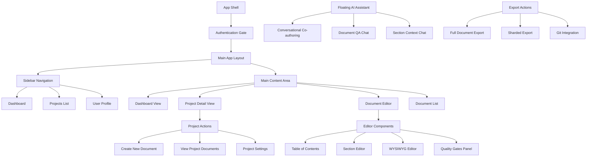
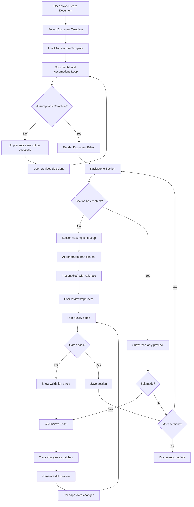
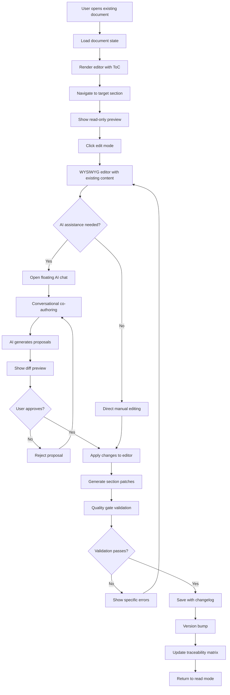
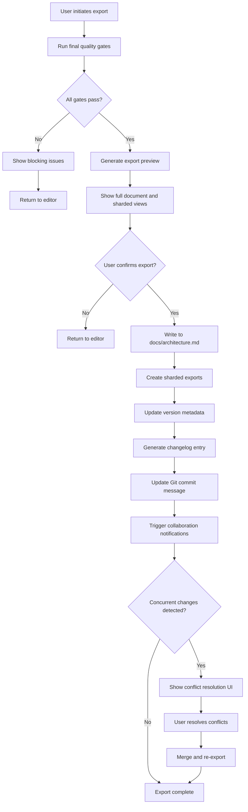

# CTRL FreaQ UI/UX Specification

This document defines the user experience goals, information architecture, user flows, and visual design specifications for CTRL FreaQ's user interface. It serves as the foundation for visual design and frontend development, ensuring a cohesive and user-centered experience.

## Introduction

Based on analysis of the existing Lovable.ai implementation, this specification documents CTRL FreaQ's current state as a document/content management system for teams and provides an improvement roadmap for developers implementing UI enhancements. The current implementation demonstrates a solid foundation with React 18, TypeScript, Tailwind CSS, and shadcn/ui components, integrated with Clerk authentication and featuring a responsive dashboard layout with project management capabilities.

Key improvement opportunities identified include enhanced document editing workflows, advanced collaboration features, improved mobile responsiveness, and expanded accessibility compliance.

## Overall UX Goals & Principles

### Target User Personas

**Senior/Staff+ Engineers & Tech Leads**
- Technical professionals adopting AI-assisted development workflows
- Primary need: Creating detailed, AI-optimized architecture documentation efficiently
- Context: Experienced developers who often deprioritize rigorous documentation
- Goal: Reduce "vibe coding" through structured, validated, machine-consumable artifacts

**Engineering Managers & Platform Leads** 
- Secondary users focused on team productivity and documentation standards
- Need oversight of documentation quality and team collaboration
- Value traceability between requirements, architecture, and implementation decisions

### Usability Goals

**Speed & Quality Balance**: Users can complete first usable architecture draft within 60 minutes while maintaining comprehensive documentation quality

**AI-Human Collaboration Efficiency**: 30% reduction in prompt crafting time through seamless human-AI interaction patterns and contextual assistance

**Iterative Refinement**: Maximum 2 revision cycles to reach "architecture approved" status through guided workflows and quality gates

**Developer-Familiar Patterns**: Leverage familiar concepts (Git-style patching, section-based editing, diff previews) to reduce cognitive load

**Context Preservation**: Maintain conversation context across sections and editing sessions to support coherent document development

### Design Principles

1. **AI as Collaborative Partner** - Design AI interactions as conversation with an intelligent colleague, not tool usage
2. **Human Agency First** - Users maintain control over all decisions; AI provides suggestions that require explicit approval
3. **Progressive Context Building** - Each interaction builds on previous context, creating increasingly refined and personalized assistance
4. **Transparent AI Reasoning** - Show rationale behind AI suggestions to build trust and enable informed decision-making
5. **Seamless Flow Transitions** - Smooth movement between reading, editing, AI consultation, and approval workflows

### Change Log
| Date | Version | Description | Author |
|------|---------|-------------|---------|
| 2025-09-12 | 1.0 | Initial front-end specification created based on Lovable.ai analysis | Sally (UX Expert) |

## Information Architecture (IA)

### Site Map / Screen Inventory

### Navigation Structure

**Primary Navigation:** 
- Hybrid project-document approach maintaining familiar project organization
- Elevated document creation/editing as primary actions within project contexts
- Persistent sidebar with Projects list, Dashboard, and User profile
- Quick access to "Create Document" prominently featured in project views

**Secondary Navigation:**
- Document-specific navigation via Table of Contents within editor
- Section-level navigation with jump-to functionality
- Quality gates status indicators in editor context
- Version/changelog access integrated with document views

**Breadcrumb Strategy:**
- Context preservation: Dashboard → Project Name → Document Name → Section Name
- "Return to Project" action always available from document editor
- Document state indicators (Draft, In Review, Published) in breadcrumb area

## User Flows

### Document Creation Flow

**User Goal:** Create a new architecture document from project Brief/PRD with AI assistance

**Entry Points:** 
- "Create Document" button from Project Detail view
- "New Architecture Document" from Dashboard quick actions
- Project sidebar "+" action

**Success Criteria:** Completed architecture document draft ready for review within 60 minutes

#### Flow Diagram

#### Edge Cases & Error Handling:
- **AI Service Unavailable**: Graceful degradation to manual editing mode with template guidance
- **Template Loading Failure**: Hard fail with clear error message and retry option
- **Assumption Resolution Timeout**: Allow manual skip with warning about potential gaps
- **Quality Gate Failures**: Block save with specific error details and suggested fixes
- **Local Storage Full**: Prompt user to export/save before continuing, clear old drafts

**Notes:** Floating AI assistant available throughout flow for contextual help and suggestions

### Document Editing Flow

**User Goal:** Update existing architecture document with new information and AI assistance

**Entry Points:**
- "Edit" button from Document List
- Direct section navigation from Document QA chat
- "Update Document" from project context

**Success Criteria:** Changes applied with changelog entry, version bump, and quality validation

#### Flow Diagram

#### Edge Cases & Error Handling:
- **Concurrent Edit Conflicts**: Show merge view with last-write-wins option and conflict warnings
- **Network Interruption During Save**: Local persistence preserves changes, retry on reconnect
- **AI Chat Service Down**: Continue with manual editing, show degraded service notification
- **Large Document Performance**: Full document always rendered with optimized scrolling performance
- **Unsaved Changes Navigation**: Prompt user with save/discard/continue options

### Export & Collaboration Flow

**User Goal:** Export completed document and handle team collaboration scenarios

**Entry Points:**
- "Export" button from document editor
- "Publish" action after quality gates pass
- Automated export triggers from collaboration events

**Success Criteria:** Document exported to docs/ with proper versioning and team notified of changes

#### Flow Diagram

#### Edge Cases & Error Handling:
- **Export Path Conflicts**: Offer backup location with timestamp suffix
- **Permission Errors**: Clear messaging about file system access requirements
- **Partial Export Failures**: Complete successful portions, report specific failures
- **Git Integration Issues**: Fallback to manual file operations with instructions
- **Large Document Export**: Visual loading indicators (animations) during generation process

**Notes:** All flows maintain local persistence for state recovery and include comprehensive error messaging aligned with developer-familiar patterns

## Wireframes & Mockups

**Primary Design Files:** Figma workspace building on Lovable.ai foundation - [Design System Link TBD]

### Key Screen Layouts

#### Enhanced Dashboard Layout

**Purpose:** Evolved dashboard that maintains existing project-centric approach while elevating document creation workflows

**Key Elements:**
- Existing two-column layout preserved (Project List + Recent Activity)
- Prominent "Create New Document" call-to-action in project cards
- Quick access to incomplete/draft documents
- Enhanced recent activity with document-level change indicators
- Project health indicators showing document completion status

**Interaction Notes:** Smooth transitions to document editor, preserved context navigation
**Design File Reference:** [Figma Frame: Enhanced Dashboard - TBD]

#### Comprehensive Document Editor

**Purpose:** Central editing interface supporting section-based navigation, WYSIWYG editing, and AI collaboration

**Key Elements:**
- Left panel: Collapsible Table of Contents with section status indicators
- Center panel: Full document view with read/edit mode toggles per section
- Section state visualization (idle → read_mode → edit_mode → assumptions → drafting → diff_preview → ready)
- Quality gates status panel (integrated, not overlay)
- Breadcrumb navigation maintaining project context
- WYSIWYG editor integration (Milkdown v7.15.5) within section contexts

**Interaction Notes:** Seamless section navigation, inline editing with diff preview, quality gate real-time feedback
**Design File Reference:** [Figma Frame: Document Editor Core - TBD]

#### Floating AI Assistant Interface

**Purpose:** Persistent, repositionable AI chat interface for conversational co-authoring and document QA

**Key Elements:**
- **Collapsed State:** Minimal floating button with AI status indicator and unread message count
- **Expanded State:** Chat interface with conversation history, context indicators, streaming response area
- **Conversation Types:** Assumption resolution, section co-authoring, document QA, general help
- **Context Panel:** Shows current section, related content, and conversation scope
- **Proposal Interface:** Diff preview integration with approve/reject actions

**Interaction Notes:** Drag-and-drop positioning, resize handles, context-aware suggestions, streaming response rendering
**Design File Reference:** [Figma Frames: AI Assistant States - TBD]

#### Assumption Resolution Interface

**Purpose:** Guided workflow for resolving document and section-level assumptions with AI assistance

**Key Elements:**
- Progress indicator showing assumption resolution status
- Current assumption display with context and rationale
- Decision aggressiveness policy selector (Conservative | Balanced | YOLO)
- Interactive response area supporting multiple choice and free-form input
- Context preservation across assumption sequences
- Skip/defer options with impact warnings

**Interaction Notes:** Keyboard navigation support, contextual help integration, progress persistence
**Design File Reference:** [Figma Frame: Assumption Resolution Flow - TBD]

#### Quality Gates & Validation Panel

**Purpose:** Real-time validation feedback and quality assurance workflow integration

**Key Elements:**
- Section-level validation indicators in ToC
- Document-level quality gates dashboard
- Blocker vs. non-blocker issue categorization
- Specific error details with suggested fixes
- Traceability matrix visualization
- Export readiness indicators

**Interaction Notes:** Click-to-navigate to problematic sections, inline fix suggestions, validation re-run triggers
**Design File Reference:** [Figma Frame: Quality Gates Panel - TBD]

#### Export & Versioning Interface

**Purpose:** Document publication workflow with version control and collaboration features

**Key Elements:**
- Export preview with full document and sharded views
- Version history and changelog editor
- Git integration status and commit message preview
- Collaboration conflict resolution interface
- Export progress indicators with detailed status
- Rollback and recovery options

**Interaction Notes:** Real-time export preview, conflict resolution workflows, progress transparency
**Design File Reference:** [Figma Frame: Export Interface - TBD]

#### Mobile-Responsive Document Reader

**Purpose:** Mobile-optimized document viewing and light editing capabilities

**Key Elements:**
- Collapsed sidebar with swipe navigation
- Touch-optimized section selection
- Simplified AI chat interface for mobile
- Read-only document consumption optimized for small screens
- Basic annotation and commenting capabilities

**Interaction Notes:** Touch gestures for navigation, adaptive UI based on screen size, offline reading support
**Design File Reference:** [Figma Frame: Mobile Document Reader - TBD]

### AI Interface Component Library

**Conversational Co-authoring Components:**
- Chat message bubbles with AI/human identification
- Streaming response indicators with typing animations  
- Diff preview cards with syntax highlighting
- Approval/rejection action buttons with confirmation states
- Context switching indicators showing section/document scope

**Assumption Resolution Components:**
- Question card layout with priority indicators
- Multiple choice selection interface
- Free-form response input with validation
- Progress tracker with assumption completion status
- Decision policy selector with impact explanations

**Quality Integration Components:**
- Validation status badges (pass/fail/warning)
- Error detail expandable cards
- Fix suggestion action items
- Traceability link visualizations
- Export readiness checklist interface

**State Management Visualization:**
- Section lifecycle indicators
- Document status progression
- AI service availability indicators
- Local vs. server sync status
- Collaboration presence indicators

### Comprehensive AI Journey Mapping

**Document Creation Journey:**
1. Template selection → AI assistant introduction
2. Document-level assumptions → Guided Q&A interface  
3. Section navigation → Context-aware AI suggestions
4. Content drafting → Real-time co-authoring with diff previews
5. Quality validation → AI-assisted error resolution
6. Export preparation → Final review with AI recommendations

**Document Editing Journey:**
1. Document opening → AI context loading
2. Section selection → Contextual editing suggestions
3. Content modification → Collaborative editing with proposals
4. Validation integration → AI quality assistance  
5. Version management → AI-generated changelog suggestions
6. Publication → Collaboration notification with AI summaries

**Error Recovery Journey:**
1. Error detection → AI diagnostic assistance
2. State recovery → AI-guided restoration options
3. Conflict resolution → AI-mediated merge suggestions
4. Validation retry → AI learning from previous failures
5. Alternative approaches → AI fallback recommendations

## Component Library / Design System

**Design System Approach:** Extend existing shadcn/ui + Tailwind CSS foundation with document-specific components, integrating AI functionality as natural extensions of familiar UI patterns rather than standalone interfaces.

### Core Components

#### AI-Enhanced Button Component

**Purpose:** Standard button component with integrated AI interaction states and streaming response indicators

**Variants:** 
- `ai-primary` - Main AI action buttons (Generate, Ask AI, Apply Suggestion)
- `ai-secondary` - Secondary AI actions (Explain, Refine, Alternative)
- `ai-ghost` - Subtle AI indicators and floating assistant triggers
- `ai-destructive` - AI-assisted destructive actions (Reject, Revert)

**States:** Default, hover, active, loading, streaming, success, error, disabled
- Loading state shows AI thinking indicator
- Streaming state displays real-time response progress
- Success state briefly confirms AI action completion

**Usage Guidelines:** Always pair AI actions with clear intent labels. Use loading/streaming states to maintain user engagement during AI processing. Provide immediate visual feedback for AI interactions.

#### Document Section Card

**Purpose:** Container component for document sections with integrated editing states and AI assistance indicators

**Variants:**
- `section-readonly` - Preview mode with subtle edit trigger
- `section-editing` - Active editing state with WYSIWYG integration
- `section-ai-assisted` - AI collaboration mode with proposal indicators
- `section-validation` - Quality gate feedback integration

**States:** Idle, read-mode, edit-mode, assumptions, drafting, diff-preview, ready, error
- Each state has distinct visual treatment and interaction patterns
- AI assistance available across all appropriate states
- Quality gate indicators integrated into section chrome

**Usage Guidelines:** Maintain clear state hierarchy. Use AI assistance indicators to show available help without overwhelming interface. Integrate quality feedback contextually within section flow.

#### Floating AI Assistant

**Purpose:** Repositionable chat interface extending shadcn/ui Dialog and Sheet components

**Variants:**
- `ai-chat-collapsed` - Minimal floating button with status indicator
- `ai-chat-expanded` - Full chat interface with history and context
- `ai-chat-proposal` - Specialized mode for content proposals and diffs
- `ai-chat-assumptions` - Guided assumption resolution interface

**States:** Collapsed, expanding, expanded, minimized, thinking, responding, error, offline
- Smooth transitions between collapsed/expanded states
- Context awareness showing current section and conversation scope
- Offline graceful degradation with clear status messaging

**Usage Guidelines:** Maintain persistent availability while respecting user workspace. Use contextual positioning to support current workflow. Provide clear conversation boundaries and context switching.

#### Assumption Resolution Interface

**Purpose:** Guided workflow component extending shadcn/ui Form patterns with AI-driven question presentation

**Variants:**
- `assumption-question` - Individual assumption presentation with context
- `assumption-multiple-choice` - Structured option selection interface
- `assumption-free-form` - Open response with AI validation
- `assumption-progress` - Overall resolution progress indicator

**States:** Loading, presenting, responding, validating, complete, skipped, error
- Progress indication across assumption sequence
- Context preservation between related assumptions
- Skip/defer options with impact warnings

**Usage Guidelines:** Maintain conversation flow while providing clear progress indicators. Use contextual help to explain assumption importance. Allow flexible interaction patterns (keyboard, mouse, voice).

#### Quality Gate Validation Panel

**Purpose:** Real-time validation feedback extending shadcn/ui Alert and Badge components

**Variants:**
- `validation-section` - Section-level validation indicators
- `validation-document` - Document-wide quality assessment
- `validation-blocker` - Critical issues preventing progress
- `validation-suggestion` - Non-blocking improvement recommendations

**States:** Validating, passing, warning, blocking, error, improving
- Clear severity indication (blocker vs. suggestion)
- Specific error details with actionable fix recommendations
- Integration with traceability matrix visualization

**Usage Guidelines:** Provide immediate feedback without disrupting workflow. Use progressive disclosure for error details. Integrate fix suggestions with AI assistance where helpful.

#### Document Export Interface

**Purpose:** Export workflow component extending shadcn/ui Progress and Preview patterns

**Variants:**
- `export-preview` - Document preview with format options
- `export-progress` - Real-time generation progress with detailed status
- `export-conflict` - Collaboration conflict resolution interface
- `export-success` - Completion confirmation with next steps

**States:** Preparing, previewing, generating, conflicts, completing, success, error
- Visual progress indication during export generation
- Conflict resolution workflows with merge options
- Success states with clear next action guidance

**Usage Guidelines:** Maintain transparency throughout export process. Provide clear conflict resolution paths. Use success states to guide user toward next logical actions.

#### Section Navigation (Table of Contents)

**Purpose:** Document navigation extending shadcn/ui ScrollArea with section state integration

**Variants:**
- `toc-standard` - Basic section navigation with jump-to functionality
- `toc-status` - Enhanced with section completion and validation status
- `toc-collaborative` - Shows editing indicators and user presence
- `toc-mobile` - Collapsed navigation optimized for touch interaction

**States:** Loading, navigating, updating, collaborative, mobile
- Section status indicators (complete, in-progress, needs-attention)
- Collaborative presence indicators showing active editors
- Mobile-responsive with touch-optimized interaction

**Usage Guidelines:** Provide clear document overview with actionable navigation. Use status indicators to guide user attention. Support both mouse and keyboard navigation patterns.

#### AI Diff Preview Component

**Purpose:** Code diff visualization extending existing syntax highlighting with AI proposal integration

**Variants:**
- `diff-inline` - Inline changes within section editing context
- `diff-side-by-side` - Full comparison view for major changes
- `diff-ai-explained` - AI-generated explanation of proposed changes
- `diff-conversation` - Changes within conversational context

**States:** Loading, presenting, explained, approved, rejected, applying
- Syntax highlighting for markdown and structured content
- AI explanation integration with change rationale
- Clear approve/reject actions with confirmation patterns

**Usage Guidelines:** Make change impact immediately clear. Provide AI explanation for complex modifications. Use familiar diff visualization patterns from developer tools.

## Branding & Style Guide

### Visual Identity
**Brand Guidelines:** Built on Hamlindigo Theme adaptation with muted, professional color palette. Extends existing CTRL FreaQ branding with AI-collaboration visual language that emphasizes sophisticated partnership between human and artificial intelligence. Logo features blue-to-purple gradient maintaining brand cohesion.

### Color Palette
| Color Type | HSL Value | Hex Code | Usage |
|------------|-----------|----------|-------|
| Primary | `hsl(266, 8%, 80%)` | `#cbc8d0` | Main actions, active states, primary UI elements |
| Secondary | `hsl(87, 7%, 65%)` | `#a6aca0` | Secondary actions, muted interactions |
| Accent | `hsl(213, 6%, 64%)` | `#9ea3a9` | Subtle highlights, supporting elements |
| Destructive | `hsl(0, 84%, 57%)` | `#ed3535` | Error states, destructive actions |
| Success | `hsl(171, 8%, 61%)` | `#94a4a1` | Success states, quality gates pass |
| Warning | `hsl(84, 13%, 76%)` | `#c3caba` | Warning states, attention needed |
| Sidebar | `hsl(266, 5%, 98%)` | `#fbfbfc` | Sidebar background (light mode) |
| Sidebar Primary | `hsl(266, 59%, 10%)` | `#0f0a19` | Sidebar active elements |
| Dashboard Surface | `hsl(266, 3%, 98%)` | `#faf9fa` | Main content background |
| AI-Active | `hsl(266, 76%, 48%)` | `#7c3aed` | Active AI processing, streaming responses |
| AI-Inactive | `hsl(266, 16%, 47%)` | `#706876` | AI unavailable, muted states |

### Dark Mode Color Palette
| Color Type | HSL Value | Hex Code | Usage |
|------------|-----------|----------|-------|
| Background | `hsl(266, 4%, 32%)` | `#504f54` | Main background (dark mode) |
| Foreground | `hsl(266, 5%, 95%)` | `#f2f1f3` | Text and foreground elements |
| Primary | `hsl(266, 5%, 95%)` | `#f2f1f3` | Primary elements (dark mode) |
| Secondary | `hsl(266, 33%, 18%)` | `#221e2e` | Secondary elements (dark mode) |
| Sidebar Dark | `hsl(266, 59%, 10%)` | `#0f0a19` | Sidebar background (dark mode) |
| Sidebar Primary Dark | `hsl(266, 76%, 48%)` | `#7c3aed` | Sidebar active (dark mode) |

### Typography

#### Font Families
- **Primary:** System font stack (uses browser/OS defaults for optimal performance and familiarity)
- **Secondary:** Same as primary - no custom fonts loaded in current implementation  
- **Monospace:** `ui-monospace, 'SF Mono', Monaco, 'Cascadia Code', 'Roboto Mono', monospace` (for code, diffs, technical content)

**Note:** Current Lovable.ai implementation uses system fonts without custom web font loading, prioritizing performance and native OS appearance.

#### Type Scale
| Element | Size | Weight | Line Height |
|---------|------|--------|-------------|
| H1 | 2.25rem (36px) | 700 | 1.2 |
| H2 | 1.875rem (30px) | 600 | 1.3 |
| H3 | 1.5rem (24px) | 600 | 1.4 |
| Body | 1rem (16px) | 400 | 1.6 |
| Small | 0.875rem (14px) | 400 | 1.5 |
| Code | 0.875rem (14px) | 500 | 1.4 |

### Iconography
**Icon Library:** Lucide React (consistent with existing Lovable.ai implementation)
**Usage Guidelines:** 
- Use consistent icon sizing (16px, 20px, 24px)
- Pair AI-specific actions with subtle animation indicators
- Maintain accessibility with proper aria-labels

### Spacing & Layout
**Grid System:** CSS Grid with Tailwind CSS utilities
**Spacing Scale:** Tailwind's default scale (0.25rem increments)
- Component spacing: 1rem (16px) standard
- Section spacing: 1.5rem (24px) between major elements
- Document padding: 2rem (32px) for main content areas

## Accessibility Requirements

### Compliance Target
**Standard:** WCAG 2.1 AA compliance with progressive enhancement toward AAA where feasible

### Key Requirements

**Visual:**
- Color contrast ratios: 4.5:1 minimum for normal text, 3:1 for large text
- Focus indicators: 2px solid focus ring with high contrast
- Text sizing: Minimum 16px base size, scalable to 200% without horizontal scrolling

**Interaction:**
- Keyboard navigation: Full keyboard accessibility for all AI interactions
- Screen reader support: Proper ARIA labels for AI states and streaming content
- Touch targets: Minimum 44px for mobile interactions, especially floating AI assistant

**Content:**
- Alternative text: Descriptive alt text for all visual AI feedback and status indicators
- Heading structure: Proper H1-H6 hierarchy matching document section structure
- Form labels: Clear labeling for all assumption resolution and input interfaces

### Testing Strategy
- Automated accessibility testing integrated with CI/CD pipeline
- Manual keyboard navigation testing for complex AI interaction flows
- Screen reader testing with NVDA/JAWS for AI conversation interfaces
- Color contrast validation for all AI-specific visual states

## Responsiveness Strategy

### Breakpoints
| Breakpoint | Min Width | Max Width | Target Devices |
|------------|-----------|-----------|----------------|
| Mobile | 320px | 767px | Smartphones, basic document reading |
| Tablet | 768px | 1023px | Tablets, light document editing |
| Desktop | 1024px | 1439px | Laptops, full document creation |
| Wide | 1440px | - | Large screens, multi-document workflows |

### Adaptation Patterns

**Layout Changes:**
- Mobile: Single column, collapsed sidebar, simplified AI assistant
- Tablet: Flexible two-column with collapsible panels
- Desktop: Full three-column layout (sidebar, content, AI assistant)
- Wide: Optional fourth column for advanced features (traceability, history)

**Navigation Changes:**
- Mobile: Bottom navigation bar with hamburger menu
- Tablet: Collapsible sidebar with gesture support
- Desktop: Persistent sidebar with full navigation hierarchy
- Wide: Enhanced sidebar with expanded AI conversation history

**Content Priority:**
- Mobile: Document reading optimized, basic editing only
- Tablet: Full editing capabilities with touch-optimized controls
- Desktop: Complete document creation and AI collaboration
- Wide: Advanced features like side-by-side document comparison

**Interaction Changes:**
- Mobile: Touch gestures for navigation, simplified AI chat
- Tablet: Hybrid touch/pointer support, resizable AI assistant
- Desktop: Full keyboard shortcuts, drag-and-drop positioning
- Wide: Advanced keyboard shortcuts, multi-window workflows

## Animation & Micro-interactions

### Motion Principles
**AI-Responsive Animation:** Subtle animations that communicate AI processing state and provide feedback for human-AI collaboration. Animations respect `prefers-reduced-motion` accessibility settings and can be globally disabled.

### Key Animations
- **AI Thinking Indicator:** Subtle pulsing animation during AI processing (Duration: 1.5s, Easing: ease-in-out)
- **Section State Transitions:** Smooth color/border transitions between section states (Duration: 200ms, Easing: ease-out)
- **Floating Assistant Movement:** Physics-based positioning with snap-to-grid behavior (Duration: 300ms, Easing: cubic-bezier(0.2, 0, 0, 1))
- **Streaming Response Animation:** Progressive text reveal during AI response generation (Duration: Variable, Easing: linear)
- **Quality Gate Feedback:** Status badge color transitions with subtle bounce effect (Duration: 150ms, Easing: ease-bounce)
- **Diff Highlight Animation:** Subtle highlight fade-in for proposed changes (Duration: 400ms, Easing: ease-in-out)

## Performance Considerations

### Performance Goals
- **Page Load:** ≤ 2s Time to First Meaningful Paint on broadband
- **Interaction Response:** ≤ 100ms for local interactions, ≤ 300ms for AI responses
- **Document Rendering:** Full document render without lazy loading, optimized for documents up to 500 sections

### Design Strategies
**AI Optimization:** Streaming UI updates for AI responses to maintain perceived performance during longer processing times. Use skeleton screens and progressive enhancement for AI-dependent features.

## Next Steps

### Immediate Actions
1. **Create Figma Design System** - Build comprehensive component library based on specifications
2. **Prototype AI Interactions** - Create interactive prototypes for floating assistant and assumption resolution flows  
3. **Validate Information Architecture** - User testing of navigation structure and document editor workflow
4. **Technical Architecture Handoff** - Provide detailed specifications to development team for implementation planning

### Design Handoff Checklist
- [x] All user flows documented with Mermaid diagrams
- [x] Component inventory complete with variants and states
- [x] Accessibility requirements defined with WCAG 2.1 AA compliance
- [x] Responsive strategy clear with breakpoint specifications
- [x] Brand guidelines incorporated with AI-specific extensions
- [x] Performance goals established with AI interaction considerations
- [ ] Figma design system created with developer handoff annotations
- [ ] AI interaction prototypes validated with stakeholder feedback
- [ ] Mobile responsiveness tested across target devices
- [ ] Technical feasibility confirmed with development team
