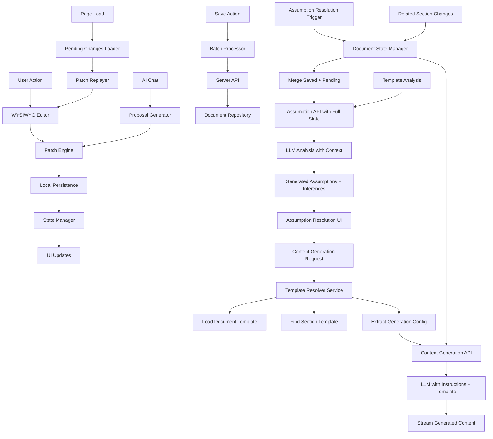

# CTRL FreaQ Frontend Architecture Document {#frontend-architecture-document}

## Template and Framework Selection {#template-framework-selection}

### Architectural Decision: React Frontend with Express.js Backend {#architectural-decision-react-express}

After analyzing the existing codebase and project requirements, this
architecture adopts a **decoupled frontend approach** using React as the primary
UI framework with Express.js as the backend API server. This decision is based
on:

1. **Existing UI Investment**: Substantial React-based UI foundation exists in
   `docs/examples/ctrl-freaq-ui` with established patterns, components, and
   routing
2. **Ecosystem Alignment**: React's extensive ecosystem for WYSIWYG editors
   (Milkdown), real-time features, and component libraries (shadcn/ui)
3. **Team Expertise**: React's widespread adoption ensures easier onboarding and
   AI agent compatibility
4. **Clear Separation of Concerns**: Decoupling frontend from backend enables
   independent scaling and deployment

The Express.js server serves as a **pure API server**, exposing REST endpoints
and SSE streams consumed by the React frontend. This provides a clear separation
of concerns while leveraging React's strengths for complex UI interactions.

### Frontend Starter Analysis {#frontend-starter-analysis}

**Foundation Used**: Custom React + TypeScript setup based on lovable.ai
generated code

- **Location**: `docs/examples/ctrl-freaq-ui`
- **Key Technologies**: React 19, TypeScript, Vite, React Router v7, JWT Auth,
  shadcn/ui, TanStack Query
- **Constraints**: Must maintain compatibility with existing component patterns
  and routing structure

### Assumptions and Resolutions {#assumptions-resolutions}

| Assumption                                              | Resolution                                                    |
| ------------------------------------------------------- | ------------------------------------------------------------- |
| Frontend framework choice conflicts with backend        | Use React for UI, Express.js for API only                     |
| Document Editor complexity requires framework alignment | Milkdown works excellently with React                         |
| Authentication must be consistent                       | JWT tokens work seamlessly with both React and Express.js     |
| Streaming AI responses need special handling            | React supports SSE/WebStreams natively                        |
| Library-first architecture applies to frontend          | Create React component libraries with Storybook documentation |

### Change Log {#ui-change-log}

| Date       | Version | Description                                                    | Author     |
| ---------- | ------- | -------------------------------------------------------------- | ---------- |
| 2025-09-13 | 1.1     | Recreated from Old UI Architecture Document                    | Winston AI |
| 2025-09-12 | 1.0     | Initial frontend architecture with React/Express.js decoupling | Architect  |

## Frontend Tech Stack {#frontend-tech-stack}

### Technology Stack Table {#technology-stack-table}

| Category         | Technology                     | Version        | Purpose                                   | Rationale                                            |
| ---------------- | ------------------------------ | -------------- | ----------------------------------------- | ---------------------------------------------------- |
| Framework        | React                          | 19.1.x         | UI framework                              | Existing investment, ecosystem, AI agent familiarity |
| UI Library       | shadcn/ui                      | latest         | Component library                         | Accessible, customizable, TypeScript native          |
| State Management | TanStack Query + Zustand       | 5.89.x / 5.0.x | Server + client state                     | Excellent DX, built-in caching, minimal boilerplate  |
| Routing          | React Router                   | 7.9.x          | Client-side routing                       | Industry standard, existing implementation           |
| Build Tool       | Vite                           | 5.x            | Build and dev server                      | Fast HMR, ESM native, excellent DX                   |
| Styling          | Tailwind CSS                   | 3.4.x          | Utility-first CSS                         | Rapid development, consistent design system          |
| Testing          | Vitest + React Testing Library | 3.x / 16.x     | Unit and integration testing              | Vite native, excellent React support                 |
| Form Handling    | React Hook Form + Zod          | 7.x / 4.x      | Form state and validation                 | Performance, TypeScript integration                  |
| Animation        | Framer Motion                  | 11.x           | Animations and transitions                | Declarative API, gesture support                     |
| Logging          | Pino                           | 9.12.0         | Browser logging with backend transmission | High-performance JSON logging, browser-optimized     |
| Dev Tools        | React DevTools + Vite Plugin   | latest         | Development experience                    | Debugging, performance profiling                     |

## Project Structure {#project-structure}

```plaintext
src/
├── app/                        # Application shell and providers
│   ├── providers/             # Context providers and wrappers
│   │   ├── auth-provider.tsx
│   │   ├── query-provider.tsx
│   │   ├── theme-provider.tsx
│   │   └── index.tsx
│   ├── router/                # Routing configuration
│   │   ├── routes.tsx
│   │   ├── protected-route.tsx
│   │   └── index.tsx
│   └── App.tsx
├── features/                  # Feature-based modules (Constitutional library-first)
│   ├── document-editor/      # Document editing feature
│   │   ├── components/
│   │   │   ├── editor-toolbar.tsx
│   │   │   ├── milkdown-editor.tsx
│   │   │   ├── section-navigator.tsx
│   │   │   └── diff-viewer.tsx
│   │   ├── hooks/
│   │   │   ├── use-editor-state.ts
│   │   │   ├── use-patch-engine.ts
│   │   │   └── use-pending-changes.ts
│   │   ├── services/
│   │   │   ├── editor-api.ts
│   │   │   └── patch-service.ts
│   │   ├── stores/
│   │   │   └── editor-store.ts
│   │   └── index.ts
│   ├── assumptions/          # Assumptions resolution
│   │   ├── components/
│   │   ├── hooks/
│   │   └── services/
│   ├── ai-chat/             # AI collaboration features
│   │   ├── components/
│   │   ├── hooks/
│   │   └── services/
│   └── quality-gates/       # QA and validation
│       ├── components/
│       ├── hooks/
│       └── services/
├── components/               # Shared UI components
│   ├── ui/                  # shadcn/ui components
│   │   ├── button.tsx
│   │   ├── dialog.tsx
│   │   └── [other shadcn components]
│   ├── layout/             # Layout components
│   │   ├── app-shell.tsx
│   │   ├── sidebar.tsx
│   │   └── header.tsx
│   └── common/             # Common components
│       ├── error-boundary.tsx
│       ├── loading-spinner.tsx
│       └── empty-state.tsx
├── pages/                   # Route pages
│   ├── dashboard/
│   │   └── index.tsx
│   ├── projects/
│   │   ├── [projectId]/
│   │   │   └── index.tsx
│   │   └── index.tsx
│   ├── documents/
│   │   ├── [documentId]/
│   │   │   ├── edit.tsx
│   │   │   └── index.tsx
│   │   └── new.tsx
│   └── auth/
│       ├── sign-in.tsx
│       └── sign-up.tsx
├── lib/                     # Core utilities (Constitutional library requirement)
│   ├── api/                # API client configuration
│   │   ├── client.ts
│   │   ├── endpoints.ts
│   │   └── types.ts
│   ├── streaming/          # SSE/WebStream utilities
│   │   ├── sse-client.ts
│   │   └── stream-parser.ts
│   ├── utils/              # Utility functions
│   │   ├── cn.ts
│   │   └── format.ts
│   └── constants/          # App constants
│       └── config.ts
├── hooks/                   # Global hooks
│   ├── use-auth.ts
│   ├── use-toast.ts
│   └── use-debounce.ts
├── stores/                  # Global state stores
│   ├── auth-store.ts
│   ├── project-store.ts
│   └── ui-store.ts
├── styles/                  # Global styles
│   ├── globals.css
│   └── themes/
│       ├── light.css
│       └── dark.css
├── types/                   # TypeScript type definitions
│   ├── api.ts
│   ├── models.ts
│   └── global.d.ts
└── test/                    # Test utilities
    ├── setup.ts
    ├── mocks/
    └── fixtures/
```

### Route Preloading Strategy {#route-preloading-strategy}

The document editor still relies on route-level code splitting so that large
feature modules (diff viewer, Milkdown editor, approval controls, and friends)
only load when a user activates the related workflow. The original webpack
implementation used ``import(`../${routePath}`)`` in
`apps/web/src/features/document-editor/utils/performance.ts`. Vite flagged that
pattern because the interpolated string prevented static analysis. Vite uses the
static graph to pre-bundle dependencies, optimise HMR boundaries, and avoid
runtime 404s, so we traded the dynamic expression for an explicit lookup table.

```ts
const ROUTE_MODULE_LOADERS: Record<string, () => Promise<unknown>> = {
  'components/document-editor': () => import('../components/document-editor'),
  'components/diff-preview': () => import('../components/diff-preview'),
  // ...additional pre-loadable modules
};

export function preloadRoute(routePath: string): Promise<void> {
  const loader = ROUTE_MODULE_LOADERS[routePath];
  if (!loader) {
    logger.warn({ operation: 'route_preload', routePath });
    return Promise.resolve();
  }
  return loader().then(() => {
    logger.info({ operation: 'route_preload', routePath });
  });
}
```

Enumerating the allowable chunks keeps the developer ergonomics of a simple
`preloadRoute('components/diff-preview')` call while restoring Vite’s static
optimisations and suppressing the startup warning. Unknown keys now
short-circuit with a warning instead of throwing, which protects the editor from
accidental typo regressions when adding future modules.

## Component Standards {#component-standards}

### Component Template {#component-template}

````tsx
// src/features/[feature]/components/[component-name].tsx
import type { FC, ReactNode } from 'react';
import { memo, useCallback, useState } from 'react';
import { cn } from '@/lib/utils';

export interface ComponentNameProps {
  className?: string;
  children?: ReactNode;
  /** Handler called when action occurs */
  onAction?: (value: string) => void;
}

/**
 * ComponentName - Brief description of component purpose
 *
 * @example
 * ```tsx
 * <ComponentName onAction={handleAction}>
 *   Content
 * </ComponentName>
 * ```
 */
export const ComponentName: FC<ComponentNameProps> = memo(
  ({ className, children, onAction }) => {
    const [selectedValue, setSelectedValue] = useState<string>('');

    const handleClick = useCallback(
      (value: string) => {
        setSelectedValue(value);
        onAction?.(value);
      },
      [onAction]
    );

    return (
      <div className={cn('component-base-styles', className)}>
        {children}
        <button type="button" onClick={() => handleClick('example')}>
          Selected: {selectedValue || 'none'}
        </button>
      </div>
    );
  }
);

ComponentName.displayName = 'ComponentName';
````

### Naming Conventions {#naming-conventions}

| Element          | Convention                      | Example                                       |
| ---------------- | ------------------------------- | --------------------------------------------- |
| Components       | PascalCase                      | `DocumentEditor.tsx`                          |
| Component files  | kebab-case or PascalCase        | `document-editor.tsx` or `DocumentEditor.tsx` |
| Hooks            | camelCase with 'use' prefix     | `useDocumentState.ts`                         |
| Services         | camelCase with 'Service' suffix | `documentService.ts`                          |
| Stores           | camelCase with 'Store' suffix   | `editorStore.ts`                              |
| Types/Interfaces | PascalCase                      | `DocumentState`, `EditorConfig`               |
| Constants        | SCREAMING_SNAKE_CASE            | `MAX_FILE_SIZE`                               |
| CSS classes      | kebab-case                      | `editor-toolbar`                              |
| Test files       | [name].test.tsx                 | `DocumentEditor.test.tsx`                     |

## State Management {#state-management}

### Store Architecture {#store-architecture}

```plaintext
src/stores/
├── auth-store.ts           # Authentication state
├── project-store.ts        # Project management
├── document-store.ts       # Document state
├── editor-store.ts         # Editor specific state
└── ui-store.ts            # UI preferences and state
```

### State Management Template {#state-management-template}

```typescript
// src/stores/document-store.ts
import { create } from 'zustand';
import { devtools, persist } from 'zustand/middleware';
import { immer } from 'zustand/middleware/immer';
import { documentService } from '@/lib/api/services/document-service';

interface Section {
  id: string;
  title: string;
  content: string;
}

type PatchDiff = {
  op: 'add' | 'remove' | 'replace';
  path: string;
  value?: unknown;
};

export interface Document {
  id: string;
  title: string;
  content: string;
  status: 'draft' | 'ready' | 'published';
  sections: Section[];
}

interface DocumentStore {
  // State
  documents: Record<string, Document>;
  activeDocumentId: string | null;
  pendingChanges: Record<string, PatchDiff[]>;

  // Computed getters
  get activeDocument(): Document | null;

  // Actions
  setActiveDocument: (id: string) => void;
  updateDocument: (id: string, updates: Partial<Document>) => void;
  addPendingChange: (documentId: string, patch: PatchDiff) => void;
  clearPendingChanges: (documentId: string) => void;

  // Async actions (integrate with API)
  fetchDocument: (id: string) => Promise<void>;
  saveDocument: (id: string) => Promise<void>;
}

export const useDocumentStore = create<DocumentStore>()(
  devtools(
    persist(
      immer((set, get) => ({
        // Initial state
        documents: {},
        activeDocumentId: null,
        pendingChanges: {},

        // Computed getters
        get activeDocument() {
          const state = get();
          return state.activeDocumentId
            ? state.documents[state.activeDocumentId]
            : null;
        },

        // Synchronous actions
        setActiveDocument: id =>
          set(state => {
            state.activeDocumentId = id;
          }),

        updateDocument: (id, updates) =>
          set(state => {
            if (state.documents[id]) {
              Object.assign(state.documents[id], updates);
            }
          }),

        addPendingChange: (documentId, patch) =>
          set(state => {
            if (!state.pendingChanges[documentId]) {
              state.pendingChanges[documentId] = [];
            }
            state.pendingChanges[documentId].push(patch);
          }),

        clearPendingChanges: documentId =>
          set(state => {
            if (state.pendingChanges[documentId]) {
              delete state.pendingChanges[documentId];
            }
          }),

        // Async actions
        fetchDocument: async id => {
          const document = await documentService.getDocument(id);
          set(state => {
            state.documents[id] = document;
          });
        },

        saveDocument: async id => {
          const document = get().documents[id];
          if (!document) {
            return;
          }

          const patches = get().pendingChanges[id] ?? [];
          await documentService.updateDocument(id, patches);

          set(state => {
            if (state.pendingChanges[id]) {
              delete state.pendingChanges[id];
            }
          });
        },
      })),
      {
        name: 'document-storage',
        partialize: state => ({
          pendingChanges: state.pendingChanges,
        }),
      }
    )
  )
);
```

## API Integration {#api-integration}

### Service Template {#service-template}

```typescript
// src/lib/api/services/document-service.ts
import { apiClient } from '@/lib/api/client';
import type { Document } from '@/types/models';
import type { ValidationResult } from '@ctrl-freaq/qa';

type PatchDiff = {
  op: 'add' | 'remove' | 'replace';
  path: string;
  value?: unknown;
};

interface ProposalContext {
  documentId: string;
  sectionId: string;
  relatedSections: string[];
}

interface ProposalChunk {
  sectionId: string;
  content: string;
  done?: boolean;
}

interface ApiErrorShape {
  code: string;
  message: string;
  details?: unknown;
  requestId?: string;
}

class DocumentService {
  private readonly baseUrl = '/api/v1/documents';

  async getDocument(id: string): Promise<Document> {
    return apiClient.get<Document>(`${this.baseUrl}/${id}`);
  }

  async createDocument(data: {
    type: 'architecture' | 'prd' | 'ui';
    title: string;
    templateId: string;
  }): Promise<Document> {
    return apiClient.post<Document>(this.baseUrl, data);
  }

  async updateDocument(id: string, patches: PatchDiff[]): Promise<Document> {
    return apiClient.patch<Document>(`${this.baseUrl}/${id}`, { patches });
  }

  streamProposals(
    sectionId: string,
    context: ProposalContext,
    onChunk: (chunk: ProposalChunk) => void,
    onComplete: () => void,
    onError: (error: Error) => void
  ): () => void {
    const url = new URL(
      `/api/v1/sections/${sectionId}/proposals.generate`,
      window.location.origin
    );
    url.searchParams.set('documentId', context.documentId);
    url.searchParams.set('contextSection', context.sectionId);
    context.relatedSections.forEach(relatedId => {
      url.searchParams.append('relatedSection', relatedId);
    });

    const eventSource = new EventSource(url.toString(), {
      withCredentials: true,
    });

    eventSource.onmessage = event => {
      try {
        const chunk = JSON.parse(event.data) as ProposalChunk;
        onChunk(chunk);
      } catch (error) {
        const message =
          error instanceof Error
            ? error
            : new Error('Failed to parse proposal chunk');
        onError(message);
      }
    };

    eventSource.onerror = () => {
      onError(new Error('Proposal stream failed'));
      eventSource.close();
    };

    eventSource.addEventListener('complete', () => {
      onComplete();
      eventSource.close();
    });

    return () => eventSource.close();
  }

  async runQualityGates(documentId: string): Promise<ValidationResult> {
    return apiClient.post<ValidationResult>(
      `${this.baseUrl}/${documentId}/gates.run`
    );
  }
}

export const documentService = new DocumentService();
export type { ApiErrorShape as ApiError, ProposalChunk, ProposalContext };
```

### API Client Configuration {#api-client-configuration}

```typescript
// src/lib/api/client.ts
import { getAuth } from '@clerk/clerk-react';

type RequestParams = Record<string, string | number | boolean | undefined>;

export interface ApiClientConfig {
  baseUrl: string;
  timeoutMs?: number;
  defaultHeaders?: HeadersInit;
  getAuthToken?: () => Promise<string | null>;
}

export class ApiError extends Error {
  constructor(
    public readonly code: string,
    message: string,
    public readonly status: number,
    public readonly details?: unknown,
    public readonly requestId?: string
  ) {
    super(message);
    this.name = 'ApiError';
  }
}

export class ApiClient {
  private readonly baseUrl: string;
  private readonly timeoutMs: number;
  private readonly getAuthToken?: () => Promise<string | null>;
  private readonly defaultHeaders: HeadersInit;

  constructor(config: ApiClientConfig) {
    this.baseUrl = config.baseUrl;
    this.timeoutMs = config.timeoutMs ?? 30_000;
    this.defaultHeaders = {
      'Content-Type': 'application/json',
      ...config.defaultHeaders,
    };
    this.getAuthToken = config.getAuthToken ?? this.createClerkTokenGetter();
  }

  private createClerkTokenGetter(): (() => Promise<string | null>) | undefined {
    try {
      const { getToken } = getAuth();
      return async () => {
        try {
          return await getToken();
        } catch {
          return null;
        }
      };
    } catch {
      return undefined;
    }
  }

  private buildQuery(params?: RequestParams): string {
    if (!params) {
      return '';
    }

    const search = new URLSearchParams();
    Object.entries(params).forEach(([key, value]) => {
      if (value !== undefined && value !== null) {
        search.append(key, String(value));
      }
    });

    const queryString = search.toString();
    return queryString.length > 0 ? `?${queryString}` : '';
  }

  private async resolveHeaders(overrides?: HeadersInit): Promise<Headers> {
    const headers = new Headers(this.defaultHeaders);
    const token = this.getAuthToken ? await this.getAuthToken() : null;

    if (token) {
      headers.set('Authorization', `Bearer ${token}`);
    }

    if (overrides) {
      new Headers(overrides).forEach((value, key) => {
        headers.set(key, value);
      });
    }

    return headers;
  }

  private async request<T>(path: string, init: RequestInit = {}): Promise<T> {
    const controller = new AbortController();
    const timeout = setTimeout(() => controller.abort(), this.timeoutMs);

    try {
      const response = await fetch(`${this.baseUrl}${path}`, {
        ...init,
        headers: await this.resolveHeaders(init.headers),
        signal: controller.signal,
      });

      if (!response.ok) {
        const payload = (await response.json().catch(() => undefined)) as
          | {
              code?: string;
              message?: string;
              details?: unknown;
              requestId?: string;
            }
          | undefined;

        throw new ApiError(
          payload?.code ?? 'unknown_error',
          payload?.message ?? response.statusText,
          response.status,
          payload?.details,
          payload?.requestId
        );
      }

      if (response.status === 204) {
        return undefined as T;
      }

      return (await response.json()) as T;
    } finally {
      clearTimeout(timeout);
    }
  }

  async get<T>(path: string, params?: RequestParams): Promise<T> {
    return this.request<T>(`${path}${this.buildQuery(params)}`);
  }

  async post<T, TBody = unknown>(path: string, body?: TBody): Promise<T> {
    return this.request<T>(path, {
      method: 'POST',
      body: body !== undefined ? JSON.stringify(body) : undefined,
    });
  }

  async patch<T, TBody = unknown>(path: string, body?: TBody): Promise<T> {
    return this.request<T>(path, {
      method: 'PATCH',
      body: body !== undefined ? JSON.stringify(body) : undefined,
    });
  }

  async delete<T>(path: string): Promise<T> {
    return this.request<T>(path, {
      method: 'DELETE',
    });
  }
}

export const apiClient = new ApiClient({
  baseUrl: import.meta.env.VITE_API_BASE_URL ?? 'http://localhost:5001/api/v1',
});
```

## Routing {#routing}

### Route Configuration {#route-configuration}

```typescript
// src/app/router/routes.tsx
import { lazy, Suspense } from 'react';
import { Routes, Route, Navigate } from 'react-router-dom';
import { ProtectedRoute } from './protected-route';
import { LoadingSpinner } from '@/components/common/loading-spinner';

// Lazy load pages for code splitting
const Dashboard = lazy(() => import('@/pages/dashboard'));
const ProjectList = lazy(() => import('@/pages/projects'));
const ProjectDetail = lazy(() => import('@/pages/projects/[projectId]'));
const DocumentEditor = lazy(() => import('@/pages/documents/[documentId]/edit'));
const DocumentView = lazy(() => import('@/pages/documents/[documentId]'));
const NewDocument = lazy(() => import('@/pages/documents/new'));
const SignIn = lazy(() => import('@/pages/auth/sign-in'));
const SignUp = lazy(() => import('@/pages/auth/sign-up'));

export const AppRoutes = () => {
  return (
    <Suspense fallback={<LoadingSpinner fullScreen />}>
      <Routes>
        {/* Public routes */}
        <Route path="/auth/sign-in" element={<SignIn />} />
        <Route path="/auth/sign-up" element={<SignUp />} />

        {/* Protected routes */}
        <Route element={<ProtectedRoute />}>
          <Route path="/" element={<Navigate to="/dashboard" replace />} />
          <Route path="/dashboard" element={<Dashboard />} />

          {/* Projects */}
          <Route path="/projects" element={<ProjectList />} />
          <Route path="/projects/:projectId" element={<ProjectDetail />} />

          {/* Documents */}
          <Route path="/documents/new" element={<NewDocument />} />
          <Route path="/documents/:documentId" element={<DocumentView />} />
          <Route path="/documents/:documentId/edit" element={<DocumentEditor />} />
        </Route>

        {/* 404 fallback */}
        <Route path="*" element={<Navigate to="/dashboard" replace />} />
      </Routes>
    </Suspense>
  );
};

// Protected route wrapper
// src/app/router/protected-route.tsx
import { useAuth } from '@clerk/clerk-react';
import { Navigate, Outlet, useLocation } from 'react-router-dom';
import { LoadingSpinner } from '@/components/common/loading-spinner';

export const ProtectedRoute = () => {
  const { isLoaded, isSignedIn } = useAuth();
  const location = useLocation();

  if (!isLoaded) {
    return <LoadingSpinner fullScreen />;
  }

  if (!isSignedIn) {
    return <Navigate to="/auth/sign-in" state={{ from: location }} replace />;
  }

  return <Outlet />;
};
```

## Document Editor Architecture {#document-editor-architecture}

### Core Components {#editor-core-components}

#### WYSIWYG Markdown Editor {#wysiwyg-markdown-editor}

- **Purpose**: Provide rich text editing experience while maintaining Markdown
  compatibility
- **Implementation**: Milkdown v7.16.x (core pinned at 7.15.5). See
  https://github.com/Milkdown/milkdown - plugin-based WYSIWYG markdown editor
  built on ProseMirror
- **Features**:
  - Real-time WYSIWYG editing with Markdown source compatibility
  - Extensible plugin system for custom functionality
  - Built-in support for tables, code blocks, math equations
  - Theme system with customizable styling
  - Collaborative editing capabilities via Yjs integration
  - Command system for keyboard shortcuts and toolbar actions
  - TypeScript support with comprehensive type definitions

**Milkdown Integration Architecture**:

- **Core Editor**: Milkdown editor instance per section with isolated state
- **Plugin Configuration**: Custom plugins for section-specific behavior (status
  indicators, assumptions integration)
- **Theme Integration**: Custom theme aligned with application design system
- **Change Tracking**: Integration with Git-style patch engine via Milkdown's
  onChange API
- **Collaborative Features**: Yjs integration for real-time collaboration
  (Phase 2)
- **Performance**: Editor instance pooling for memory management across sections

#### Git-Style Patch Engine (`packages/editor-core`) {#git-style-patch-engine}

- **Purpose**: Track document changes as atomic patch operations
- **Key Functions**:
  - `createPatch(original: string, modified: string): Patch[]`
  - `applyPatch(content: string, patches: Patch[]): string`
  - `previewPatch(content: string, patches: Patch[]): DiffView`
- **Benefits**: Granular change tracking, conflict resolution, undo/redo
  capabilities

#### Local Persistence Layer (`packages/editor-persistence`) {#local-persistence-layer}

- **Purpose**: Manage pending changes before server persistence
- **Storage Strategy**:
  - Client-side storage (localStorage/IndexedDB via localforage)
  - Per-section patch diffs with timestamps
  - Automatic replay on page reload
- **Conflict Resolution**: Last-write-wins with user notification

#### Section Navigation & State Management {#section-navigation-state-management}

- **Table of Contents**: Interactive navigation with section status indicators
- **Section States**:
  - `idle` (not selected)
  - `read_mode` (viewing content)
  - `edit_mode` (WYSIWYG editing)
  - `has_pending` (unsaved changes)
  - `saving` (persistence in progress)
- **State Transitions**: Managed through centralized state machine

#### Document State Manager (`packages/editor-persistence`) {#document-state-manager}

- **Purpose**: Manages document state including both saved content and pending
  changes
- **Core Functions**:
  - `getCurrentState(): DocumentState` - Merge saved content with pending
    patches
  - `prepareForAssumptionResolution(sectionId: string): AssumptionContext` -
    Prepare state for assumption APIs
  - `applyPendingPatches(savedContent: string, patches: PatchDiff[]): string` -
    Apply patches to content
  - `trackSectionChanges(sectionId: string, patches: PatchDiff[])` - Track
    pending changes per section
  - `hasUnsavedChanges(sectionId?: string): boolean` - Check for unsaved changes
- **State Tracking**:
  - Per-section pending patches with timestamps
  - Automatic replay on page load
  - Delta compression for large documents
  - Conflict detection for collaborative editing

#### Integration Points {#editor-integration-points}

- **AI Assistance**: Conversational co-authoring within editor context with full
  document state
- **Quality Gates**: Real-time validation during editing with pending changes
  context
- **Export System**: Batch conversion of pending changes to final document
  format
- **Collaboration**: Section-level editing indicators and conflict warnings
- **Assumption Resolution**: Full document state including unsaved changes for
  context-aware assumptions

#### Quality Gate Stores & Hooks {#quality-gate-stores-hooks}

- **Section Quality Store (`section-quality-store.ts`)**: Tracks per-section
  validation status, remediation cards, and submission gating. `useQualityGates`
  mutates this store in response to TanStack Query mutations so UI chips stay in
  sync with API runs and CLI-triggered retries.
- **Document Quality Store (`document-quality-store.ts`)**: Aggregates summary
  tiles, SLA messaging, and publish disablement flags. The dashboard loads via
  `fetchDocumentQualitySummary` and keeps the Zustand slice hydrated for both
  server-fetched and optimistic updates.
- **Traceability Store (`traceability-store.ts`)**: Normalises requirement rows,
  filter state, orphan counts, and matrix metadata. The new `useTraceability`
  hook wires TanStack Query for `/documents/:id/traceability`, exposes an
  imperative orphan mutation, and resets state when the document context
  changes.
- **Telemetry Integration**: Section/document hooks emit
  `emitQualityGateValidationMetric`, while traceability endpoints log orphan
  actions in `TraceabilityController` and append audit events in the shared-data
  repository so SOC2 logging spans UI triggers, API handlers, and persistence.

#### Traceability Matrix & Alerts UI {#traceability-matrix-ui}

- **Matrix Component (`TraceabilityMatrix.tsx`)**: Renders two-line requirement
  previews, coverage badges, and filter chips. The wrapper advertises
  `aria-live="polite"` and `aria-busy` states so assistive tech hears loading
  transitions, while status badges reuse the shared token palette for visual
  alignment with dashboard tiles.
- **Alerts Component (`TraceabilityAlerts.tsx`)**: Surfaces orphan banners and
  slow-run incident copy with `role="alert"`, reusing the same resolver callback
  the dashboard banner exposes. Clicking `Resolve now` routes the store filter
  to the `neutral` bucket, matching the quickstart guidance.
- **Dashboard Composition**: `DocumentQualityDashboard.tsx` consumes both hooks,
  rendering SLA tiles, traceability alerts, the matrix, and publish controls in
  a single layout. The component waits for TanStack Query hydration before
  enabling action buttons to avoid stale state changes.

### Data Flow Architecture {#data-flow-architecture}



### Draft Persistence UX {#draft-persistence-ux}

- **Status badge + ARIA** — `DraftStatusBadge` renders a visible text badge and
  an `aria-live="polite"` announcement so screen readers hear state changes such
  as "Draft pending" or "Draft reverted".
- **Recovery gate** — When the app rehydrates local drafts, a modal overlay
  (`data-testid="draft-recovery-gate"`) blocks the editor until the author
  explicitly applies or discards recovered sections. Each draft entry wires the
  confirm/discard callbacks provided by the persistence hook.
- **Quota banner** — Browser storage pressure raises
  `draft-storage:quota-exceeded` events. The document editor shows a dismissible
  banner explaining that the browser pruned the oldest drafts and links to the
  telemetry console for keys that were removed.
- **Logout purge** — `registerDraftLogoutHandler` keys cleanup handlers per
  author. The Clerk `UserButton` intercepts sign-out, triggers
  `triggerDraftLogoutHandlers(authorId)`, and only then calls Clerk's `signOut`,
  guaranteeing local drafts clear before the session ends.
- **Compliance messaging** — When fixtures flag retention policies, the
  persistence hook logs a `compliance.warning` telemetry event and posts to the
  `/draft-compliance` endpoint. Toast copy references policy IDs so support can
  escalate without exposing draft content.

### Performance Considerations {#editor-performance-considerations}

- **Incremental Loading**: Load document sections on-demand as user navigates
- **Debounced Persistence**: Batch local changes to reduce storage operations
- **Diff Optimization**: Use efficient diff algorithms to minimize patch size
- **Memory Management**: Clear unused editor instances when navigating between
  sections

### Manual Save & Approval Telemetry {#editor-telemetry}

- `useSectionDraft` orchestrates manual saves, conflict rebases, and formatting
  warnings. The new unit suite at
  `/apps/web/src/features/section-editor/hooks/use-section-draft.test.ts`
  exercises clean saves and optimistic conflict handling against the shared
  store so regressions surface before UI wiring changes ship.
- Express-side safeguards live in
  `/apps/api/src/modules/section-editor/services/section-conflict.service.ts`,
  `/section-draft.service.ts`, and `/section-approval.service.ts`. Dedicated
  tests (`*.test.ts`) assert conflict logging, draft version checks, and review
  approval propagation so frontend hooks can rely on consistent payloads.
- Edit-mode transitions are timed inside
  `/apps/web/src/features/document-editor/components/document-editor.tsx` via
  `performanceMonitor.startNavigation()`. The component automatically logs a
  warning if the switch from preview to edit mode exceeds the 300 ms target
  mandated by FR-001.
- Long-form sections (≥50k characters) trigger a one-second frame sampling loop
  that records the measured FPS to the structured client logger. Anything below
  60 FPS is flagged, while healthy runs are archived for observability audits.

### Accessibility & WCAG Validation {#editor-accessibility-validation}

- Playwright now runs an automated Axe audit from
  `/apps/web/tests/e2e/section-editor/accessibility-audit.e2e.ts`, covering WCAG
  2.1 A/AA rules while ignoring the live contenteditable region that Axe cannot
  reliably score. Use `pnpm --filter @ctrl-freaq/web test:e2e:quick` for
  fixture-backed runs; append `:ci` to mirror the pipeline configuration.
- Edit-mode components expose `data-testid` attributes (`enter-edit`,
  `milkdown-editor`, `review-submit-dialog`, etc.) so audits and screen reader
  assertions remain stable even as UI polish evolves.
- Draft persistence surfaces SR-only announcements (status badge live region),
  focusable modal controls for recovered drafts, and logout confirmations so
  users relying on assistive tech receive every state change mandated by
  FR-002a.
- Telemetry events produced by `DocumentEditor` provide the trace IDs required
  to correlate accessibility runs, manual saves, and approval decisions with
  backend contract logs, satisfying the constitution's observability mandate.

### Document State Synchronization {#document-state-synchronization}

#### State Management Strategy {#state-management-strategy}

The Document Editor maintains multiple layers of state to support real-time
editing while ensuring data consistency:

1. **Server State**: Last saved version of each section stored in database
2. **Client Cache**: Local copy of saved state for offline capability
3. **Pending Changes**: Git-style patch diffs for each modified section
4. **Merged State**: Real-time combination of saved state + pending patches

#### State Synchronization Patterns {#state-synchronization-patterns}

**For AI Operations** (Assumptions, Chat, Proposals):

- Always send complete merged state including pending changes
- Use delta compression for large documents (>100KB)
- Include section dependency graph for context understanding
- Cache merged state to avoid recomputation per API call

**For Collaborative Editing**:

- Broadcast pending changes to other users in real-time
- Implement operational transformation for conflict resolution
- Use section-level locking to prevent simultaneous edits
- Maintain activity log for audit and rollback capability

**For Persistence Operations**:

- Batch multiple section changes into single save operation
- Use optimistic updates with rollback on server errors
- Implement automatic save with user-configurable intervals
- Preserve patch history for undo/redo functionality

#### API Integration Patterns {#api-integration-patterns}

```typescript
// Example: Preparing document state for assumption resolution
type ISODateString = string;

interface PatchDiff {
  op: 'add' | 'remove' | 'replace';
  path: string;
  value?: unknown;
}

interface DocumentState {
  sections: Array<{
    id: string;
    savedContent: string; // Last saved version
    pendingPatches: PatchDiff[]; // Unsaved changes
    mergedContent: string; // Computed: savedContent + patches
    lastModified: ISODateString;
    hasConflicts: boolean;
  }>;
  metadata: {
    documentVersion: string;
    lastSyncTime: ISODateString;
    conflictResolution: 'last-write-wins' | 'manual';
  };
}

const documentState: DocumentState = {
  sections: [
    {
      id: 'SEC123',
      savedContent: '# Heading',
      pendingPatches: [
        { op: 'replace', path: '/content/0', value: 'Updated paragraph' },
      ],
      mergedContent: 'Updated paragraph',
      lastModified: new Date().toISOString(),
      hasConflicts: false,
    },
  ],
  metadata: {
    documentVersion: 'v1.2.3',
    lastSyncTime: new Date().toISOString(),
    conflictResolution: 'manual',
  },
};

const payload = {
  sectionId: 'SEC123',
  currentState: documentState,
};
```

```http
POST /api/v1/documents/{docId}/assumptions/query
Content-Type: application/json

{
  "sectionId": "SEC123",
  "currentState": {
    "sections": [
      {
        "id": "SEC123",
        "content": "merged content with pending changes",
        "hasUnsavedChanges": true
      }
    ]
  }
}
```

#### Performance Optimizations {#state-performance-optimizations}

- **State Compression**: Use diff-based compression for large documents
- **Selective Synchronization**: Only send changed sections to APIs
- **Smart Caching**: Cache assumption results per document state hash
- **Background Processing**: Pre-compute assumptions for likely next sections
- **Network Optimization**: Batch API calls and use HTTP/2 multiplexing

#### Error Handling & Recovery {#state-error-handling-recovery}

- **Connection Loss**: Queue pending changes locally, sync on reconnect
- **Merge Conflicts**: Present diff view with manual resolution options
- **Server Errors**: Rollback optimistic updates, preserve user changes
- **Data Corruption**: Automatic backup creation before major operations

### Template Resolution & Content Generation {#template-resolution-content-generation}

#### Template Hierarchy Traversal {#template-hierarchy-traversal}

The Template Resolver Service navigates complex document template hierarchies to
find section-specific configuration:

```typescript
interface TemplateSection {
  id: string; // e.g., "introduction", "high-level-architecture"
  title?: string;
  instruction?: string; // LLM instructions for content generation
  template?: string; // Template text for LLM to render/fill
  type?:
    | 'paragraphs'
    | 'bullet-list'
    | 'numbered-list'
    | 'table'
    | 'mermaid'
    | 'custom';
  sections?: TemplateSection[]; // nested sub-sections
  decisionAggressivenessDefault?: 'conservative' | 'balanced' | 'yolo';
}

// Traversal algorithm
function findSectionTemplate(
  documentTemplate: DocumentTemplate,
  sectionId: string
): TemplateSection | null {
  // Breadth-first search through nested sections
  const queue = [...documentTemplate.sections];

  while (queue.length > 0) {
    const section = queue.shift();
    if (section.id === sectionId) {
      return section;
    }
    if (section.sections) {
      queue.push(...section.sections);
    }
  }

  return null;
}
```

#### Generation Configuration Extraction {#generation-configuration-extraction}

Extract all generation-relevant configuration with proper inheritance:

```typescript
interface GenerationConfig {
  instruction?: string;
  template?: string;
  type?: string;
  aggressivenessPolicy: 'Conservative' | 'Balanced' | 'YOLO';
  maxTokens?: number;
  temperature?: number;
}

function extractGenerationConfig(
  sectionTemplate: TemplateSection,
  documentTemplate: DocumentTemplate
): GenerationConfig {
  return {
    instruction: sectionTemplate.instruction,
    template: sectionTemplate.template,
    type: sectionTemplate.type,
    // Inheritance: section -> document -> system default
    aggressivenessPolicy:
      sectionTemplate.decisionAggressivenessDefault ||
      documentTemplate.decisionAggressivenessDefault ||
      'Balanced',
    maxTokens: sectionTemplate.maxTokens || documentTemplate.maxTokens || 4000,
    temperature:
      sectionTemplate.temperature || documentTemplate.temperature || 0.7,
  };
}
```

#### Template Caching Strategy {#template-caching-strategy}

**Cache Structure**:

```typescript
type ISODateString = string;

interface TemplateCache {
  templates: Map<string, CachedTemplate>; // templateId -> template
  sections: Map<string, CachedSection>; // sectionKey -> resolved config
  lruOrder: string[]; // LRU tracking
  maxSize: number; // Cache size limit
}

interface CachedTemplate {
  template: DocumentTemplate;
  version: string;
  loadedAt: ISODateString;
  accessCount: number;
}

interface CachedSection {
  templateId: string;
  sectionId: string;
  config: GenerationConfig;
  templateVersion: string;
  resolvedAt: ISODateString;
}
```

**Cache Operations**:

- **Cache Key**: `${templateId}:${sectionId}:${templateVersion}` for section
  configs
- **Invalidation**: Version-based - clear all entries when template version
  changes
- **LRU Eviction**: Remove least recently used templates when cache size
  exceeded
- **Background Refresh**: Pre-load commonly used templates during low traffic
- **Cache Warming**: Load document template when first section is accessed

#### Content Generation Pipeline {#content-generation-pipeline}

```typescript
async function generateSectionContent(
  sectionId: string,
  request: ContentGenerationRequest
) {
  // 1. Resolve template with caching
  const cacheKey = `${request.documentId}:${sectionId}`;
  let config = templateCache.get(cacheKey);

  if (!config || config.templateVersion !== currentTemplateVersion) {
    const documentTemplate = await templateResolver.loadDocumentTemplate(
      request.templateId
    );
    const sectionTemplate = templateResolver.findSectionTemplate(
      documentTemplate,
      sectionId
    );

    if (!sectionTemplate) {
      throw new Error(`Section template not found: ${sectionId}`);
    }

    config = templateResolver.extractGenerationConfig(
      sectionTemplate,
      documentTemplate
    );
    templateCache.set(cacheKey, config);
  }

  // 2. Build context-aware prompt
  const prompt = buildContentGenerationPrompt({
    instruction: config.instruction,
    template: config.template,
    documentState: request.currentDocumentState,
    resolvedAssumptions: request.resolvedAssumptions,
    sectionType: config.type,
  });

  // 3. Stream LLM generation with progress events
  return streamLLMGeneration(prompt, {
    maxTokens: config.maxTokens,
    temperature: config.temperature,
  });
}
```

#### Error Handling & Fallbacks {#template-error-handling-fallbacks}

- **Template Not Found**: Use default generation strategy with basic
  instructions
- **Invalid Template Syntax**: Validate before sending to LLM, fall back to
  instruction-only mode
- **Cache Corruption**: Rebuild cache from source templates on validation
  failure
- **Network Failures**: Use cached templates during template service outages
- **LLM Errors**: Retry with simplified prompt if generation fails

## Testing Requirements {#testing-requirements}

### Component Test Template {#component-test-template}

```typescript
// src/features/document-editor/components/DocumentEditor.test.tsx
import type { FC, ReactNode } from 'react';
import { describe, it, expect, vi, beforeEach } from 'vitest';
import { render, screen } from '@testing-library/react';
import userEvent from '@testing-library/user-event';
import { QueryClient, QueryClientProvider } from '@tanstack/react-query';
import { DocumentEditor } from './DocumentEditor';
import { documentService } from '@/lib/api/services/document-service';

// Mock API service
vi.mock('@/lib/api/services/document-service');

// Test utilities
const createWrapper = (): FC<{ children: ReactNode }> => {
  const queryClient = new QueryClient({
    defaultOptions: {
      queries: { retry: false },
      mutations: { retry: false },
    },
  });

  const Wrapper: FC<{ children: ReactNode }> = ({ children }) => (
    <QueryClientProvider client={queryClient}>{children}</QueryClientProvider>
  );

  return Wrapper;
};

describe('DocumentEditor', () => {
  const mockDocument = {
    id: 'doc-1',
    title: 'Test Document',
    content: '# Test Content',
    status: 'draft' as const,
    sections: [],
  };

  beforeEach(() => {
    vi.clearAllMocks();
    vi.mocked(documentService.getDocument).mockResolvedValue(mockDocument);
  });

  it('renders document editor with content', async () => {
    render(<DocumentEditor documentId="doc-1" />, { wrapper: createWrapper() });

    await screen.findByText('Test Document');

    // Verify editor components
    expect(screen.getByRole('textbox', { name: /editor/i })).toBeInTheDocument();
    expect(screen.getByRole('navigation', { name: /sections/i })).toBeInTheDocument();
  });

  it('handles user text input', async () => {
    const user = userEvent.setup();

    render(<DocumentEditor documentId="doc-1" />, { wrapper: createWrapper() });

    await screen.findByText('Test Document');

    const editor = screen.getByRole('textbox', { name: /editor/i });
    await user.type(editor, 'New content');

    expect(editor).toHaveValue(expect.stringContaining('New content'));
  });

  it('saves document on save button click', async () => {
    const user = userEvent.setup();
    vi.mocked(documentService.updateDocument).mockResolvedValue({
      ...mockDocument,
      content: 'Updated content',
    });

    render(<DocumentEditor documentId="doc-1" />, { wrapper: createWrapper() });

    await screen.findByText('Test Document');

    // Make changes
    const editor = screen.getByRole('textbox', { name: /editor/i });
    await user.clear(editor);
    await user.type(editor, 'Updated content');

    // Click save
    const saveButton = screen.getByRole('button', { name: /save/i });
    await user.click(saveButton);

    await vi.waitFor(() => {
      expect(documentService.updateDocument).toHaveBeenCalledWith(
        'doc-1',
        expect.any(Array)
      );
    });
  });

  it('displays error when document fails to load', async () => {
    const error = new Error('Failed to load document');
    vi.mocked(documentService.getDocument).mockRejectedValue(error);

    render(<DocumentEditor documentId="doc-1" />, { wrapper: createWrapper() });

    await screen.findByText(/failed to load document/i);
  });
});
```

### Testing Best Practices {#testing-best-practices}

1. **Unit Tests**: Test individual components in isolation
2. **Integration Tests**: Test component interactions
3. **E2E Tests**: Test critical user flows (using Playwright)
4. **Coverage Goals**: Use thresholds defined in CI Quality Gates (per-package)
5. **Test Structure**: Arrange-Act-Assert pattern
6. **Mock External Dependencies**: API calls, routing, state management

## E2E and Visual Testing with Playwright {#e2e-visual-testing-playwright}

### Playwright Configuration {#playwright-configuration}

**Framework**: Playwright Test Framework **Test Location**: `tests/e2e/` **File
Convention**: `*.e2e.ts` for E2E tests, `*.visual.ts` for visual regression
tests

```typescript
// playwright.config.ts
import { defineConfig, devices } from '@playwright/test';

export default defineConfig({
  testDir: './tests/e2e',
  fullyParallel: true,
  forbidOnly: !!process.env.CI,
  retries: process.env.CI ? 2 : 0,
  workers: process.env.CI ? 1 : undefined,
  reporter: [
    ['html'],
    ['json', { outputFile: 'test-results.json' }],
    ['junit', { outputFile: 'junit.xml' }],
  ],

  use: {
    baseURL: process.env.VITE_API_BASE_URL || 'http://localhost:5173',
    trace: 'on-first-retry',
    screenshot: 'only-on-failure',
    video: 'retain-on-failure',
  },

  projects: [
    {
      name: 'Desktop Chrome',
      use: {
        ...devices['Desktop Chrome'],
        viewport: { width: 1440, height: 900 },
      },
    },
    {
      name: 'Desktop Firefox',
      use: {
        ...devices['Desktop Firefox'],
        viewport: { width: 1440, height: 900 },
      },
    },
    {
      name: 'Mobile Safari',
      use: { ...devices['iPhone 13'] },
    },
    {
      name: 'Tablet',
      use: { ...devices['iPad Pro'] },
    },
  ],

  webServer: {
    command: 'npm run dev',
    url: 'http://localhost:5173',
    reuseExistingServer: !process.env.CI,
  },
});
```

### Visual Regression Testing {#visual-regression-testing}

```typescript
// tests/e2e/visual/document-editor.visual.ts
import { test, expect } from '@playwright/test';

test.describe('Document Editor Visual Tests', () => {
  test.beforeEach(async ({ page }) => {
    // Authenticate and navigate to editor
    await page.goto('/auth/sign-in');
    await page.fill('[data-testid="email"]', 'test@example.com');
    await page.fill('[data-testid="password"]', 'testpass');
    await page.click('[data-testid="sign-in-button"]');
    await page.waitForURL('/dashboard');
  });

  test('document editor renders correctly across viewports', async ({
    page,
  }) => {
    await page.goto('/documents/test-doc/edit');

    // Full page screenshot for visual regression
    await expect(page).toHaveScreenshot('document-editor-full.png', {
      fullPage: true,
      maxDiffPixels: 100,
      threshold: 0.2, // 20% difference threshold
    });
  });

  test('AI assistant animation states', async ({ page }) => {
    await page.goto('/documents/test-doc/edit');

    // Collapsed state
    await expect(page.locator('[data-testid="ai-assistant"]')).toHaveScreenshot(
      'ai-assistant-collapsed.png'
    );

    // Expanding animation
    await page.click('[data-testid="ai-assistant-button"]');
    await page.waitForTimeout(150); // Mid-animation
    await expect(page.locator('[data-testid="ai-assistant"]')).toHaveScreenshot(
      'ai-assistant-expanding.png'
    );

    // Expanded state
    await page.waitForSelector('[data-testid="ai-chat-interface"]');
    await expect(page.locator('[data-testid="ai-assistant"]')).toHaveScreenshot(
      'ai-assistant-expanded.png'
    );
  });

  test('section state transitions', async ({ page }) => {
    await page.goto('/documents/test-doc/edit');
    const section = page.locator('[data-testid="section-intro"]');

    // Capture each state
    const states = ['idle', 'read_mode', 'edit_mode', 'saving'];
    for (const state of states) {
      await section.click();
      if (state === 'edit_mode') {
        await page.click('[data-testid="edit-button"]');
      }
      await expect(section).toHaveScreenshot(`section-state-${state}.png`);
    }
  });
});
```

### Responsive Testing Patterns {#responsive-testing-patterns}

```typescript
// tests/e2e/responsive/layout.e2e.ts
import { test, expect, devices } from '@playwright/test';

const viewports = [
  { name: 'mobile', width: 320, height: 568 },
  { name: 'tablet', width: 768, height: 1024 },
  { name: 'desktop', width: 1440, height: 900 },
  { name: 'wide', width: 1920, height: 1080 },
];

test.describe('Responsive Layout Tests', () => {
  viewports.forEach(({ name, width, height }) => {
    test(`renders correctly at ${name} viewport`, async ({ page }) => {
      await page.setViewportSize({ width, height });
      await page.goto('/dashboard');

      // Visual regression for each viewport
      await expect(page).toHaveScreenshot(`dashboard-${name}.png`, {
        fullPage: true,
        animations: 'disabled', // Disable animations for consistent screenshots
      });

      // Functional tests per viewport
      if (width < 768) {
        // Mobile: hamburger menu should be visible
        await expect(page.locator('[data-testid="mobile-menu"]')).toBeVisible();
        await expect(page.locator('[data-testid="sidebar"]')).not.toBeVisible();
      } else {
        // Desktop: sidebar should be visible
        await expect(page.locator('[data-testid="sidebar"]')).toBeVisible();
        await expect(
          page.locator('[data-testid="mobile-menu"]')
        ).not.toBeVisible();
      }
    });
  });
});
```

### Animation and Micro-interaction Testing {#animation-testing}

```typescript
// tests/e2e/visual/animations.visual.ts
import { test, expect } from '@playwright/test';

test.describe('Animation Tests', () => {
  test('AI thinking indicator pulses correctly', async ({ page }) => {
    await page.goto('/documents/test-doc/edit');

    // Trigger AI processing
    await page.click('[data-testid="ai-generate-button"]');

    // Capture animation frames
    const frames = [];
    for (let i = 0; i < 5; i++) {
      frames.push(
        await page.locator('[data-testid="ai-thinking"]').screenshot()
      );
      await page.waitForTimeout(300); // 1.5s animation / 5 frames
    }

    // Verify frames are different (animation is occurring)
    for (let i = 1; i < frames.length; i++) {
      expect(Buffer.compare(frames[i - 1], frames[i])).not.toBe(0);
    }
  });

  test('respects prefers-reduced-motion', async ({ page, context }) => {
    // Enable reduced motion
    await context.emulateMedia({ reducedMotion: 'reduce' });
    await page.goto('/documents/test-doc/edit');

    // Verify animations are disabled
    const aiButton = page.locator('[data-testid="ai-assistant-button"]');
    const initialScreenshot = await aiButton.screenshot();

    await aiButton.hover();
    await page.waitForTimeout(500);

    const hoverScreenshot = await aiButton.screenshot();

    // Should have minimal visual difference (no animation)
    expect(Buffer.compare(initialScreenshot, hoverScreenshot)).toBe(0);
  });
});
```

### Cross-Browser Visual Testing {#cross-browser-testing}

```typescript
// tests/e2e/cross-browser/compatibility.e2e.ts
import { test, expect } from '@playwright/test';

test.describe('Cross-Browser Compatibility', () => {
  ['chromium', 'firefox', 'webkit'].forEach(browserName => {
    test(`renders consistently in ${browserName}`, async ({ page }) => {
      await page.goto('/dashboard');

      // Browser-specific screenshot
      await expect(page).toHaveScreenshot(`dashboard-${browserName}.png`, {
        fullPage: true,
        maxDiffPixelRatio: 0.02, // Allow 2% difference between browsers
      });

      // Test browser-specific features
      if (browserName === 'webkit') {
        // Safari-specific tests
        await expect(page.locator('.safari-specific-style')).toHaveCSS(
          '-webkit-backdrop-filter',
          'blur(10px)'
        );
      }
    });
  });
});
```

### Theme Testing {#theme-testing}

```typescript
// tests/e2e/visual/themes.visual.ts
import { test, expect } from '@playwright/test';

test.describe('Theme Visual Tests', () => {
  test('light and dark themes render correctly', async ({ page }) => {
    await page.goto('/dashboard');

    // Light theme
    await page.evaluate(() => {
      document.documentElement.classList.remove('dark');
      document.documentElement.classList.add('light');
    });
    await expect(page).toHaveScreenshot('dashboard-light-theme.png');

    // Dark theme
    await page.evaluate(() => {
      document.documentElement.classList.remove('light');
      document.documentElement.classList.add('dark');
    });
    await expect(page).toHaveScreenshot('dashboard-dark-theme.png');

    // Verify theme transition
    await page.click('[data-testid="theme-toggle"]');
    await page.waitForTimeout(200); // Wait for transition

    // Check CSS variables are applied
    const backgroundColor = await page.evaluate(() => {
      return getComputedStyle(document.documentElement).getPropertyValue(
        '--background'
      );
    });
    expect(backgroundColor).toMatch(/hsl\(266, 4%, 32%\)/); // Dark mode color
  });
});
```

### Performance Monitoring in Visual Tests {#performance-monitoring}

```typescript
// tests/e2e/performance/visual-performance.e2e.ts
import { test, expect } from '@playwright/test';

test.describe('Visual Performance Tests', () => {
  test('maintains 60fps during animations', async ({ page }) => {
    await page.goto('/documents/test-doc/edit');

    // Start performance measurement
    await page.evaluate(() => {
      window.performanceEntries = [];
      const observer = new PerformanceObserver(list => {
        window.performanceEntries.push(...list.getEntries());
      });
      observer.observe({ entryTypes: ['measure', 'paint'] });
    });

    // Trigger animation
    await page.click('[data-testid="section-toggle"]');
    await page.waitForTimeout(500); // Wait for animation

    // Analyze performance
    const metrics = await page.evaluate(() => window.performanceEntries);
    const frameTimes = metrics.filter(m => m.entryType === 'measure');

    frameTimes.forEach(frame => {
      expect(frame.duration).toBeLessThan(16.67); // 60fps threshold
    });
  });
});
```

### Test Commands {#playwright-test-commands}

```bash
# Repository gauntlet (Vitest + fixture + visual)
pnpm test

# Vitest-only feedback loop
pnpm test:quick

# Fixture Playwright (fast iteration)
pnpm --filter @ctrl-freaq/web test:e2e:quick

# Fixture Playwright (CI parity)
pnpm --filter @ctrl-freaq/web test:e2e:ci

# Live-service Playwright (opt-in)
pnpm --filter @ctrl-freaq/web test:live

# Visual regression (fast iteration)
pnpm --filter @ctrl-freaq/web test:visual:quick

# Visual regression (CI parity)
pnpm --filter @ctrl-freaq/web test:visual:ci

# Update visual snapshots
pnpm --filter @ctrl-freaq/web test:visual:update

# Target a specific browser/project
pnpm --filter @ctrl-freaq/web test:e2e:quick -- --project="Desktop Chrome"

# Interactive debugging UI
pnpm --filter @ctrl-freaq/web test:e2e:quick -- --ui

# Override reporters for ad-hoc runs
pnpm --filter @ctrl-freaq/web test:e2e:quick -- --reporter=line
```

### Visual Testing Best Practices {#visual-testing-best-practices}

1. **Deterministic Screenshots**: Disable animations, use fixed timestamps, mock
   dynamic content
2. **Threshold Configuration**: Set appropriate diff thresholds (typically
   0.1-0.2 for minor variations)
3. **Viewport Consistency**: Always set explicit viewport sizes for reproducible
   results
4. **Baseline Management**: Store baseline images in version control, review
   changes in PRs
5. **Cross-Platform Considerations**: Account for font rendering differences
   between OS
6. **Performance Impact**: Run visual tests separately from functional E2E tests
   in CI
7. **Selective Testing**: Focus visual tests on critical UI components and user
   flows

## Browser Logging with Pino {#browser-logging-pino}

### Logging Architecture {#frontend-logging-architecture}

- **Technology**: Pino for browser-optimized structured logging
- **Backend Transmission**: Automatic error transmission to `/api/v1/logs`
  endpoint
- **Context Management**: Component and feature-specific child loggers
- **Performance Tracking**: Web Vitals and component render timing integration
- **Environment Configuration**:
  - Development: Console output with pretty formatting
  - Production: Error-only transmission to backend
  - Test: Silent mode with mocked transmission

### Browser-Specific Considerations {#browser-specific-considerations}

- Serialization of browser objects (Events, Errors) for backend compatibility
- RequestId correlation between frontend and backend logs
- User context (userId, sessionId) attached to all log entries
- Automatic URL and user agent capture for debugging
- Graceful fallback to console when backend transmission fails

## Environment Configuration {#environment-configuration}

```bash
# .env.development
VITE_API_BASE_URL=http://localhost:5173
VITE_CLERK_PUBLISHABLE_KEY=pk_test_...
VITE_ENABLE_MOCK_API=false
VITE_LOG_LEVEL=debug
VITE_SSE_TIMEOUT=30000
VITE_MAX_FILE_SIZE=10485760
VITE_ENABLE_DEV_TOOLS=true

# .env.production
VITE_API_BASE_URL=https://api.ctrl-freaq.com
VITE_CLERK_PUBLISHABLE_KEY=pk_live_...
VITE_ENABLE_MOCK_API=false
VITE_LOG_LEVEL=error
VITE_SSE_TIMEOUT=60000
VITE_MAX_FILE_SIZE=52428800
VITE_ENABLE_DEV_TOOLS=false

# .env.test
VITE_API_BASE_URL=http://localhost:3001
VITE_CLERK_PUBLISHABLE_KEY=pk_test_mock
VITE_ENABLE_MOCK_API=true
VITE_LOG_LEVEL=silent
VITE_SSE_TIMEOUT=5000
VITE_MAX_FILE_SIZE=1048576
VITE_ENABLE_DEV_TOOLS=false
```

## Frontend Developer Standards {#frontend-developer-standards}

### Alignment With Backend Architecture {#frontend-backend-alignment}

- API Contract: Reuse backend error shapes, status codes, pagination,
  versioning, and response envelopes
- Auth Flows: Mirror authentication/authorization; align token handling,
  refresh, and logout behavior
- Correlation: Propagate request/correlation IDs from backend to client logs and
  subsequent API calls
- Configuration: Keep environment variable naming/parity and build-time vs
  runtime config boundaries consistent with backend

### Linting & Formatting (UI) {#linting-formatting-ui}

- Linter: ESLint v9 (flat config)
  - Rule sets/plugins: @eslint/js, @typescript-eslint, import, react,
    react-hooks, jsx-a11y
  - Module/import resolution: TypeScript-aware resolver (workspace tsconfig
    paths) and Node resolver
  - Severity policy: Lint warnings fail CI (`pnpm run lint:ci` uses
    `--max-warnings=0`)
- Formatter: Prettier v3
  - Plugins: prettier-plugin-tailwindcss, prettier-plugin-packagejson
  - Non-code assets: Format Markdown, JSON, YAML
- YAML linting: via ESLint (eslint-plugin-yml + yaml-eslint-parser)
- Versioning: Pin versions in package.json; prefer minimal config churn

### Language/Compiler Standards (UI) {#language-compiler-standards-ui}

- Language & Runtime: TypeScript + modern browsers (Vite)
- Strictness: `strict`, `noUnusedLocals`, `noUnusedParameters`,
  `noImplicitReturns`, `noFallthroughCasesInSwitch`
- Module semantics: ESM with bundler resolution; type-only imports with
  `import type`
- Safety: `noImplicitOverride`, `useUnknownInCatchVariables`

### Accessibility Standards {#accessibility-standards}

- Target Level: WCAG 2.1 AA
- Keyboard & Focus: Visible focus styles; trap focus in modals; escape to close
- Color & Contrast: Meet contrast ratios; prefer system theme and CSS variables
- ARIA & Semantics: Use semantic HTML; ARIA only to enhance semantics
- Testing: Include a11y checks in tests (role/name/description), lint a11y rules

### Performance & Budgets {#performance-standards}

- Web-Vitals Targets: LCP ≤ 2.5s, CLS ≤ 0.1, INP ≤ 200ms (typical targets)
- Budgets: JS/CSS/image/font budget per route; analyze and reduce bundle size
- Lazy/Code Split: Route-level code splitting and component-level lazy loading
- Caching: Set cache headers, leverage HTTP/2 or HTTP/3; prefetch critical
  assets

### Security Controls (UI) {#security-standards-ui}

- DOM Sanitization: Sanitize/encode user content; avoid dangerouslySetInnerHTML
- CSP: Define content security policy; restrict inline scripts/styles
- Storage: No secrets or PII in local/session storage
- Secrets: Do not bundle secrets in client; use environment vars at build time
  only when safe
- Third-Party Scripts: Vet and limit; load with integrity attributes where
  possible

### Observability & Telemetry (UI) {#observability-standards-ui}

- Structured Logging: Use structured logs in browser; redact PII
- Correlation: Include backend-provided correlation/request IDs in client logs
  and API calls
- RUM/Metrics: Capture web-vitals and key UI metrics; forward to backend or
  monitoring
- Error Reporting: Centralized client error capture with context breadcrumbs

### CI Quality Gates (UI) {#ci-quality-gates-ui}

- Lint Gate: Lint warnings fail the pipeline
- Typecheck Gate: Type errors fail the pipeline
- Test Coverage Thresholds: Lines 80% • Statements 80% • Branches 70% •
  Functions 80%
- Accessibility Checks: Basic a11y rules enforced in lint/tests
- Performance Budgets: Monitor build size; flag budget regressions

### Pre-commit Automation (UI) {#pre-commit-automation-ui}

- Hook mechanism: Husky pre-commit runs lint-staged
- Staged file tasks: Lint/format/test changed files; keep hooks fast and
  deterministic

### Critical Coding Rules {#critical-coding-rules}

1. **Never commit sensitive data** - Use environment variables for all secrets
2. **Always use TypeScript** - No `any` types except when absolutely necessary
3. **Component composition over inheritance** - Use hooks and composition
   patterns
4. **Immutable state updates** - Never mutate state directly, use Immer in
   Zustand
5. **Error boundaries for all features** - Wrap feature components in error
   boundaries
6. **Memoize expensive computations** - Use `useMemo` and `useCallback`
   appropriately
7. **Lazy load route components** - Use React.lazy for code splitting
8. **Validate all API responses** - Use Zod schemas for runtime validation
9. **Handle loading and error states** - Every async operation needs UI feedback
10. **Test user interactions** - Focus on testing what users do, not
    implementation
11. **Use semantic HTML** - Proper ARIA labels and keyboard navigation
12. **Optimize bundle size** - Monitor with Bundle Analyzer, tree-shake imports

### Quick Reference {#quick-reference}

#### Common Commands {#common-commands}

```bash
# Development
npm run dev              # Start dev server (Vite)
npm run build           # Build for production
npm run preview         # Preview production build
npm run type-check      # Run TypeScript compiler
npm run lint            # Run ESLint
npm run format          # Run Prettier
npm test                # Run tests
npm run test:watch      # Run tests in watch mode
npm run test:coverage   # Generate coverage report
npm run storybook       # Start Storybook

# Code generation
npm run generate:component   # Generate component boilerplate
npm run generate:feature    # Generate feature module
npm run generate:api        # Generate API service
```

#### Key Import Patterns {#key-import-patterns}

```typescript
// Components
import { Button } from '@/components/ui/button';
import { DocumentEditor } from '@/features/document-editor';

// Hooks
import { useAuth } from '@/hooks/use-auth';
import { useDocumentStore } from '@/stores/document-store';

// Services
import { documentService } from '@/lib/api/services/document-service';

// Utils
import { cn } from '@/lib/utils';
import { formatDate } from '@/lib/utils/format';

// Types
import type { Document } from '@/types/models';
```

#### File Naming Conventions {#file-naming-conventions}

```
components/
  Button.tsx              # Component
  button.test.tsx        # Test
  button.stories.tsx     # Storybook

hooks/
  use-auth.ts            # Hook
  use-auth.test.ts       # Test

services/
  document-service.ts    # Service
  document-service.test.ts # Test
```

#### Project-Specific Patterns {#project-specific-patterns}

```typescript
// Feature module export pattern
// features/document-editor/index.ts
export { DocumentEditor } from './components/DocumentEditor';
export { useEditorState } from './hooks/use-editor-state';
export type { EditorConfig } from './types';

// API error handling pattern
try {
  const document = await documentService.getDocument(id);
} catch (error) {
  if (error instanceof ApiError) {
    if (error.code === 'not_found') {
      // Handle not found
    }
  }
  // Generic error handling
}

// Streaming response pattern
const cleanup = documentService.streamProposals(
  sectionId,
  context,
  chunk => {
    // Handle chunk
  },
  () => {
    // Handle complete
  },
  error => {
    // Handle error
  }
);

// Cleanup on unmount
useEffect(() => {
  return cleanup;
}, []);
```

---

## Integration with Express.js Backend {#integration-express-backend}

The React frontend communicates with the Express.js backend through:

1. **REST APIs** at `/api/v1/*` endpoints
2. **Server-Sent Events (SSE)** for streaming AI responses
3. **WebSocket** connections for real-time collaboration (Phase 2)

All API calls include Clerk authentication tokens and follow the error handling
patterns defined in the backend architecture document.

## Constitutional Compliance {#constitutional-compliance-frontend}

This frontend architecture maintains alignment with Constitutional requirements:

- **Library-First**: Features organized as standalone modules with clear
  boundaries
- **CLI Interfaces**: Component generation scripts and development tools
- **Test-First Development**: Testing templates and patterns enforced
- **Observability**: Comprehensive error tracking and performance monitoring
- **Simplicity**: Minimal abstraction, composition over inheritance
