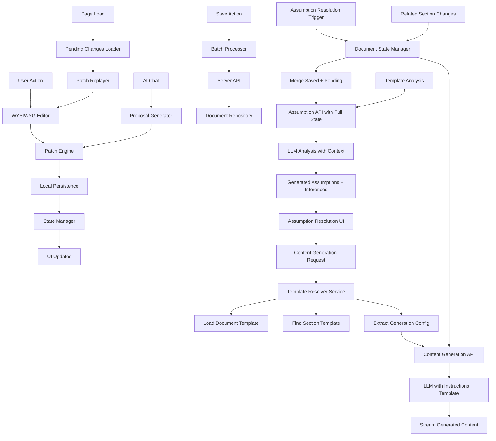

# CTRL FreaQ Frontend Architecture Document {#frontend-architecture-document}

## Template and Framework Selection {#template-framework-selection}

### Architectural Decision: React Frontend with Express.js Backend {#architectural-decision-react-express}

After analyzing the existing codebase and project requirements, this architecture adopts a **decoupled frontend approach** using React as the primary UI framework with Express.js as the backend API server. This decision is based on:

1. **Existing UI Investment**: Substantial React-based UI foundation exists in `docs/examples/ctrl-freaq-ui` with established patterns, components, and routing
2. **Ecosystem Alignment**: React's extensive ecosystem for WYSIWYG editors (Milkdown), real-time features, and component libraries (shadcn/ui)
3. **Team Expertise**: React's widespread adoption ensures easier onboarding and AI agent compatibility
4. **Clear Separation of Concerns**: Decoupling frontend from backend enables independent scaling and deployment

The Express.js server serves as a **pure API server**, exposing REST endpoints and SSE streams consumed by the React frontend. This provides a clear separation of concerns while leveraging React's strengths for complex UI interactions.

### Frontend Starter Analysis {#frontend-starter-analysis}

**Foundation Used**: Custom React + TypeScript setup based on lovable.ai generated code
- **Location**: `docs/examples/ctrl-freaq-ui`
- **Key Technologies**: React 18, TypeScript, Vite, React Router v6, JWT Auth, shadcn/ui, TanStack Query
- **Constraints**: Must maintain compatibility with existing component patterns and routing structure

### Assumptions and Resolutions {#assumptions-resolutions}

| Assumption | Resolution |
|------------|------------|
| Frontend framework choice conflicts with backend | Use React for UI, Express.js for API only |
| Document Editor complexity requires framework alignment | Milkdown works excellently with React |
| Authentication must be consistent | JWT tokens work seamlessly with both React and Express.js |
| Streaming AI responses need special handling | React supports SSE/WebStreams natively |
| Library-first architecture applies to frontend | Create React component libraries with Storybook documentation |

### Change Log {#ui-change-log}

| Date | Version | Description | Author |
|------|---------|-------------|--------|
| 2025-09-13 | 1.1 | Recreated from Old UI Architecture Document | Winston AI |
| 2025-09-12 | 1.0 | Initial frontend architecture with React/Express.js decoupling | Architect |

## Frontend Tech Stack {#frontend-tech-stack}

### Technology Stack Table {#technology-stack-table}

| Category | Technology | Version | Purpose | Rationale |
|----------|------------|---------|---------|-----------|
| Framework | React | 18.3.x | UI framework | Existing investment, ecosystem, AI agent familiarity |
| UI Library | shadcn/ui | latest | Component library | Accessible, customizable, TypeScript native |
| State Management | TanStack Query + Zustand | 5.x / 4.5.x | Server + client state | Excellent DX, built-in caching, minimal boilerplate |
| Routing | React Router | 6.x | Client-side routing | Industry standard, existing implementation |
| Build Tool | Vite | 5.x | Build and dev server | Fast HMR, ESM native, excellent DX |
| Styling | Tailwind CSS | 3.4.x | Utility-first CSS | Rapid development, consistent design system |
| Testing | Vitest + React Testing Library | 1.x / 14.x | Unit and integration testing | Vite native, excellent React support |
| Form Handling | React Hook Form + Zod | 7.x / 3.x | Form state and validation | Performance, TypeScript integration |
| Animation | Framer Motion | 11.x | Animations and transitions | Declarative API, gesture support |
| Logging | Pino | 9.5.0 | Browser logging with backend transmission | High-performance JSON logging, browser-optimized |
| Dev Tools | React DevTools + Vite Plugin | latest | Development experience | Debugging, performance profiling |

## Project Structure {#project-structure}

```plaintext
src/
├── app/                        # Application shell and providers
│   ├── providers/             # Context providers and wrappers
│   │   ├── auth-provider.tsx
│   │   ├── query-provider.tsx
│   │   ├── theme-provider.tsx
│   │   └── index.tsx
│   ├── router/                # Routing configuration
│   │   ├── routes.tsx
│   │   ├── protected-route.tsx
│   │   └── index.tsx
│   └── App.tsx
├── features/                  # Feature-based modules (Constitutional library-first)
│   ├── document-editor/      # Document editing feature
│   │   ├── components/
│   │   │   ├── editor-toolbar.tsx
│   │   │   ├── milkdown-editor.tsx
│   │   │   ├── section-navigator.tsx
│   │   │   └── diff-viewer.tsx
│   │   ├── hooks/
│   │   │   ├── use-editor-state.ts
│   │   │   ├── use-patch-engine.ts
│   │   │   └── use-pending-changes.ts
│   │   ├── services/
│   │   │   ├── editor-api.ts
│   │   │   └── patch-service.ts
│   │   ├── stores/
│   │   │   └── editor-store.ts
│   │   └── index.ts
│   ├── assumptions/          # Assumptions resolution
│   │   ├── components/
│   │   ├── hooks/
│   │   └── services/
│   ├── ai-chat/             # AI collaboration features
│   │   ├── components/
│   │   ├── hooks/
│   │   └── services/
│   └── quality-gates/       # QA and validation
│       ├── components/
│       ├── hooks/
│       └── services/
├── components/               # Shared UI components
│   ├── ui/                  # shadcn/ui components
│   │   ├── button.tsx
│   │   ├── dialog.tsx
│   │   └── [other shadcn components]
│   ├── layout/             # Layout components
│   │   ├── app-shell.tsx
│   │   ├── sidebar.tsx
│   │   └── header.tsx
│   └── common/             # Common components
│       ├── error-boundary.tsx
│       ├── loading-spinner.tsx
│       └── empty-state.tsx
├── pages/                   # Route pages
│   ├── dashboard/
│   │   └── index.tsx
│   ├── projects/
│   │   ├── [projectId]/
│   │   │   └── index.tsx
│   │   └── index.tsx
│   ├── documents/
│   │   ├── [documentId]/
│   │   │   ├── edit.tsx
│   │   │   └── index.tsx
│   │   └── new.tsx
│   └── auth/
│       ├── sign-in.tsx
│       └── sign-up.tsx
├── lib/                     # Core utilities (Constitutional library requirement)
│   ├── api/                # API client configuration
│   │   ├── client.ts
│   │   ├── endpoints.ts
│   │   └── types.ts
│   ├── streaming/          # SSE/WebStream utilities
│   │   ├── sse-client.ts
│   │   └── stream-parser.ts
│   ├── utils/              # Utility functions
│   │   ├── cn.ts
│   │   └── format.ts
│   └── constants/          # App constants
│       └── config.ts
├── hooks/                   # Global hooks
│   ├── use-auth.ts
│   ├── use-toast.ts
│   └── use-debounce.ts
├── stores/                  # Global state stores
│   ├── auth-store.ts
│   ├── project-store.ts
│   └── ui-store.ts
├── styles/                  # Global styles
│   ├── globals.css
│   └── themes/
│       ├── light.css
│       └── dark.css
├── types/                   # TypeScript type definitions
│   ├── api.ts
│   ├── models.ts
│   └── global.d.ts
└── test/                    # Test utilities
    ├── setup.ts
    ├── mocks/
    └── fixtures/
```

## Component Standards {#component-standards}

### Component Template {#component-template}

```typescript
// src/features/[feature]/components/[component-name].tsx
import { FC, memo, useCallback, useState } from 'react';
import { cn } from '@/lib/utils';

export interface ComponentNameProps {
  className?: string;
  children?: React.ReactNode;
  // Add specific props with JSDoc comments
  /** Handler called when action occurs */
  onAction?: (value: string) => void;
}

/**
 * ComponentName - Brief description of component purpose
 *
 * @example
 * ```tsx
 * <ComponentName onAction={handleAction}>
 *   Content
 * </ComponentName>
 * ```
 */
export const ComponentName: FC<ComponentNameProps> = memo(({
  className,
  children,
  onAction,
}) => {
  const [state, setState] = useState<string>('');

  const handleClick = useCallback((value: string) => {
    setState(value);
    onAction?.(value);
  }, [onAction]);

  return (
    <div className={cn('component-base-styles', className)}>
      {children}
    </div>
  );
});

ComponentName.displayName = 'ComponentName';
```

### Naming Conventions {#naming-conventions}

| Element | Convention | Example |
|---------|------------|---------|
| Components | PascalCase | `DocumentEditor.tsx` |
| Component files | kebab-case or PascalCase | `document-editor.tsx` or `DocumentEditor.tsx` |
| Hooks | camelCase with 'use' prefix | `useDocumentState.ts` |
| Services | camelCase with 'Service' suffix | `documentService.ts` |
| Stores | camelCase with 'Store' suffix | `editorStore.ts` |
| Types/Interfaces | PascalCase | `DocumentState`, `EditorConfig` |
| Constants | SCREAMING_SNAKE_CASE | `MAX_FILE_SIZE` |
| CSS classes | kebab-case | `editor-toolbar` |
| Test files | [name].test.tsx | `DocumentEditor.test.tsx` |

## State Management {#state-management}

### Store Architecture {#store-architecture}

```plaintext
src/stores/
├── auth-store.ts           # Authentication state
├── project-store.ts        # Project management
├── document-store.ts       # Document state
├── editor-store.ts         # Editor specific state
└── ui-store.ts            # UI preferences and state
```

### State Management Template {#state-management-template}

```typescript
// src/stores/document-store.ts
import { create } from 'zustand';
import { devtools, persist } from 'zustand/middleware';
import { immer } from 'zustand/middleware/immer';

export interface Document {
  id: string;
  title: string;
  content: string;
  status: 'draft' | 'ready' | 'published';
  sections: Section[];
}

interface DocumentStore {
  // State
  documents: Record<string, Document>;
  activeDocumentId: string | null;
  pendingChanges: Record<string, PatchDiff[]>;

  // Computed getters
  get activeDocument(): Document | null;

  // Actions
  setActiveDocument: (id: string) => void;
  updateDocument: (id: string, updates: Partial<Document>) => void;
  addPendingChange: (documentId: string, patch: PatchDiff) => void;
  clearPendingChanges: (documentId: string) => void;

  // Async actions (integrate with API)
  fetchDocument: (id: string) => Promise<void>;
  saveDocument: (id: string) => Promise<void>;
}

export const useDocumentStore = create<DocumentStore>()(
  devtools(
    persist(
      immer((set, get) => ({
        // Initial state
        documents: {},
        activeDocumentId: null,
        pendingChanges: {},

        // Computed getters
        get activeDocument() {
          const state = get();
          return state.activeDocumentId
            ? state.documents[state.activeDocumentId]
            : null;
        },

        // Synchronous actions
        setActiveDocument: (id) => set((state) => {
          state.activeDocumentId = id;
        }),

        updateDocument: (id, updates) => set((state) => {
          if (state.documents[id]) {
            Object.assign(state.documents[id], updates);
          }
        }),

        addPendingChange: (documentId, patch) => set((state) => {
          if (!state.pendingChanges[documentId]) {
            state.pendingChanges[documentId] = [];
          }
          state.pendingChanges[documentId].push(patch);
        }),

        clearPendingChanges: (documentId) => set((state) => {
          delete state.pendingChanges[documentId];
        }),

        // Async actions
        fetchDocument: async (id) => {
          const response = await documentApi.getDocument(id);
          set((state) => {
            state.documents[id] = response.data;
          });
        },

        saveDocument: async (id) => {
          const document = get().documents[id];
          const patches = get().pendingChanges[id] || [];

          await documentApi.saveDocument(id, { document, patches });

          set((state) => {
            state.clearPendingChanges(id);
          });
        },
      })),
      {
        name: 'document-storage',
        partialize: (state) => ({
          pendingChanges: state.pendingChanges,
        }),
      }
    )
  )
);
```

## API Integration {#api-integration}

### Service Template {#service-template}

```typescript
// src/lib/api/services/document-service.ts
import { apiClient } from '@/lib/api/client';
import { Document, Section, Assumption, Proposal } from '@/types/models';

export interface PaginatedResponse<T> {
  items: T[];
  nextCursor?: string;
  total?: number;
}

export interface ApiError {
  code: string;
  message: string;
  details?: any;
  requestId?: string;
}

class DocumentService {
  private baseUrl = '/api/v1/documents';

  /**
   * Fetch a document by ID
   */
  async getDocument(id: string): Promise<Document> {
    return apiClient.get<Document>(`${this.baseUrl}/${id}`);
  }

  /**
   * Create a new document
   */
  async createDocument(data: {
    type: 'architecture' | 'prd' | 'ui';
    title: string;
    templateId: string;
  }): Promise<Document> {
    return apiClient.post<Document>(this.baseUrl, data);
  }

  /**
   * Update document with patches
   */
  async updateDocument(
    id: string,
    patches: PatchDiff[]
  ): Promise<Document> {
    return apiClient.patch<Document>(`${this.baseUrl}/${id}`, { patches });
  }

  /**
   * Stream AI proposals for a section
   */
  streamProposals(
    sectionId: string,
    context: ProposalContext,
    onChunk: (chunk: ProposalChunk) => void,
    onComplete: () => void,
    onError: (error: Error) => void
  ): () => void {
    const eventSource = new EventSource(
      `/api/v1/sections/${sectionId}/proposals.generate`,
      {
        withCredentials: true,
      }
    );

    eventSource.onmessage = (event) => {
      try {
        const chunk = JSON.parse(event.data) as ProposalChunk;
        onChunk(chunk);
      } catch (error) {
        console.error('Failed to parse proposal chunk:', error);
      }
    };

    eventSource.onerror = (error) => {
      onError(new Error('Proposal stream failed'));
      eventSource.close();
    };

    eventSource.addEventListener('complete', () => {
      onComplete();
      eventSource.close();
    });

    // Return cleanup function
    return () => eventSource.close();
  }

  /**
   * Run quality gates
   */
  async runQualityGates(documentId: string): Promise<QualityGateResult> {
    return apiClient.post<QualityGateResult>(
      `${this.baseUrl}/${documentId}/gates.run`
    );
  }
}

export const documentService = new DocumentService();
```

### API Client Configuration {#api-client-configuration}

```typescript
// src/lib/api/client.ts
import { getAuth } from '@clerk/clerk-react';

export interface ApiClientConfig {
  baseURL: string;
  timeout?: number;
  headers?: Record<string, string>;
}

export class ApiClient {
  private config: ApiClientConfig;

  constructor(config: ApiClientConfig) {
    this.config = {
      timeout: 30000,
      ...config,
    };
  }

  private async getHeaders(): Promise<Headers> {
    const headers = new Headers({
      'Content-Type': 'application/json',
      ...this.config.headers,
    });

    // Add Clerk authentication token
    try {
      const { getToken } = getAuth();
      const token = await getToken();
      if (token) {
        headers.set('Authorization', `Bearer ${token}`);
      }
    } catch (error) {
      console.warn('Failed to get auth token:', error);
    }

    return headers;
  }

  private async handleResponse<T>(response: Response): Promise<T> {
    if (!response.ok) {
      const error = await response.json().catch(() => ({
        code: 'unknown_error',
        message: 'An unexpected error occurred',
      }));

      throw new ApiError(
        error.code || 'unknown_error',
        error.message || response.statusText,
        response.status,
        error.details,
        error.requestId
      );
    }

    // Handle empty responses
    if (response.status === 204) {
      return {} as T;
    }

    return response.json();
  }

  async get<T>(path: string, params?: Record<string, any>): Promise<T> {
    const url = new URL(`${this.config.baseURL}${path}`);
    if (params) {
      Object.entries(params).forEach(([key, value]) => {
        if (value !== undefined && value !== null) {
          url.searchParams.append(key, String(value));
        }
      });
    }

    const response = await fetch(url.toString(), {
      method: 'GET',
      headers: await this.getHeaders(),
    });

    return this.handleResponse<T>(response);
  }

  async post<T>(path: string, data?: any): Promise<T> {
    const response = await fetch(`${this.config.baseURL}${path}`, {
      method: 'POST',
      headers: await this.getHeaders(),
      body: data ? JSON.stringify(data) : undefined,
    });

    return this.handleResponse<T>(response);
  }

  async patch<T>(path: string, data?: any): Promise<T> {
    const response = await fetch(`${this.config.baseURL}${path}`, {
      method: 'PATCH',
      headers: await this.getHeaders(),
      body: data ? JSON.stringify(data) : undefined,
    });

    return this.handleResponse<T>(response);
  }

  async delete<T>(path: string): Promise<T> {
    const response = await fetch(`${this.config.baseURL}${path}`, {
      method: 'DELETE',
      headers: await this.getHeaders(),
    });

    return this.handleResponse<T>(response);
  }
}

// Export configured instance
export const apiClient = new ApiClient({
  baseURL: import.meta.env.VITE_API_BASE_URL || 'http://localhost:5173',
});

// Custom error class
export class ApiError extends Error {
  constructor(
    public code: string,
    message: string,
    public status: number,
    public details?: any,
    public requestId?: string
  ) {
    super(message);
    this.name = 'ApiError';
  }
}
```

## Routing {#routing}

### Route Configuration {#route-configuration}

```typescript
// src/app/router/routes.tsx
import { lazy, Suspense } from 'react';
import { Routes, Route, Navigate } from 'react-router-dom';
import { ProtectedRoute } from './protected-route';
import { LoadingSpinner } from '@/components/common/loading-spinner';

// Lazy load pages for code splitting
const Dashboard = lazy(() => import('@/pages/dashboard'));
const ProjectList = lazy(() => import('@/pages/projects'));
const ProjectDetail = lazy(() => import('@/pages/projects/[projectId]'));
const DocumentEditor = lazy(() => import('@/pages/documents/[documentId]/edit'));
const DocumentView = lazy(() => import('@/pages/documents/[documentId]'));
const NewDocument = lazy(() => import('@/pages/documents/new'));
const SignIn = lazy(() => import('@/pages/auth/sign-in'));
const SignUp = lazy(() => import('@/pages/auth/sign-up'));

export const AppRoutes = () => {
  return (
    <Suspense fallback={<LoadingSpinner fullScreen />}>
      <Routes>
        {/* Public routes */}
        <Route path="/auth/sign-in" element={<SignIn />} />
        <Route path="/auth/sign-up" element={<SignUp />} />

        {/* Protected routes */}
        <Route element={<ProtectedRoute />}>
          <Route path="/" element={<Navigate to="/dashboard" replace />} />
          <Route path="/dashboard" element={<Dashboard />} />

          {/* Projects */}
          <Route path="/projects" element={<ProjectList />} />
          <Route path="/projects/:projectId" element={<ProjectDetail />} />

          {/* Documents */}
          <Route path="/documents/new" element={<NewDocument />} />
          <Route path="/documents/:documentId" element={<DocumentView />} />
          <Route path="/documents/:documentId/edit" element={<DocumentEditor />} />
        </Route>

        {/* 404 fallback */}
        <Route path="*" element={<Navigate to="/dashboard" replace />} />
      </Routes>
    </Suspense>
  );
};

// Protected route wrapper
// src/app/router/protected-route.tsx
import { useAuth } from '@clerk/clerk-react';
import { Navigate, Outlet, useLocation } from 'react-router-dom';
import { LoadingSpinner } from '@/components/common/loading-spinner';

export const ProtectedRoute = () => {
  const { isLoaded, isSignedIn } = useAuth();
  const location = useLocation();

  if (!isLoaded) {
    return <LoadingSpinner fullScreen />;
  }

  if (!isSignedIn) {
    return <Navigate to="/auth/sign-in" state={{ from: location }} replace />;
  }

  return <Outlet />;
};
```

## Document Editor Architecture {#document-editor-architecture}

### Core Components {#editor-core-components}

#### WYSIWYG Markdown Editor {#wysiwyg-markdown-editor}
- **Purpose**: Provide rich text editing experience while maintaining Markdown compatibility
- **Implementation**: Milkdown v7.15.5 (https://github.com/Milkdown/milkdown) - Plugin-based WYSIWYG markdown editor built on ProseMirror
- **Features**:
  - Real-time WYSIWYG editing with Markdown source compatibility
  - Extensible plugin system for custom functionality
  - Built-in support for tables, code blocks, math equations
  - Theme system with customizable styling
  - Collaborative editing capabilities via Yjs integration
  - Command system for keyboard shortcuts and toolbar actions
  - TypeScript support with comprehensive type definitions

**Milkdown Integration Architecture**:
- **Core Editor**: Milkdown editor instance per section with isolated state
- **Plugin Configuration**: Custom plugins for section-specific behavior (status indicators, assumptions integration)
- **Theme Integration**: Custom theme aligned with application design system
- **Change Tracking**: Integration with Git-style patch engine via Milkdown's onChange API
- **Collaborative Features**: Yjs integration for real-time collaboration (Phase 2)
- **Performance**: Editor instance pooling for memory management across sections

#### Git-Style Patch Engine (`packages/editor-core`) {#git-style-patch-engine}
- **Purpose**: Track document changes as atomic patch operations
- **Key Functions**:
  - `createPatch(original: string, modified: string): Patch[]`
  - `applyPatch(content: string, patches: Patch[]): string`
  - `previewPatch(content: string, patches: Patch[]): DiffView`
- **Benefits**: Granular change tracking, conflict resolution, undo/redo capabilities

#### Local Persistence Layer (`packages/editor-persistence`) {#local-persistence-layer}
- **Purpose**: Manage pending changes before server persistence
- **Storage Strategy**:
  - Client-side storage (localStorage/IndexedDB via localforage)
  - Per-section patch diffs with timestamps
  - Automatic replay on page reload
- **Conflict Resolution**: Last-write-wins with user notification

#### Section Navigation & State Management {#section-navigation-state-management}
- **Table of Contents**: Interactive navigation with section status indicators
- **Section States**:
  - `idle` (not selected)
  - `read_mode` (viewing content)
  - `edit_mode` (WYSIWYG editing)
  - `has_pending` (unsaved changes)
  - `saving` (persistence in progress)
- **State Transitions**: Managed through centralized state machine

#### Document State Manager (`packages/editor-persistence`) {#document-state-manager}
- **Purpose**: Manages document state including both saved content and pending changes
- **Core Functions**:
  - `getCurrentState(): DocumentState` - Merge saved content with pending patches
  - `prepareForAssumptionResolution(sectionId: string): AssumptionContext` - Prepare state for assumption APIs
  - `applyPendingPatches(savedContent: string, patches: PatchDiff[]): string` - Apply patches to content
  - `trackSectionChanges(sectionId: string, patches: PatchDiff[])` - Track pending changes per section
  - `hasUnsavedChanges(sectionId?: string): boolean` - Check for unsaved changes
- **State Tracking**:
  - Per-section pending patches with timestamps
  - Automatic replay on page load
  - Delta compression for large documents
  - Conflict detection for collaborative editing

#### Integration Points {#editor-integration-points}
- **AI Assistance**: Conversational co-authoring within editor context with full document state
- **Quality Gates**: Real-time validation during editing with pending changes context
- **Export System**: Batch conversion of pending changes to final document format
- **Collaboration**: Section-level editing indicators and conflict warnings
- **Assumption Resolution**: Full document state including unsaved changes for context-aware assumptions

### Data Flow Architecture {#data-flow-architecture}



### Performance Considerations {#editor-performance-considerations}
- **Incremental Loading**: Load document sections on-demand as user navigates
- **Debounced Persistence**: Batch local changes to reduce storage operations
- **Diff Optimization**: Use efficient diff algorithms to minimize patch size
- **Memory Management**: Clear unused editor instances when navigating between sections

### Document State Synchronization {#document-state-synchronization}

#### State Management Strategy {#state-management-strategy}
The Document Editor maintains multiple layers of state to support real-time editing while ensuring data consistency:

1. **Server State**: Last saved version of each section stored in database
2. **Client Cache**: Local copy of saved state for offline capability
3. **Pending Changes**: Git-style patch diffs for each modified section
4. **Merged State**: Real-time combination of saved state + pending patches

#### State Synchronization Patterns {#state-synchronization-patterns}

**For AI Operations** (Assumptions, Chat, Proposals):
- Always send complete merged state including pending changes
- Use delta compression for large documents (>100KB)
- Include section dependency graph for context understanding
- Cache merged state to avoid recomputation per API call

**For Collaborative Editing**:
- Broadcast pending changes to other users in real-time
- Implement operational transformation for conflict resolution
- Use section-level locking to prevent simultaneous edits
- Maintain activity log for audit and rollback capability

**For Persistence Operations**:
- Batch multiple section changes into single save operation
- Use optimistic updates with rollback on server errors
- Implement automatic save with user-configurable intervals
- Preserve patch history for undo/redo functionality

#### API Integration Patterns {#api-integration-patterns}

```typescript
// Example: Preparing document state for assumption resolution
interface DocumentState {
  sections: Array<{
    id: string;
    savedContent: string;        // Last saved version
    pendingPatches: PatchDiff[]; // Unsaved changes
    mergedContent: string;       // Computed: savedContent + patches
    lastModified: timestamp;
    hasConflicts: boolean;
  }>;
  metadata: {
    documentVersion: string;
    lastSyncTime: timestamp;
    conflictResolution: 'last-write-wins' | 'manual';
  };
}

// Usage in assumption resolution
POST /api/v1/documents/{docId}/assumptions/query
{
  "sectionId": "SEC123",
  "currentState": {
    "sections": [
      {
        "id": "SEC123",
        "content": "merged content with pending changes",
        "hasUnsavedChanges": true
      },
      // Include related sections for context
      ...relatedSections
    ]
  }
}
```

#### Performance Optimizations {#state-performance-optimizations}

- **State Compression**: Use diff-based compression for large documents
- **Selective Synchronization**: Only send changed sections to APIs
- **Smart Caching**: Cache assumption results per document state hash
- **Background Processing**: Pre-compute assumptions for likely next sections
- **Network Optimization**: Batch API calls and use HTTP/2 multiplexing

#### Error Handling & Recovery {#state-error-handling-recovery}

- **Connection Loss**: Queue pending changes locally, sync on reconnect
- **Merge Conflicts**: Present diff view with manual resolution options
- **Server Errors**: Rollback optimistic updates, preserve user changes
- **Data Corruption**: Automatic backup creation before major operations

### Template Resolution & Content Generation {#template-resolution-content-generation}

#### Template Hierarchy Traversal {#template-hierarchy-traversal}
The Template Resolver Service navigates complex document template hierarchies to find section-specific configuration:

```typescript
interface TemplateSection {
  id: string;                 // e.g., "introduction", "high-level-architecture"
  title?: string;
  instruction?: string;       // LLM instructions for content generation
  template?: string;          // Template text for LLM to render/fill
  type?: 'paragraphs'|'bullet-list'|'numbered-list'|'table'|'mermaid'|'custom';
  sections?: TemplateSection[]; // nested sub-sections
  decisionAggressivenessDefault?: 'conservative'|'balanced'|'yolo';
}

// Traversal algorithm
function findSectionTemplate(documentTemplate: DocumentTemplate, sectionId: string): TemplateSection | null {
  // Breadth-first search through nested sections
  const queue = [...documentTemplate.sections];

  while (queue.length > 0) {
    const section = queue.shift();
    if (section.id === sectionId) {
      return section;
    }
    if (section.sections) {
      queue.push(...section.sections);
    }
  }

  return null;
}
```

#### Generation Configuration Extraction {#generation-configuration-extraction}
Extract all generation-relevant configuration with proper inheritance:

```typescript
interface GenerationConfig {
  instruction?: string;
  template?: string;
  type?: string;
  aggressivenessPolicy: 'Conservative' | 'Balanced' | 'YOLO';
  maxTokens?: number;
  temperature?: number;
}

function extractGenerationConfig(
  sectionTemplate: TemplateSection,
  documentTemplate: DocumentTemplate
): GenerationConfig {
  return {
    instruction: sectionTemplate.instruction,
    template: sectionTemplate.template,
    type: sectionTemplate.type,
    // Inheritance: section -> document -> system default
    aggressivenessPolicy:
      sectionTemplate.decisionAggressivenessDefault ||
      documentTemplate.decisionAggressivenessDefault ||
      'Balanced',
    maxTokens: sectionTemplate.maxTokens || documentTemplate.maxTokens || 4000,
    temperature: sectionTemplate.temperature || documentTemplate.temperature || 0.7
  };
}
```

#### Template Caching Strategy {#template-caching-strategy}

**Cache Structure**:
```typescript
interface TemplateCache {
  templates: Map<string, CachedTemplate>;     // templateId -> template
  sections: Map<string, CachedSection>;       // sectionKey -> resolved config
  lruOrder: string[];                         // LRU tracking
  maxSize: number;                           // Cache size limit
}

interface CachedTemplate {
  template: DocumentTemplate;
  version: string;
  loadedAt: timestamp;
  accessCount: number;
}

interface CachedSection {
  templateId: string;
  sectionId: string;
  config: GenerationConfig;
  templateVersion: string;
  resolvedAt: timestamp;
}
```

**Cache Operations**:
- **Cache Key**: `${templateId}:${sectionId}:${templateVersion}` for section configs
- **Invalidation**: Version-based - clear all entries when template version changes
- **LRU Eviction**: Remove least recently used templates when cache size exceeded
- **Background Refresh**: Pre-load commonly used templates during low traffic
- **Cache Warming**: Load document template when first section is accessed

#### Content Generation Pipeline {#content-generation-pipeline}

```typescript
async function generateSectionContent(sectionId: string, request: ContentGenerationRequest) {
  // 1. Resolve template with caching
  const cacheKey = `${request.documentId}:${sectionId}`;
  let config = templateCache.get(cacheKey);

  if (!config || config.templateVersion !== currentTemplateVersion) {
    const documentTemplate = await templateResolver.loadDocumentTemplate(request.templateId);
    const sectionTemplate = templateResolver.findSectionTemplate(documentTemplate, sectionId);

    if (!sectionTemplate) {
      throw new Error(`Section template not found: ${sectionId}`);
    }

    config = templateResolver.extractGenerationConfig(sectionTemplate, documentTemplate);
    templateCache.set(cacheKey, config);
  }

  // 2. Build context-aware prompt
  const prompt = buildContentGenerationPrompt({
    instruction: config.instruction,
    template: config.template,
    documentState: request.currentDocumentState,
    resolvedAssumptions: request.resolvedAssumptions,
    sectionType: config.type
  });

  // 3. Stream LLM generation with progress events
  return streamLLMGeneration(prompt, {
    maxTokens: config.maxTokens,
    temperature: config.temperature
  });
}
```

#### Error Handling & Fallbacks {#template-error-handling-fallbacks}

- **Template Not Found**: Use default generation strategy with basic instructions
- **Invalid Template Syntax**: Validate before sending to LLM, fall back to instruction-only mode
- **Cache Corruption**: Rebuild cache from source templates on validation failure
- **Network Failures**: Use cached templates during template service outages
- **LLM Errors**: Retry with simplified prompt if generation fails

## Testing Requirements {#testing-requirements}

### Component Test Template {#component-test-template}

```typescript
// src/features/document-editor/components/__tests__/DocumentEditor.test.tsx
import { describe, it, expect, vi, beforeEach } from 'vitest';
import { render, screen, waitFor, within } from '@testing-library/react';
import userEvent from '@testing-library/user-event';
import { QueryClient, QueryClientProvider } from '@tanstack/react-query';
import { DocumentEditor } from '../DocumentEditor';
import { documentService } from '@/lib/api/services/document-service';

// Mock API service
vi.mock('@/lib/api/services/document-service');

// Test utilities
const createWrapper = () => {
  const queryClient = new QueryClient({
    defaultOptions: {
      queries: { retry: false },
      mutations: { retry: false },
    },
  });

  return ({ children }: { children: React.ReactNode }) => (
    <QueryClientProvider client={queryClient}>
      {children}
    </QueryClientProvider>
  );
};

describe('DocumentEditor', () => {
  const mockDocument = {
    id: 'doc-1',
    title: 'Test Document',
    content: '# Test Content',
    status: 'draft' as const,
    sections: [],
  };

  beforeEach(() => {
    vi.clearAllMocks();
    vi.mocked(documentService.getDocument).mockResolvedValue(mockDocument);
  });

  it('renders document editor with content', async () => {
    render(
      <DocumentEditor documentId="doc-1" />,
      { wrapper: createWrapper() }
    );

    // Wait for document to load
    await waitFor(() => {
      expect(screen.getByText('Test Document')).toBeInTheDocument();
    });

    // Verify editor components
    expect(screen.getByRole('textbox', { name: /editor/i })).toBeInTheDocument();
    expect(screen.getByRole('navigation', { name: /sections/i })).toBeInTheDocument();
  });

  it('handles user text input', async () => {
    const user = userEvent.setup();

    render(
      <DocumentEditor documentId="doc-1" />,
      { wrapper: createWrapper() }
    );

    await waitFor(() => {
      expect(screen.getByText('Test Document')).toBeInTheDocument();
    });

    const editor = screen.getByRole('textbox', { name: /editor/i });
    await user.type(editor, 'New content');

    expect(editor).toHaveValue(expect.stringContaining('New content'));
  });

  it('saves document on save button click', async () => {
    const user = userEvent.setup();
    vi.mocked(documentService.updateDocument).mockResolvedValue({
      ...mockDocument,
      content: 'Updated content',
    });

    render(
      <DocumentEditor documentId="doc-1" />,
      { wrapper: createWrapper() }
    );

    await waitFor(() => {
      expect(screen.getByText('Test Document')).toBeInTheDocument();
    });

    // Make changes
    const editor = screen.getByRole('textbox', { name: /editor/i });
    await user.clear(editor);
    await user.type(editor, 'Updated content');

    // Click save
    const saveButton = screen.getByRole('button', { name: /save/i });
    await user.click(saveButton);

    // Verify API call
    await waitFor(() => {
      expect(documentService.updateDocument).toHaveBeenCalledWith(
        'doc-1',
        expect.any(Array) // patches
      );
    });
  });

  it('displays error when document fails to load', async () => {
    const error = new Error('Failed to load document');
    vi.mocked(documentService.getDocument).mockRejectedValue(error);

    render(
      <DocumentEditor documentId="doc-1" />,
      { wrapper: createWrapper() }
    );

    await waitFor(() => {
      expect(screen.getByText(/failed to load document/i)).toBeInTheDocument();
    });
  });
});
```

### Testing Best Practices {#testing-best-practices}

1. **Unit Tests**: Test individual components in isolation
2. **Integration Tests**: Test component interactions
3. **E2E Tests**: Test critical user flows (using Cypress/Playwright)
4. **Coverage Goals**: Aim for 80% code coverage
5. **Test Structure**: Arrange-Act-Assert pattern
6. **Mock External Dependencies**: API calls, routing, state management

## Browser Logging with Pino {#browser-logging-pino}

### Logging Architecture {#frontend-logging-architecture}
- **Technology**: Pino for browser-optimized structured logging
- **Backend Transmission**: Automatic error transmission to `/api/v1/logs` endpoint
- **Context Management**: Component and feature-specific child loggers
- **Performance Tracking**: Web Vitals and component render timing integration
- **Environment Configuration**:
  - Development: Console output with pretty formatting
  - Production: Error-only transmission to backend
  - Test: Silent mode with mocked transmission

### Browser-Specific Considerations {#browser-specific-considerations}
- Serialization of browser objects (Events, Errors) for backend compatibility
- RequestId correlation between frontend and backend logs
- User context (userId, sessionId) attached to all log entries
- Automatic URL and user agent capture for debugging
- Graceful fallback to console when backend transmission fails

## Environment Configuration {#environment-configuration}

```bash
# .env.development
VITE_API_BASE_URL=http://localhost:5173
VITE_CLERK_PUBLISHABLE_KEY=pk_test_...
VITE_ENABLE_MOCK_API=false
VITE_LOG_LEVEL=debug
VITE_SSE_TIMEOUT=30000
VITE_MAX_FILE_SIZE=10485760
VITE_ENABLE_DEV_TOOLS=true

# .env.production
VITE_API_BASE_URL=https://api.ctrl-freaq.com
VITE_CLERK_PUBLISHABLE_KEY=pk_live_...
VITE_ENABLE_MOCK_API=false
VITE_LOG_LEVEL=error
VITE_SSE_TIMEOUT=60000
VITE_MAX_FILE_SIZE=52428800
VITE_ENABLE_DEV_TOOLS=false

# .env.test
VITE_API_BASE_URL=http://localhost:3001
VITE_CLERK_PUBLISHABLE_KEY=pk_test_mock
VITE_ENABLE_MOCK_API=true
VITE_LOG_LEVEL=silent
VITE_SSE_TIMEOUT=5000
VITE_MAX_FILE_SIZE=1048576
VITE_ENABLE_DEV_TOOLS=false
```

## Frontend Developer Standards {#frontend-developer-standards}

### Critical Coding Rules {#critical-coding-rules}

1. **Never commit sensitive data** - Use environment variables for all secrets
2. **Always use TypeScript** - No `any` types except when absolutely necessary
3. **Component composition over inheritance** - Use hooks and composition patterns
4. **Immutable state updates** - Never mutate state directly, use Immer in Zustand
5. **Error boundaries for all features** - Wrap feature components in error boundaries
6. **Memoize expensive computations** - Use `useMemo` and `useCallback` appropriately
7. **Lazy load route components** - Use React.lazy for code splitting
8. **Validate all API responses** - Use Zod schemas for runtime validation
9. **Handle loading and error states** - Every async operation needs UI feedback
10. **Test user interactions** - Focus on testing what users do, not implementation
11. **Use semantic HTML** - Proper ARIA labels and keyboard navigation
12. **Optimize bundle size** - Monitor with Bundle Analyzer, tree-shake imports

### Quick Reference {#quick-reference}

#### Common Commands {#common-commands}
```bash
# Development
npm run dev              # Start dev server (Vite)
npm run build           # Build for production
npm run preview         # Preview production build
npm run type-check      # Run TypeScript compiler
npm run lint            # Run ESLint
npm run format          # Run Prettier
npm test                # Run tests
npm run test:watch      # Run tests in watch mode
npm run test:coverage   # Generate coverage report
npm run storybook       # Start Storybook

# Code generation
npm run generate:component   # Generate component boilerplate
npm run generate:feature    # Generate feature module
npm run generate:api        # Generate API service
```

#### Key Import Patterns {#key-import-patterns}
```typescript
// Components
import { Button } from '@/components/ui/button';
import { DocumentEditor } from '@/features/document-editor';

// Hooks
import { useAuth } from '@/hooks/use-auth';
import { useDocumentStore } from '@/stores/document-store';

// Services
import { documentService } from '@/lib/api/services/document-service';

// Utils
import { cn } from '@/lib/utils';
import { formatDate } from '@/lib/utils/format';

// Types
import type { Document } from '@/types/models';
```

#### File Naming Conventions {#file-naming-conventions}
```
components/
  Button.tsx              # Component
  button.test.tsx        # Test
  button.stories.tsx     # Storybook

hooks/
  use-auth.ts            # Hook
  use-auth.test.ts       # Test

services/
  document-service.ts    # Service
  document-service.test.ts # Test
```

#### Project-Specific Patterns {#project-specific-patterns}
```typescript
// Feature module export pattern
// features/document-editor/index.ts
export { DocumentEditor } from './components/DocumentEditor';
export { useEditorState } from './hooks/use-editor-state';
export type { EditorConfig } from './types';

// API error handling pattern
try {
  const document = await documentService.getDocument(id);
} catch (error) {
  if (error instanceof ApiError) {
    if (error.code === 'not_found') {
      // Handle not found
    }
  }
  // Generic error handling
}

// Streaming response pattern
const cleanup = documentService.streamProposals(
  sectionId,
  context,
  (chunk) => {
    // Handle chunk
  },
  () => {
    // Handle complete
  },
  (error) => {
    // Handle error
  }
);

// Cleanup on unmount
useEffect(() => {
  return cleanup;
}, []);
```

---

## Integration with Express.js Backend {#integration-express-backend}

The React frontend communicates with the Express.js backend through:

1. **REST APIs** at `/api/v1/*` endpoints
2. **Server-Sent Events (SSE)** for streaming AI responses
3. **WebSocket** connections for real-time collaboration (Phase 2)

All API calls include Clerk authentication tokens and follow the error handling patterns defined in the backend architecture document.

## Constitutional Compliance {#constitutional-compliance-frontend}

This frontend architecture maintains alignment with Constitutional requirements:

- **Library-First**: Features organized as standalone modules with clear boundaries
- **CLI Interfaces**: Component generation scripts and development tools
- **Test-First Development**: Testing templates and patterns enforced
- **Observability**: Comprehensive error tracking and performance monitoring
- **Simplicity**: Minimal abstraction, composition over inheritance