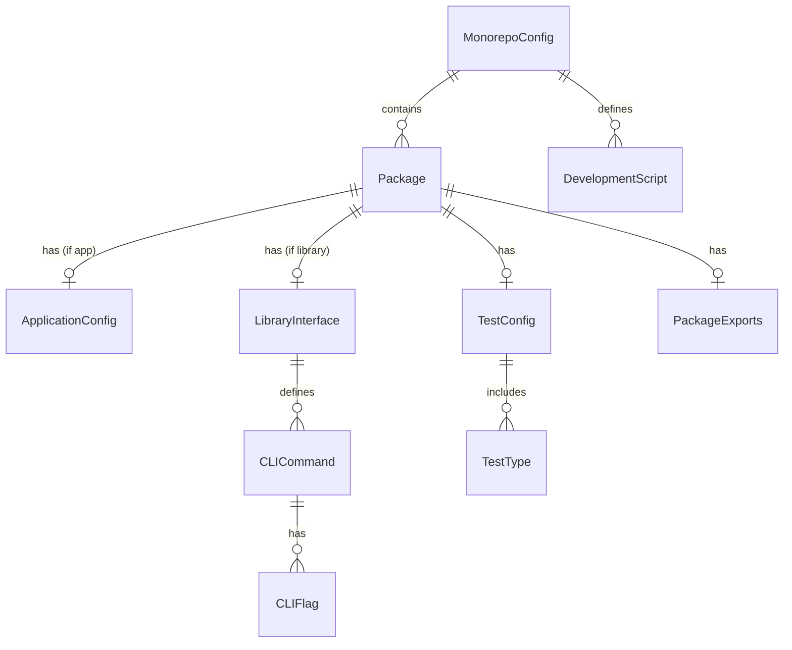

# Data Model: Development Environment Bootstrap

## Core Entities

### MonorepoConfig
**Purpose**: Root configuration for the monorepo
**Fields**:
- `workspaces`: string[] - List of workspace paths
- `packageManager`: string - "pnpm@9.x"
- `nodeVersion`: string - "20.x"
- `scripts`: Record<string, string> - Root-level commands

**Validation**:
- workspaces must include ["apps/*", "packages/*"]
- packageManager must be pnpm version 9.x
- nodeVersion must be Node.js 20.x LTS

### Package
**Purpose**: Individual package or application metadata
**Fields**:
- `name`: string - Scoped package name (e.g., "@ctrl-freaq/shared-data")
- `version`: string - Semantic version (starts at 0.1.0)
- `type`: enum - "application" | "library"
- `path`: string - Relative path from root
- `dependencies`: Record<string, string>
- `scripts`: Record<string, string>
- `exports`: PackageExports

**Validation**:
- name must follow npm scoping rules
- version must be valid semver
- libraries must have CLI entry point
- libraries must have README.md

### PackageExports
**Purpose**: Define package public API
**Fields**:
- `main`: string - CommonJS entry (if needed)
- `module`: string - ESM entry point
- `types`: string - TypeScript definitions
- `bin`: Record<string, string> - CLI commands (libraries only)

### ApplicationConfig
**Purpose**: Application-specific configuration
**Subtypes**:

#### FrontendConfig (apps/web)
- `framework`: "react"
- `buildTool`: "vite"
- `port`: 5173
- `apiUrl`: string - Backend URL
- `authProvider`: "clerk"

#### BackendConfig (apps/api)
- `framework`: "express"
- `port`: 5001
- `database`: "sqlite"
- `apiVersion`: "v1"
- `corsOrigin`: string[]

### LibraryInterface
**Purpose**: Define library boundaries and contracts
**Fields**:
- `name`: string - Library name
- `purpose`: string - Problem it solves
- `cliCommands`: CLICommand[]
- `exports`: string[] - Public API surface
- `dependencies`: string[] - Required packages

### CLICommand
**Purpose**: Individual CLI command specification
**Fields**:
- `name`: string - Command name
- `description`: string
- `flags`: CLIFlag[]
- `examples`: string[]
- `outputFormat`: "json" | "human" | "both"

### CLIFlag
**Purpose**: Command-line flag definition
**Fields**:
- `name`: string
- `short`: string - Single character
- `description`: string
- `required`: boolean
- `default`: any
- `type`: "string" | "number" | "boolean"

### TestConfig
**Purpose**: Test infrastructure configuration
**Fields**:
- `framework`: "vitest"
- `testMatch`: string[] - File patterns
- `coverage`: CoverageConfig
- `testTypes`: TestType[]

### TestType
**Purpose**: Categories of tests
**Fields**:
- `name`: "unit" | "integration" | "contract" | "e2e"
- `path`: string - Test directory
- `pattern`: string - File naming pattern
- `dependencies`: string[] - Required services

### DevelopmentScript
**Purpose**: Development automation commands
**Fields**:
- `name`: string
- `command`: string
- `description`: string
- `category`: "dev" | "test" | "build" | "lint"

## Relationships



## State Transitions

### Package Lifecycle
```
created → configured → tested → built → published
```

### Development Environment States
```
uninitialized → installing → configured → running → error
                    ↑______________|________________↓
```

## Validation Rules

1. **Monorepo Structure**
   - Must have apps/ and packages/ directories
   - Must have pnpm-workspace.yaml
   - Must have turbo.json for pipeline

2. **Package Requirements**
   - All packages must have package.json
   - All packages must have tsconfig.json
   - All libraries must have src/cli.ts
   - All libraries must have src/index.ts
   - All packages must have test/ directory

3. **Dependency Rules**
   - No circular dependencies between packages
   - Libraries cannot depend on applications
   - Applications can depend on any library
   - All dependencies must be explicit

4. **Version Constraints**
   - All packages start at 0.1.0
   - Breaking changes require major version bump
   - Must maintain CHANGELOG.md

5. **Testing Requirements**
   - Every package must have at least one test
   - Contract tests required for APIs
   - Integration tests for library boundaries
   - CLI tests for all commands

## Implementation Notes

- Use Zod schemas for runtime validation
- Generate TypeScript types from Zod schemas
- Maintain type safety across package boundaries
- Each library owns its data types (no shared-types)
- Use discriminated unions for config variants