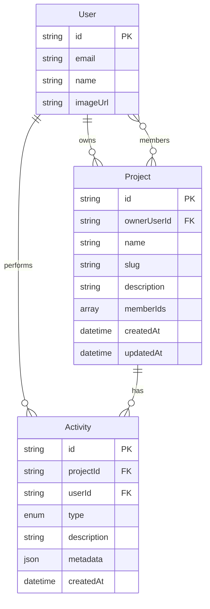
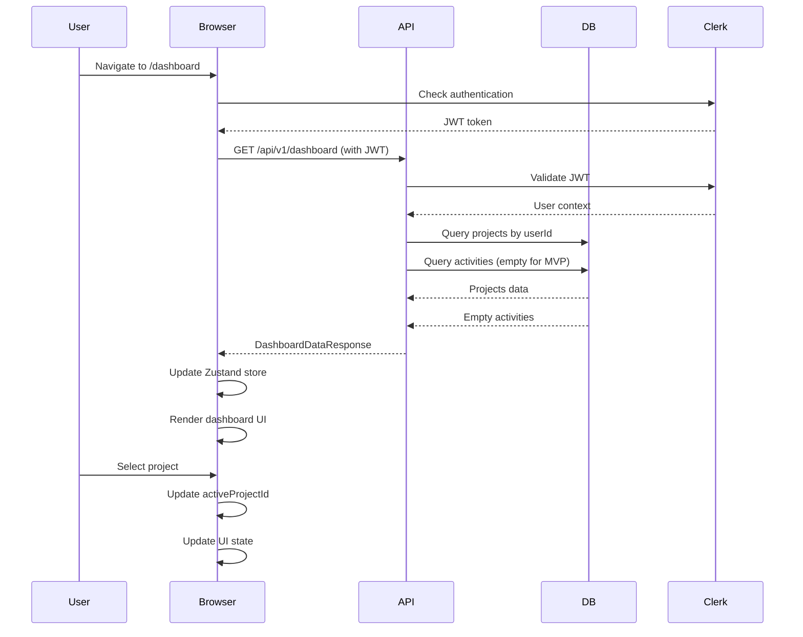

# Data Model: Authenticated App Layout + Dashboard

**Feature**: Authenticated App Layout + Dashboard **Date**: 2025-09-15
**Status**: Complete

## Entity Definitions

### User (from Clerk)

**Source**: External (Clerk authentication provider) **Purpose**: Authenticated
user context

| Field     | Type     | Required | Description        | Validation    |
| --------- | -------- | -------- | ------------------ | ------------- |
| id        | string   | Yes      | Clerk user ID      | UUID format   |
| email     | string   | Yes      | User email address | Valid email   |
| name      | string   | No       | Display name       | Max 255 chars |
| imageUrl  | string   | No       | Avatar URL         | Valid URL     |
| createdAt | datetime | Yes      | Account creation   | ISO 8601      |

**State**: Managed by Clerk, read-only in application

### Project

**Source**: Database (existing entity) **Purpose**: User's projects for sidebar
display

| Field       | Type     | Required | Description             | Validation         |
| ----------- | -------- | -------- | ----------------------- | ------------------ |
| id          | string   | Yes      | Project identifier      | UUID               |
| ownerUserId | string   | Yes      | Foreign key to User.id  | Valid user ID      |
| name        | string   | Yes      | Project name            | 1-255 chars        |
| slug        | string   | Yes      | URL-friendly identifier | Lowercase, hyphens |
| description | string   | No       | Project summary         | Max 500 chars      |
| memberIds   | string[] | No       | Array of user IDs       | Valid user IDs     |
| createdAt   | datetime | Yes      | Creation timestamp      | ISO 8601           |
| updatedAt   | datetime | Yes      | Last modification       | ISO 8601           |
| createdBy   | string   | Yes      | Creator user ID         | Valid user ID      |
| updatedBy   | string   | Yes      | Last modifier ID        | Valid user ID      |

**State Transitions**: None for MVP (CRUD only)

**Business Rules**:

- Name must be unique per user
- Slug must be globally unique
- Owner cannot be removed from memberIds
- Sorted alphabetically by name in UI

### Activity

**Source**: Database (placeholder for MVP) **Purpose**: Recent activity tracking

| Field       | Type     | Required | Description                | Validation       |
| ----------- | -------- | -------- | -------------------------- | ---------------- |
| id          | string   | Yes      | Activity identifier        | UUID             |
| projectId   | string   | Yes      | Related project            | Valid project ID |
| userId      | string   | Yes      | Actor user ID              | Valid user ID    |
| type        | enum     | Yes      | Activity type              | See types below  |
| description | string   | Yes      | Human-readable description | Max 255 chars    |
| metadata    | json     | No       | Additional context         | Valid JSON       |
| createdAt   | datetime | Yes      | Activity timestamp         | ISO 8601         |

**Activity Types** (future implementation):

- `document_created`
- `document_updated`
- `document_published`
- `member_added`
- `member_removed`

**MVP Implementation**: Empty array returned from API

### DashboardState (client-side only)

**Source**: Frontend state management **Purpose**: UI state for dashboard view

| Field               | Type    | Required | Description                | Validation               |
| ------------------- | ------- | -------- | -------------------------- | ------------------------ |
| activeProjectId     | string  | No       | Currently selected project | Valid project ID or null |
| isLoadingProjects   | boolean | Yes      | Projects fetch state       | -                        |
| isLoadingActivities | boolean | Yes      | Activities fetch state     | -                        |
| projectsError       | Error   | No       | Projects fetch error       | -                        |
| activitiesError     | Error   | No       | Activities fetch error     | -                        |
| sidebarCollapsed    | boolean | Yes      | Sidebar visibility         | Default: false           |
| viewMode            | enum    | Yes      | Dashboard view mode        | 'grid' or 'list'         |

**State Transitions**:

- `idle` → `loading` → `success` or `error`
- Project selection updates `activeProjectId`
- Sidebar toggle updates `sidebarCollapsed`

## Relationships



## API Response Shapes

### ProjectListResponse

```typescript
interface ProjectListResponse {
  projects: Array<{
    id: string;
    name: string;
    slug: string;
    description: string | null;
    memberAvatars: Array<{
      userId: string;
      imageUrl: string;
      name: string;
    }>;
    lastModified: string | null; // "N/A" for MVP
    createdAt: string;
    updatedAt: string;
  }>;
  total: number;
}
```

### DashboardDataResponse

```typescript
interface DashboardDataResponse {
  projects: ProjectListResponse['projects'];
  activities: Array<{
    id: string;
    projectId: string;
    projectName: string;
    userId: string;
    userAvatar: string;
    userName: string;
    type: string;
    description: string;
    createdAt: string;
  }>;
  stats: {
    totalProjects: number;
    recentActivityCount: number;
  };
}
```

### EmptyStateResponse

```typescript
interface EmptyStateResponse {
  projects: [];
  activities: [];
  stats: {
    totalProjects: 0;
    recentActivityCount: 0;
  };
  message: string; // Contextual empty state message
}
```

## Validation Rules

### Project Validation

- **name**: Required, 1-255 characters, trimmed
- **slug**: Auto-generated from name, lowercase, hyphens only
- **description**: Optional, max 500 characters
- **ownerUserId**: Must match authenticated user for creation

### Activity Validation

- **type**: Must be valid enum value
- **description**: Required, max 255 characters
- **projectId**: Must exist and user must have access
- **userId**: Must match authenticated user

### Request Validation

- All list endpoints support optional pagination:
  - `limit`: 1-100, default 20
  - `offset`: >= 0, default 0
- Sort order for projects: alphabetical by name (hardcoded)
- Authentication required for all endpoints

## Database Schema (SQLite)

```sql
-- Projects table already exists
-- Adding indexes for dashboard queries
CREATE INDEX IF NOT EXISTS idx_projects_owner_name
  ON projects(owner_user_id, name);

-- Activities table (future implementation)
CREATE TABLE IF NOT EXISTS activities (
  id TEXT PRIMARY KEY,
  project_id TEXT NOT NULL REFERENCES projects(id) ON DELETE CASCADE,
  user_id TEXT NOT NULL,
  type TEXT NOT NULL CHECK (type IN (
    'document_created',
    'document_updated',
    'document_published',
    'member_added',
    'member_removed'
  )),
  description TEXT NOT NULL,
  metadata TEXT, -- JSON string
  created_at TEXT NOT NULL DEFAULT CURRENT_TIMESTAMP,
  FOREIGN KEY (project_id) REFERENCES projects(id)
);

CREATE INDEX IF NOT EXISTS idx_activities_project
  ON activities(project_id, created_at DESC);
CREATE INDEX IF NOT EXISTS idx_activities_user
  ON activities(user_id, created_at DESC);
```

## Repository Methods

### ProjectRepository (extending existing)

```typescript
interface ProjectRepository {
  // Existing methods...

  // New methods for dashboard
  findByUserId(userId: string): Promise<Project[]>;
  findByUserIdWithMembers(userId: string): Promise<ProjectWithMembers[]>;
  countByUserId(userId: string): Promise<number>;
}
```

### ActivityRepository (new, placeholder for MVP)

```typescript
interface ActivityRepository {
  findRecentByUserId(userId: string, limit: number): Promise<Activity[]>;
  findByProjectId(projectId: string, limit: number): Promise<Activity[]>;
  create(activity: CreateActivityInput): Promise<Activity>;
  countByUserId(userId: string): Promise<number>;
}
```

## Client State Management

### Zustand Store Shape

```typescript
interface DashboardStore {
  // State
  activeProjectId: string | null;
  sidebarCollapsed: boolean;
  viewMode: 'grid' | 'list';

  // Actions
  setActiveProject: (projectId: string | null) => void;
  toggleSidebar: () => void;
  setViewMode: (mode: 'grid' | 'list') => void;

  // Computed
  get isProjectActive(): (projectId: string) => boolean;
}
```

### TanStack Query Keys

```typescript
const queryKeys = {
  projects: {
    all: ['projects'] as const,
    list: (userId: string) => ['projects', 'list', userId] as const,
    detail: (id: string) => ['projects', 'detail', id] as const,
  },
  activities: {
    all: ['activities'] as const,
    recent: (userId: string) => ['activities', 'recent', userId] as const,
    byProject: (projectId: string) =>
      ['activities', 'project', projectId] as const,
  },
  dashboard: {
    all: ['dashboard'] as const,
    data: (userId: string) => ['dashboard', 'data', userId] as const,
  },
};
```

## Data Flow



## Migration Considerations

### DynamoDB Structure (Future)

```typescript
// Single-table design
interface DynamoDBItem {
  PK: string; // USER#<userId> or PROJECT#<projectId>
  SK: string; // PROJECT#<projectId> or ACTIVITY#<timestamp>#<activityId>
  GSI1PK?: string; // PROJECT#<projectId> for activities
  GSI1SK?: string; // ACTIVITY#<timestamp>
  Type: 'User' | 'Project' | 'Activity';
  // ... entity fields
}
```

### Access Patterns Supported

1. Get all projects for a user: Query PK=USER#userId, SK begins with PROJECT#
2. Get project details: Get PK=PROJECT#projectId, SK=PROJECT#projectId
3. Get recent activities: Query GSI1PK=PROJECT#projectId, limit
4. Get user's recent activities: Query across user's projects (scatter-gather)

---

_Data model completed for Phase 1 of implementation plan_
