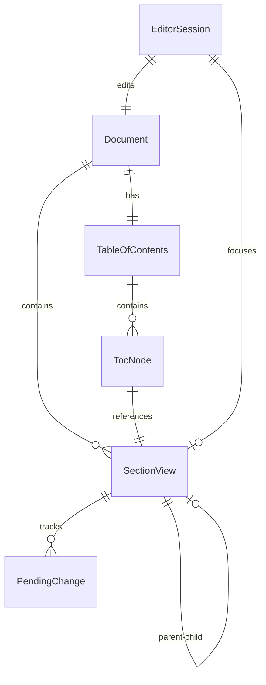

# Data Model: Document Editor Core Infrastructure

**Feature**: Document Editor Core Infrastructure (006-story-2-2) **Date**:
2025-09-20

## Overview

This document defines the data entities, relationships, and state management
required for the Document Editor Core Infrastructure. The model supports
hierarchical document sections with read/edit modes, pending changes tracking,
and section lifecycle management.

## Core Entities

### SectionView

Represents the view state of a document section in the editor.

```typescript
interface SectionView {
  id: string; // Section unique identifier
  docId: string; // Parent document ID
  parentSectionId: string | null; // Parent section for hierarchy
  key: string; // Section key from template
  title: string; // Display title
  depth: number; // Nesting level (0 = root)
  orderIndex: number; // Sort order within parent

  // Content states
  contentMarkdown: string; // Current saved content
  placeholderText: string; // Template placeholder when empty
  hasContent: boolean; // Whether section has saved content

  // Editor states
  viewState: 'idle' | 'read_mode' | 'edit_mode' | 'saving';
  editingUser: string | null; // User currently editing (for collaboration)
  lastModified: string; // ISO timestamp of last change

  // Section lifecycle
  status: 'idle' | 'assumptions' | 'drafting' | 'review' | 'ready';
  assumptionsResolved: boolean; // Whether assumptions have been addressed
  qualityGateStatus: 'pending' | 'passed' | 'failed' | null;
}
```

### PendingChange

Tracks unsaved changes as Git-style patches per section.

```typescript
interface PendingChange {
  id: string; // Change identifier
  sectionId: string; // Target section
  documentId: string; // Parent document (denormalized)

  // Patch data
  patches: PatchDiff[]; // Array of diff operations
  originalContent: string; // Content before changes
  previewContent: string; // Content after applying patches

  // Metadata
  createdAt: string; // ISO timestamp
  createdBy: string; // User who made changes
  sessionId: string; // Browser session identifier

  // State
  status: 'pending' | 'applying' | 'applied' | 'failed';
  conflictsWith: string[]; // IDs of conflicting changes
}

interface PatchDiff {
  op: 'add' | 'remove' | 'replace';
  path: string; // JSONPath or line number
  value?: string; // New content for add/replace
  oldValue?: string; // Previous content for remove/replace
}
```

### EditorSession

Manages the active editing session state.

```typescript
interface EditorSession {
  documentId: string; // Active document
  userId: string; // Current user
  sessionId: string; // Unique session identifier

  // Navigation state
  activeSectionId: string | null; // Currently focused section
  expandedSections: string[]; // Expanded ToC nodes
  scrollPosition: number; // Document scroll offset

  // Editor configuration
  editorMode: 'wysiwyg' | 'markdown' | 'preview';
  showDiffView: boolean; // Whether showing changes
  autoSaveEnabled: boolean; // Auto-save preference
  autoSaveInterval: number; // Milliseconds between saves

  // Collaboration
  collaborators: Array<{
    userId: string;
    userName: string;
    activeSectionId: string | null;
    lastActivity: string; // ISO timestamp
  }>;

  // Performance metrics
  lastSaveTime: number; // Ms for last save operation
  pendingChangeCount: number; // Number of unsaved changes
}
```

### TableOfContents

Navigation structure for document sections.

```typescript
interface TableOfContents {
  documentId: string;
  sections: TocNode[];
  lastUpdated: string; // ISO timestamp
}

interface TocNode {
  sectionId: string;
  title: string;
  depth: number;
  orderIndex: number;
  hasContent: boolean;
  status: 'idle' | 'assumptions' | 'drafting' | 'review' | 'ready';

  // UI state
  isExpanded: boolean; // For nested sections
  isActive: boolean; // Currently selected
  isVisible: boolean; // In viewport
  hasUnsavedChanges: boolean; // Pending changes exist

  // Navigation
  children: TocNode[]; // Child sections
  parentId: string | null; // Parent section ID
}
```

## State Transitions

### Section View State Machine

```
States: idle → read_mode → edit_mode → saving → read_mode

Transitions:
- idle → read_mode: User navigates to section
- read_mode → edit_mode: User clicks edit button
- edit_mode → saving: User saves changes
- saving → read_mode: Save completes
- edit_mode → read_mode: User cancels editing
```

### Section Lifecycle State Machine

```
States: idle → assumptions → drafting → review → ready

Transitions:
- idle → assumptions: New content requested
- assumptions → drafting: Assumptions resolved
- drafting → review: Content complete
- review → ready: Quality gates passed
- review → drafting: Issues found, rework needed
```

### Pending Change State Machine

```
States: pending → applying → applied | failed

Transitions:
- pending → applying: Save initiated
- applying → applied: Server confirms save
- applying → failed: Server rejects/error
- failed → pending: Retry after error
```

## Validation Rules

### SectionView Validation

- `id` must be unique within document
- `depth` must be >= 0 and <= 5 (max nesting)
- `orderIndex` must be unique within parent
- `viewState` and `status` must be valid enum values
- `contentMarkdown` max length: 100,000 characters

### PendingChange Validation

- `patches` array must not be empty
- `originalContent` must match current section content
- `createdAt` must be valid ISO timestamp
- `status` transitions must follow state machine

### EditorSession Validation

- `activeSectionId` must exist in document if not null
- `autoSaveInterval` must be >= 10000 (10 seconds min)
- `collaborators` array max length: 10 (MVP limit)
- `editorMode` must be valid enum value

### TableOfContents Validation

- Tree structure must be valid (no cycles)
- All `sectionId` values must exist in document
- `depth` must match tree position
- Root sections must have `parentId` = null

## Relationships



## Storage Strategy

### Client-Side Storage (Browser)

- **PendingChange**: IndexedDB via localforage
- **EditorSession**: sessionStorage for active session
- **TableOfContents**: Memory with localStorage cache
- **UI preferences**: localStorage

### Server-Side Storage (SQLite)

- **SectionView**: `sections` table with full content
- **Document metadata**: `documents` table
- **Change history**: `proposals` table (applied changes)
- **User preferences**: `user_settings` table

## Performance Considerations

### Indexing Strategy

- Index on `(docId, parentSectionId, orderIndex)` for hierarchy queries
- Index on `(sectionId, createdAt)` for pending changes
- Index on `(documentId, status)` for section filtering

### Caching Strategy

- Cache ToC structure for 5 minutes
- Cache section content until modified
- Debounce pending change creation (500ms)
- Batch save operations (max 10 sections)

### Memory Management

- Limit pending changes to 100 per section
- Clear old changes after successful save
- Pool Milkdown editor instances (max 3)
- Lazy load section content on scroll

## Migration Path

From current SQLite schema to this model:

1. Add `viewState` field to sections table
2. Create `pending_changes` table for patches
3. Add `editor_sessions` table for collaboration
4. Migrate existing content to `contentMarkdown`
5. Generate ToC from section hierarchy

## Security Considerations

- Validate all patches before applying
- Sanitize Markdown content before rendering
- Enforce section-level permissions (Phase 2)
- Rate limit save operations (10 per minute)
- Encrypt pending changes in IndexedDB
