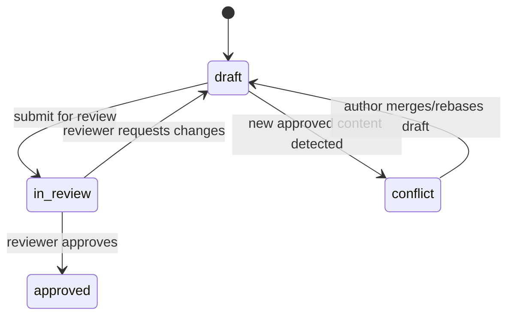

# Data Model: Section Editor & WYSIWYG Capabilities

## Entity Overview

### DocumentSection

| Field              | Type                                            | Constraints                   | Notes                                       |
| ------------------ | ----------------------------------------------- | ----------------------------- | ------------------------------------------- |
| id                 | UUID                                            | primary key                   | Stable identifier for the section           |
| document_id        | UUID                                            | required, FK documents        | Links section to parent document            |
| slug               | string                                          | required, unique per document | Drives navigation and URLs                  |
| title              | string                                          | required                      | Editable headline displayed in TOC          |
| status             | enum(`approved`,`draft`,`in_review`,`conflict`) | required                      | Mirrors workflow state                      |
| approved_content   | markdown                                        | required                      | Canonical content visible in read-only mode |
| approved_by        | UUID                                            | nullable FK users             | Populated on approval                       |
| approved_at        | datetime                                        | nullable                      | Approval timestamp                          |
| last_draft_id      | UUID                                            | nullable FK section_drafts    | References most recent draft                |
| quality_gate_state | jsonb                                           | required                      | Captures QA signal badges                   |
| metadata           | jsonb                                           | optional                      | Stores AI hints, revision counts            |
| created_at         | datetime                                        | required                      | Audit field                                 |
| updated_at         | datetime                                        | required                      | Audit field                                 |
| request_id         | string                                          | required                      | Trace ID for observability                  |

**Relationships**: Has many `SectionDraft` records; has many `ReviewSummary`
entries via drafts. Surfaces derived conflict indicator when latest draft
version

> approved version.

### SectionDraft

| Field             | Type                      | Constraints                   | Notes                                      |
| ----------------- | ------------------------- | ----------------------------- | ------------------------------------------ |
| id                | UUID                      | primary key                   | Autosave snapshot identifier               |
| section_id        | UUID                      | required FK document_sections | Parent section                             |
| author_id         | UUID                      | required FK users             | Draft owner                                |
| version           | integer                   | required, optimistic locking  | Incremented per save                       |
| content           | markdown                  | required                      | Editable body respecting Markdown controls |
| change_summary    | string                    | optional, max 500 chars       | Rationale for reviewers                    |
| formatting_schema | jsonb                     | required                      | Toolbar state, e.g., enabled marks         |
| conflicts_with    | UUID                      | nullable                      | Points to conflicting draft version        |
| autosave_state    | enum(`manual`,`autosave`) | required                      | Indicates save trigger                     |
| created_at        | datetime                  | required                      | Snapshot timestamp                         |
| updated_at        | datetime                  | required                      | Last modification                          |
| request_id        | string                    | required                      | Traceability per constitution              |

**Relationships**: Belongs to `DocumentSection`; may have one `ReviewSummary`. A
unique `(section_id, version)` compound index prevents duplicate versions.

### ReviewSummary

| Field            | Type                                 | Constraints                | Notes                                |
| ---------------- | ------------------------------------ | -------------------------- | ------------------------------------ |
| id               | UUID                                 | primary key                |                                      |
| section_draft_id | UUID                                 | required FK section_drafts | Reviewed draft                       |
| reviewer_id      | UUID                                 | required FK users          | Approver                             |
| status           | enum(`approved`,`changes_requested`) | required                   | Review outcome                       |
| notes            | text                                 | optional                   | Reviewer remarks                     |
| diff_snapshot    | jsonb                                | required                   | Serialized diff artifacts used in UI |
| created_at       | datetime                             | required                   | Timestamp of decision                |
| request_id       | string                               | required                   | Audit trace                          |

**Relationships**: Belongs to `SectionDraft`. Propagates approval metadata back
to `DocumentSection` upon status change.

## State Transitions

- Autosave increments `SectionDraft.version` while remaining in `draft` until
  submission.
- Approval copies `content` to `DocumentSection.approved_content`, updates
  `status` to `approved`, and stores approver metadata.
- Conflict state triggers reconciliation UI and requires drafting a merge before
  resubmission.

## Validation Rules

- All Markdown must conform to the template schema: headings h1-h4, lists,
  tables, code, links, blockquotes.
- `change_summary` is required when status transitions to `in_review`.
- `diff_snapshot` must include both draft and approved hashes for auditability.
- Request IDs propagate from API gateway to persistence on all mutations.
- Optimistic locking errors surface conflict warnings in the UI.
